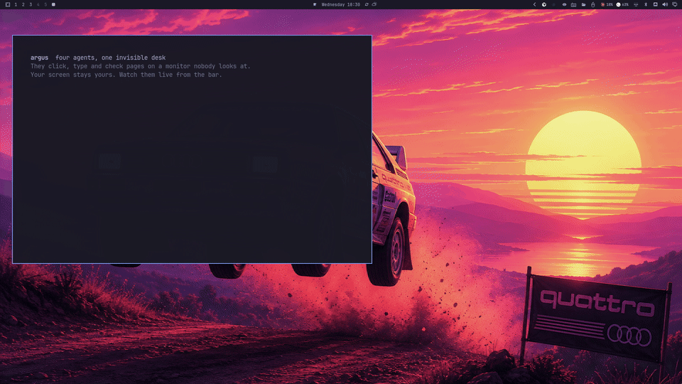
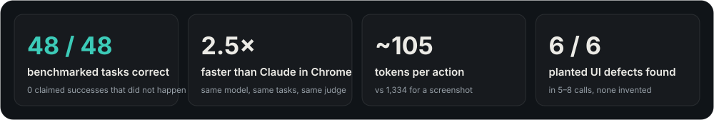
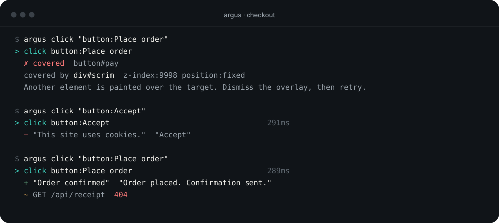
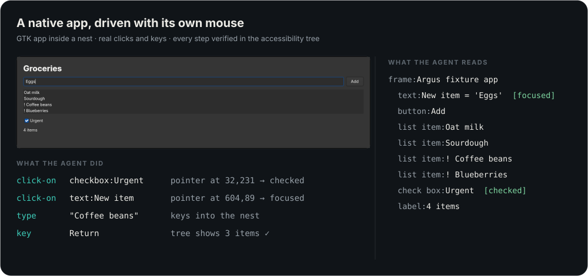
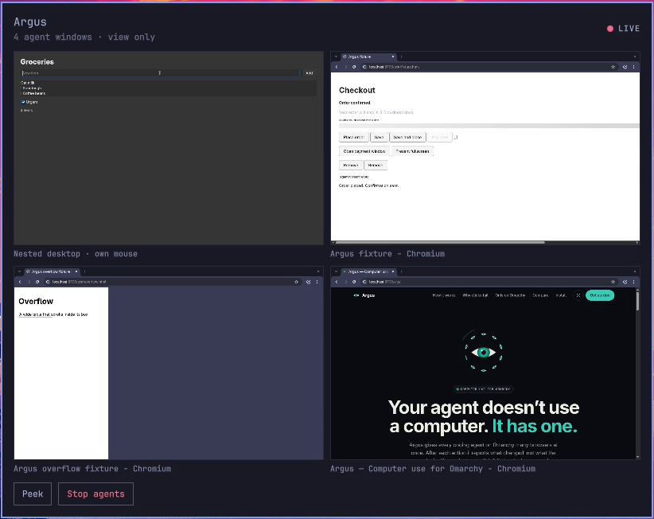
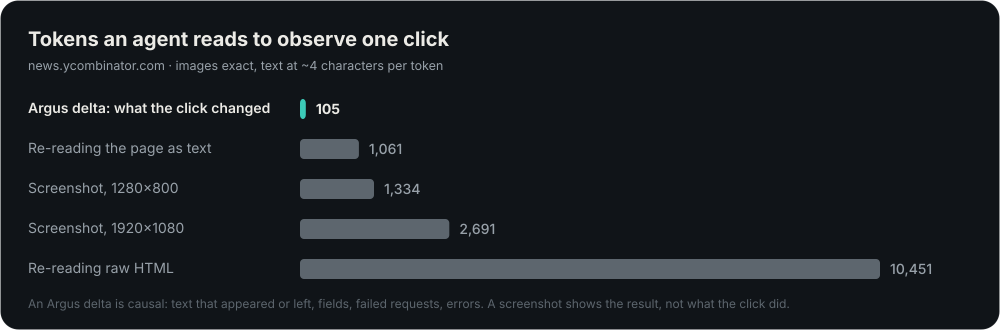
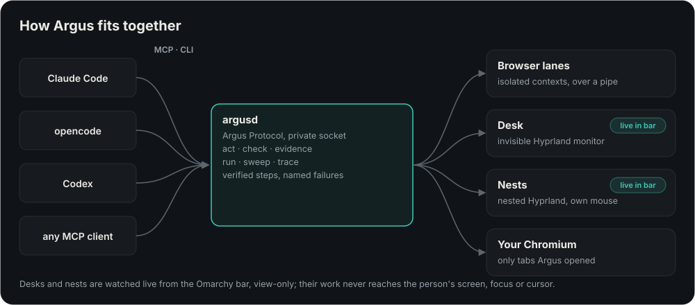

<div align="center">



# Argus

### Computer use for Omarchy.
Agents see the screen, act on it, and are told the truth about what happened.

[](LICENSE)
[](https://omarchy.org)
[](https://hypr.land)
[](docs/PROTOCOL.md)
[](#connect-an-agent)
[](#status)

[Quick start](#quick-start) · [Why Argus](#why-argus) · [How it works](#how-it-works) · [Benchmarks](#benchmarks) · [Protocol](docs/PROTOCOL.md) · [Performance](docs/performance.md)

<br>

<a href="docs/media/demo.mp4"></a>

<sub><b>Real time, one take.</b> Four agents at once: a checkout recovering from a blocked button, a phone-width audit, a layout check, and a native GTK app driven with its own mouse. The Omarchy bar shows each one live. The person's screen is never touched.</sub>

<br><br>



</div>

## Why Argus

### 1. It never says "done" when nothing happened

A click on a covered button does not come back as `Clicked`. It comes back as
**covered**, with the element on top named, so the agent fixes the cause
instead of building on a step that never happened. Every action is verified;
every failure has a reason from a fixed set.



### 2. Agents get their own screens

Browsers and apps run on an **invisible desk**, a monitor that exists only for
agents and sits where no cursor can reach. Your focus, cursor and workspace are
never touched. The Omarchy bar shows every agent live, view-only, with one
click to peek or stop.

When an app needs a real mouse, a **nest** gives the agent a whole nested
Hyprland with a pointer and keyboard of its own. It reads the app through its
accessibility tree and verifies every step there.



<p align="center"><br><sub><b>The Argus panel in the Omarchy bar.</b> Every agent window, live and view-only, with peek and stop.</sub></p>

### 3. Text first, pixels priced

After an action, the agent reads **what changed**: text that appeared or left,
fields that filled, requests that failed, errors that fired. When a question
really needs pixels, Argus sends a crop and says what it costs.



### 4. Built for how software is made

Scripts state what should happen, waits are expectations instead of sleeps, a
`run` is a test with a verdict, and a `sweep` checks the same flow at every
screen size and color scheme in parallel. `check` reviews accessibility, layout
and runtime errors, including inside frames and shadow roots.

```jsonc
// one call, six parallel lanes
{"method": "sweep", "params": {"name": "checkout",
  "steps": [{"open": "http://localhost:5173/checkout"},
            {"click": "button:Place order", "expect": {"appears": "Order confirmed"}}],
  "across": {"viewports": [{"w": 375, "h": 812}, {"w": 768, "h": 1024}, {"w": 1440, "h": 900}],
             "colorScheme": ["light", "dark"]}}}
```

## What an agent learns after it acts

| | Screenshot-driven agents | Scripted Playwright | **Argus** |
|---|:---:|:---:|:---:|
| Text that appeared or disappeared | inferred from pixels | if you query for it | ✅ reported |
| Which request failed | ❌ | if you listen for it | ✅ reported |
| Why a click didn't land | ❌ | actionability error | ✅ named blocker |
| Controls inside frames and shadow roots | from pixels | ✅ | ✅ |
| Contrast, tap targets, overflow | ❌ | not built in | ✅ `check` |
| A native window or dialog opening | if on screen | outside the page | ✅ from Hyprland |
| Works without taking over your screen | uses your screen | headless only | ✅ desks and nests |
| Real mouse in native apps, yours untouched | moves your mouse | ❌ | ✅ nests |

## Quick start

Argus runs on [Omarchy](https://omarchy.org) and uses what it ships: Chromium,
Hyprland and the Omarchy shell.

```bash
git clone https://github.com/elberacasa/argus && cd argus

bin/argus bar install        # the Argus widget in your bar, and `argus` on your PATH
argus desk up                # an invisible monitor for agents
test/demo-desk.sh            # watch four agents from the bar
```

Drive a browser yourself:

```bash
argus open https://example.com
argus click "link:Learn more"
argus audit
```

### Connect an agent

Agents started inside this folder pick up the included `.mcp.json`. Elsewhere,
point any MCP client (Claude Code, opencode, Codex, …) at the server:

```json
{ "mcpServers": { "argus": { "command": "/path/to/argus/bin/argus-mcp" } } }
```

## How it works



| | What it is | Command |
|---|---|---|
| **Lanes** | Isolated browsers, many at once. Every action returns a verified delta. | `argus --lane N …` |
| **Desk** | A Hyprland monitor only agents use. Real, headful windows. | `argus desk up` · `argus --desk …` |
| **Nests** | A nested Hyprland with its own seat for native apps. | `argus nest up` · `argus nest click-on …` |
| **Your browser** | Tabs in your own Chromium, with your logins. No debugging port. | `argus own install` · `argus --own …` |
| **The bar** | Live cards for every agent, with peek and stop. | `argus bar install` |
| **argusd** | The daemon that speaks the [Argus Protocol](docs/PROTOCOL.md). | `argusd serve` |

The standard is the protocol, not the implementation: JSON-RPC over a unix
socket, a JSON Schema, and examples every implementation must pass. A script
stops at the first surprise and says why: `covered`, `disabled`, `hidden`,
`offscreen`, `ambiguous`, `not-found` with near matches, `expectation-failed`,
`timeout`.

## Benchmarks

Two head-to-heads against Claude in Chrome on the same machine, every call and
token counted.

**UI Testing Playground**, a third-party site built to break automation
([details](docs/benchmark-uitap.md)):

| | Passed | Reported success for something that did not happen |
|---|:---:|:---:|
| **Argus** (prototype) | 7 / 10 | **0** |
| Claude in Chrome | 9 / 10 | 3 |

Argus's three misses were shadow DOM, frames and waiting for a slow element.
`argusd` was built to close exactly those, its tests cover all three, and the
benchmark will be rerun through it.

**Argus's own test pages** ([details](docs/benchmark.md)): ~1,880 tokens for
Argus and ~5,540 for Claude in Chrome across the five tasks both attempted.

### Performance

Measured on one Omarchy machine ([method](docs/performance.md)).

| | |
|---|---:|
| Observe one click: delta vs 1280×800 screenshot | **~105** vs 1,334 tokens |
| Explain a blocked click, naming the blocker | **3 ms** |
| Review a page with `check` | **2 ms** |
| Page outline, hit-tested | **5 ms**, ≤250 tokens |
| One verified step in argusd | **~160 ms** |
| Nested desktop ready | **~300 ms** |
| Real click inside a nest | **1–2 ms** |
| 12 browser lanes | **4.9 GB** |

## Safety

- **Never touches what it did not create.** Processes, tabs and windows are
  identified by ownership, never by name.
- **No ports.** Browsers over pipes, the daemon on a socket only you can open,
  your browser through native messaging.
- **Your session stays yours.** Agents never take your focus or cursor, the
  virtual pointer refuses your own compositor, and nests never enter your
  session environment. Each is a test.
- **Secrets never reach a model.** A step names a secret; the value is resolved
  only after you approve. *(Approval is designed, not built yet.)*
- **Destructive Omarchy commands** require explicit confirmation.

## Status

Argus is a **preview**. The `argus` command, desks, nests, the bar widget and
the own-browser bridge work today and are tested on every change. `argusd`
speaks Protocol v0 for browser lanes: verified `act`, outlines, `check`, priced
screenshots and crops, `run`, `sweep` and traces. Desk, own-browser and
native-app lanes move into the daemon next. The protocol may change until v1.

## Development

```bash
./test/run.sh                                         # core suite
ARGUS_TEST_DESK=1 ARGUS_TEST_NESTED=1 ./test/run.sh    # plus desks and nests
cd argusd && bun install && bun test                  # daemon, protocol and scene
scripts/record-demo.sh                                # re-record the demo
scripts/readme-art.py                                 # regenerate the figures
```

## License

[MIT](LICENSE) © elberacasa
