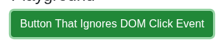

# Argus · Click · round 2

**Goal met (read from the page): yes** (turned green) · claimed success · 3 tool calls · 9.6 s · $0.032

## 1. `browser_open`

```json
{
  "url": "http://127.0.0.1:40695/click"
}
```

```
lane main opened
  → http://127.0.0.1:40695/click
  title "Click"
  + "UITAP"
  + "Home"
  + "Resources"
  + "Click"
  + "Physical mouse click and DOM event emulated click are differently handled by browsers. There are still cases, with sometimes hardly ident..."
  + "Scenario"
  + "Record button click. The button becomes green after clicking."
  + "Then execute your test to make sure that it is able to click the button."
  + "Playground"
  + "Button That Ignores DOM Click Event"
  + "Star"
  + "Fork the website on GitHub ."
  + … 2 more

Click (1280x800)
landmarks:
  navigation e0.28
  contentinfo e0.63
headings:
  Click e0.42
  Scenario e0.46
  Playground e0.55
actions:
  link:UITAP e0.29
  link:Home e0.36
  link:Resources e0.39
  button:Button That Ignores DOM Click Event e0.57
  link:Star inflectra/ui-test-automation-playground on GitHub e0.72
  link:Fork the website on GitHub e0.6
  link:Rapise e0.85
  link:Inflectra Corporation e0.88
  link:Apache License 2.0 e0.94
```

## 2. `browser_click`

```json
{
  "target": "e0.57"
}
```

```
✓ click button:Button That Ignores DOM Click Event e0.57  159ms
```

## 3. `browser_look`

```json
{
  "target": "e0.57"
}
```

```
324x70, 36 image tokens
```



## Final answer

```
I clicked "Button That Ignores DOM Click Event" with a real mouse click, and it reacted: a close-up image taken afterwards shows the button is now green.

RESULT: success
```
