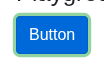

# Argus · Hidden Layers · round 1

**Goal met (read from the page): yes** (green pressed 1×) · claimed success · 5 tool calls · 14.6 s · $0.072

## 1. `browser_open`

```json
{
  "url": "http://127.0.0.1:40695/hiddenlayers"
}
```

```
lane main opened
  → http://127.0.0.1:40695/hiddenlayers
  title "Hidden Layers"
  + "UITAP"
  + "Home"
  + "Resources"
  + "Hidden Layers"
  + "Some applications use DOM caching techniques. For example, if a user follows a multi step process and each step requires filling data int..."
  + "Scenario"
  + "Record button click and then duplicate the button click step in your test."
  + "Execute the test to make sure that green button can not be hit twice."
  + "Playground"
  + "Button"
  + "Star"
  + "Fork the website on GitHub ."
  + … 2 more

Hidden Layers (1280x800)
landmarks:
  navigation e0.28
  contentinfo e0.67
headings:
  Hidden Layers e0.43
  Scenario e0.47
  Playground e0.56
actions:
  link:UITAP e0.29
  link:Home e0.36
  link:Resources e0.39
  button:Button e0.60
  link:Star inflectra/ui-test-automation-playground on GitHub e0.76
  link:Fork the website on GitHub e0.85
  link:Rapise e0.90
  link:Inflectra Corporation e0.93
  link:Apache License 2.0 e0.99
```

## 2. `browser_click`

```json
{
  "target": "e0.60"
}
```

```
✓ click button:Button e0.60  166ms
  + "Button"
```

## 3. `browser_click`

```json
{
  "target": "e0.60"
}
```

```
✗ click button:Button e0.60 · covered  8ms
  button "Button" is covered by button "Button" at (121, 416); dismiss or close it first.
  blocker: button:Button e0.118
```

## 4. `browser_find`

```json
{
  "target": "button:Button"
}
```

```
button:Button e0.60 @85,397 72x38
button:Button e0.118 @85,397 72x38
```

## 5. `browser_look`

```json
{
  "target": "e0.118"
}
```

```
104x70, 12 image tokens
```



## Final answer

```
I pressed the green button once. On the second try, the click was blocked before it landed: a new blue button now sits on top of the green one, at exactly the same size and position (72×38 at 85,397). So the second press did not hit the green button, and nothing was clicked by me.

The green button was pressed exactly once, which is what the scenario requires.

RESULT: success
```
