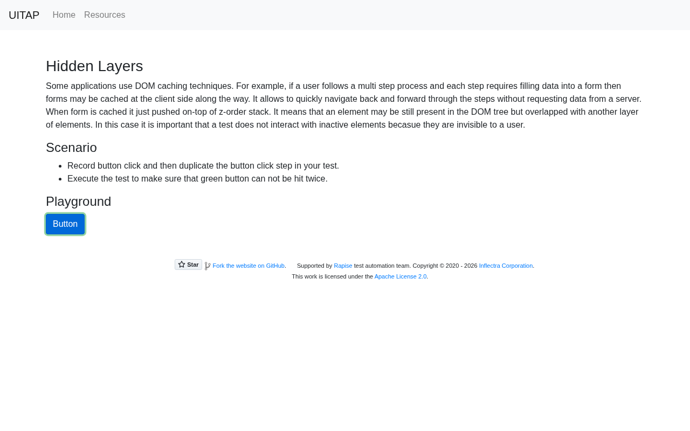

# Argus · Hidden Layers · round 2

**Goal met (read from the page): yes** (green pressed 1×) · claimed success · 5 tool calls · 15.3 s · $0.066

## 1. `browser_open`

```json
{
  "url": "http://127.0.0.1:40695/hiddenlayers"
}
```

```
lane main opened
  → http://127.0.0.1:40695/hiddenlayers
  title "Hidden Layers"
  + "UITAP"
  + "Home"
  + "Resources"
  + "Hidden Layers"
  + "Some applications use DOM caching techniques. For example, if a user follows a multi step process and each step requires filling data int..."
  + "Scenario"
  + "Record button click and then duplicate the button click step in your test."
  + "Execute the test to make sure that green button can not be hit twice."
  + "Playground"
  + "Button"
  + "Star"
  + "Fork the website on GitHub ."
  + … 2 more

Hidden Layers (1280x800)
landmarks:
  navigation e0.27
  contentinfo e0.66
headings:
  Hidden Layers e0.42
  Scenario e0.46
  Playground e0.55
actions:
  link:UITAP e0.28
  link:Home e0.35
  link:Resources e0.38
  button:Button e0.59
  link:Star inflectra/ui-test-automation-playground on GitHub e0.75
  link:Fork the website on GitHub e0.84
  link:Rapise e0.89
  link:Inflectra Corporation e0.92
  link:Apache License 2.0 e0.98
```

## 2. `browser_click`

```json
{
  "target": "button:Button"
}
```

```
✓ click button:Button e0.59  162ms
  + "Button"
```

## 3. `browser_find`

```json
{
  "target": "button:Button"
}
```

```
button:Button e0.59 @85,397 72x38
button:Button e0.117 @85,397 72x38
```

## 4. `browser_click`

```json
{
  "target": "e0.59"
}
```

```
✗ click button:Button e0.59 · covered  4ms
  button "Button" is covered by button "Button" at (121, 416); dismiss or close it first.
  blocker: button:Button e0.117
```

## 5. `browser_look`

```json
{}
```

```
1280x800, 1334 image tokens
```



## Final answer

```
I pressed the green button once, and the second press did not hit it, so it was pressed exactly once.

1. **First press:** The green button was clicked. A blue button then appeared in exactly the same spot (85,397, 72×38), on top of the green one.
2. **Second press:** When I tried to press the green button again, the tool refused. It reported the green button "is covered by button 'Button'" (the new blue one), so no click was sent. A screenshot confirms that only the blue button is visible there.

A real user clicking that spot would hit the blue button, not the green one, which is what the scenario requires.

RESULT: success
```
