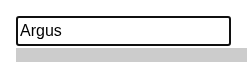

# Argus · Overlapped · round 1

**Goal met (read from the page): yes** (name = "Argus") · claimed success · 4 tool calls · 12.3 s · $0.051

## 1. `browser_open`

```json
{
  "url": "http://127.0.0.1:40695/overlapped"
}
```

```
lane main opened
  → http://127.0.0.1:40695/overlapped
  title "Overlapped Element"
  + "UITAP"
  + "Home"
  + "Resources"
  + "Overlapped Element"
  + "Entering text to a partially visible element may require scrolling it into view."
  + "Scenario"
  + "Record setting text into the Name input field (scroll element before entering the text)."
  + "Then execute your test to make sure that the text was entered correctly."
  + "Playground"
  + "Star"
  + "Fork the website on GitHub ."
  + "Supported by Rapise test automation team. Copyright © 2020 - 2026 Inflectra Corporation ."
  + … 1 more

Overlapped Element (1280x800)
landmarks:
  navigation e0.30
  contentinfo e0.79
headings:
  Overlapped Element e0.45
  Scenario e0.49
  Playground e0.58
fields:
  textbox:Id e0.6
  textbox:Name e0.7 [covered by e0.73 div]
  textbox:Subject e0.8 [scrolled out of its container]
actions:
  link:UITAP e0.31
  link:Home e0.38
  link:Resources e0.41
  link:Star inflectra/ui-test-automation-playground on GitHub e0.88
  link:Fork the website on GitHub e0.97
  link:Rapise e0.102
  link:Inflectra Corporation e0.105
  link:Apache License 2.0 e0.111
```

## 2. `browser_act`

```json
{
  "steps": [
    {
      "scroll": "textbox:Name"
    },
    {
      "type": [
        "textbox:Name",
        "Argus"
      ],
      "expect": {
        "field": [
          "textbox:Name",
          "Argus"
        ]
      }
    }
  ]
}
```

```
✓ scroll textbox:Name e0.7  163ms
✓ type textbox:Name e0.7  167ms
  = textbox:Name: "Argus"
```

## 3. `browser_find`

```json
{
  "target": "textbox:Name"
}
```

```
textbox:Name e0.7 @85,360 215x30
```

## 4. `browser_look`

```json
{
  "target": "textbox:Name"
}
```

```
247x62, 27 image tokens
```



## Final answer

```
The Name field now holds exactly "Argus".

When the page opened, a box was sitting on top of the Name field. I scrolled the field into view inside its container, then typed "Argus". The tool confirmed the field's value right after typing, and a close-up of the field shows "Argus" in it.

RESULT: success
```
