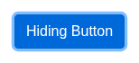

# Argus · Scrollbars · round 1

**Goal met (read from the page): yes** (hidden button clicked 1×) · claimed success · 3 tool calls · 10.9 s · $0.043

## 1. `browser_open`

```json
{
  "url": "http://127.0.0.1:40695/scrollbars"
}
```

```
lane main opened
  → http://127.0.0.1:40695/scrollbars
  title "Scrollbars"
  + "UITAP"
  + "Home"
  + "Resources"
  + "Scrollbars"
  + "An application may use native or custom scrollbars and some elements may be out of view. A test scenario may require to ensure that an el..."
  + "Scenario"
  + "Find a button in the scroll view and record button click."
  + "Update your test to automatically scroll the button into a visible area."
  + "Then execute your test to make sure it works."
  + "Playground"
  + "Hiding Button"
  + "Star"
  + … 3 more

Scrollbars (1280x800)
landmarks:
  navigation e0.27
  contentinfo e0.71
headings:
  Scrollbars e0.41
  Scenario e0.45
  Playground e0.57
actions:
  link:UITAP e0.28
  link:Home e0.35
  link:Resources e0.38
  button:Hiding Button e0.67 [scrolled out of its container]
  link:Star inflectra/ui-test-automation-playground on GitHub e0.80
  link:Fork the website on GitHub e0.89
  link:Rapise e0.94
  link:Inflectra Corporation e0.97
  link:Apache License 2.0 e0.103
```

## 2. `browser_click`

```json
{
  "target": "e0.67"
}
```

```
✓ click button:Hiding Button e0.67  173ms
```

## 3. `browser_look`

```json
{
  "target": "e0.67"
}
```

```
154x70, 18 image tokens
```



## Final answer

```
I clicked the "Hiding Button". It started out scrolled out of view inside its scrollable box, and the browser tool scrolled it into view before clicking. The tool confirmed a real pointer click landed on the button. A close-up afterwards shows the button in view with the focus outline you'd expect after a click.

The page itself doesn't show any message when the button is clicked, so the only proof is that confirmed click and the focus outline.

RESULT: success
```
