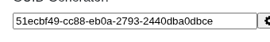

# Argus · Shadow DOM · round 2

**Goal met (read from the page): yes** (field "51ecbf49-cc88-eb0a-2793-2440dba0dbce", reported 51ecbf49-cc88-eb0a-2793-2440dba0dbce) · claimed success · 4 tool calls · 12.5 s · $0.043

## 1. `browser_open`

```json
{
  "url": "http://127.0.0.1:40695/shadowdom"
}
```

```
lane main opened
  → http://127.0.0.1:40695/shadowdom
  title "Shadow DOM"
  + "UITAP"
  + "Home"
  + "Resources"
  + "Shadow DOM"
  + "This is a page with a Shadow DOM component guid-generator. Using it one can generate a guid and copy it to the clipboard."
  + "Scenario"
  + "Create a test that clicks on and then on buttons. This sequence of steps generates new guid and copies it to the clipboard."
  + "Add an assertion step to your test to compare the value from the clipboard with the value of the input field."
  + "Then execute the test to make sure that the assertion step is not failing."
  + "Playground"
  + "GUID Generator:"
  + "Star"
  + … 3 more

Shadow DOM (1280x800)
landmarks:
  navigation e0.29
  contentinfo e0.82
headings:
  Shadow DOM e0.43
  Scenario e0.47
  Playground e0.64
  GUID Generator: e0.66
fields:
  textbox:input#editField.edit-field e0.6
actions:
  link:UITAP e0.30
  link:Home e0.37
  link:Resources e0.40
  button:button#buttonGenerate.button-generate e0.72
  button:button#buttonCopy.button-copy e0.75
  link:Star inflectra/ui-test-automation-playground on GitHub e0.91
  link:Fork the website on GitHub e0.100
  link:Rapise e0.105
  link:Inflectra Corporation e0.108
  link:Apache License 2.0 e0.114
```

## 2. `browser_click`

```json
{
  "target": "e0.72"
}
```

```
✓ click button:button#buttonGenerate.button-generate e0.72  164ms
  = textbox:input#editField.edit-field: "51ecbf49-cc88-eb0a-2793-2440dba0dbce"
```

## 3. `browser_find`

```json
{
  "target": "e0.6"
}
```

```
textbox:input#editField.edit-field e0.6 @85,378 308x21
```

## 4. `browser_look`

```json
{
  "target": "e0.6"
}
```

```
340x53, 26 image tokens
```



## Final answer

```
I clicked the gear button in the GUID generator on the Shadow DOM page, and it put a new GUID in the field. The field's value after the click matches what the screenshot of the field shows:

GUID: 51ecbf49-cc88-eb0a-2793-2440dba0dbce

RESULT: success
```
