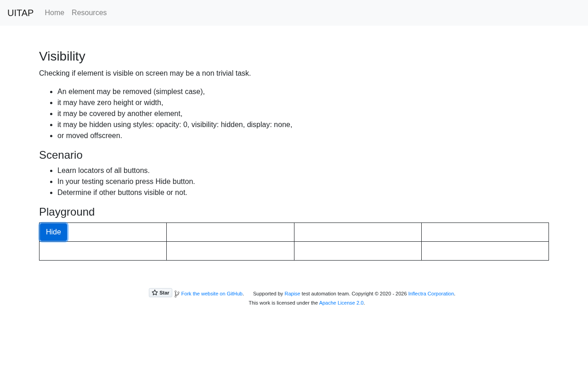

# Argus · Visibility · round 1

**Goal met (read from the page): yes** (Hide applied; 7/7 answered not clickable) · claimed success · 6 tool calls · 16.9 s · $0.083

## 1. `browser_open`

```json
{
  "url": "http://127.0.0.1:40695/visibility"
}
```

```
lane main opened
  → http://127.0.0.1:40695/visibility
  title "Visibility"
  + "UITAP"
  + "Home"
  + "Resources"
  + "Visibility"
  + "Checking if element is visible on screen may be a non trivial task."
  + "An element may be removed (simplest case),"
  + "it may have zero height or width,"
  + "it may be covered by another element,"
  + "it may be hidden using styles: opacity: 0, visibility: hidden, display: none,"
  + "or moved offscreen."
  + "Scenario"
  + "Learn locators of all buttons."
  + … 15 more

Visibility (1280x800)
landmarks:
  navigation e0.27
  contentinfo e0.108
headings:
  Visibility e0.42
  Scenario e0.62
  Playground e0.73
actions:
  link:UITAP e0.28
  link:Home e0.35
  link:Resources e0.38
  button:Hide e0.79
  button:Removed e0.82
  button:Zero Width e0.85
  button:Overlapped e0.88
  button:Opacity 0 e0.93
  button:Visibility Hidden e0.96
  button:Display None e0.99
  button:Offscreen e0.102
  link:Star inflectra/ui-test-automation-playground on GitHub e0.117
  link:Fork the website on GitHub e0.126
  link:Rapise e0.131
  link:Inflectra Corporation e0.134
  link:Apache License 2.0 e0.140
```

## 2. `browser_click`

```json
{
  "target": "button:Hide"
}
```

```
✓ click button:Hide e0.79  166ms
  − "Removed"
  − "Opacity 0"
  − "Visibility Hidden"
  − "Display None"
```

## 3. `browser_find`

```json
{
  "target": {
    "role": "button"
  }
}
```

```
button:Hide e0.79 @87,487 59x38
button:Overlapped e0.88 @919,487 109x38
button:Offscreen e0.102 @-9999,-9999 95x38
```

## 4. `browser_screenshot`

```json
{}
```

```
1280x800, 1334 image tokens
```



## 5. `browser_click`

```json
{
  "target": "button:Overlapped"
}
```

```
✗ click button:Overlapped e0.88 · covered  9ms
  button "Overlapped" is covered by generic div#hidingLayer at (974, 506); dismiss or close it first.
  blocker: generic:div#hidingLayer e0.90
```

## 6. `browser_find`

```json
{
  "target": {
    "text": "Zero Width"
  }
}
```

```
button:Zero Width e0.85 @642,487 0x38
```

## Final answer

```
After pressing Hide, none of the other seven buttons can be both seen and clicked. The screenshot shows only the Hide button left in the playground.

Removed: not clickable
Zero Width: not clickable
Overlapped: not clickable
Opacity 0: not clickable
Visibility Hidden: not clickable
Display None: not clickable
Offscreen: not clickable

- **Removed, Opacity 0, Visibility Hidden, Display None:** These disappeared from the page's list of buttons as soon as I clicked Hide.
- **Zero Width:** It's still on the page but is 0 pixels wide, so there's nothing to see or click.
- **Overlapped:** It's still there, but a layer (`div#hidingLayer`) sits on top of it. When I tried clicking it, the click was blocked.
- **Offscreen:** It was moved to position (-9999, -9999), far outside the visible window.

RESULT: success
```
