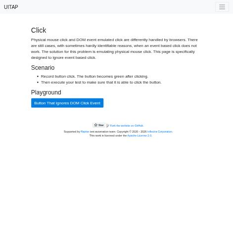
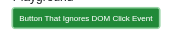

# Claude in Chrome · Click · round 1

**Goal met (read from the page): yes** (turned green) · claimed success · 4 tool calls · 23.7 s · $0.090

## 1. `tabs_context_mcp`

```json
{
  "createIfEmpty": true
}
```

```
{"availableTabs":[{"tabId":453241855,"title":"New Tab","url":"chrome://newtab/"}],"tabGroupId":543160806}
```

## 2. `browser_batch`

```json
{
  "actions": [
    {
      "name": "navigate",
      "input": {
        "url": "http://127.0.0.1:40695/click",
        "tabId": 453241855
      }
    },
    {
      "name": "computer",
      "input": {
        "action": "screenshot",
        "tabId": 453241855,
        "scale": 0.5
      }
    }
  ]
}
```

```
[navigate] Navigated to http://127.0.0.1:40695/click
```

```
[computer:screenshot] Successfully captured screenshot (471x455, jpeg) - ID: ss_767615x1v — 0.5-scale view; coordinate frame: 941x909.
```


## 3. `browser_batch`

```json
{
  "actions": [
    {
      "name": "computer",
      "input": {
        "action": "left_click",
        "coordinate": [
          271,
          415
        ],
        "tabId": 453241855
      }
    },
    {
      "name": "javascript_tool",
      "input": {
        "action": "javascript_exec",
        "text": "const b=document.getElementById('badButton'); [b.className, getComputedStyle(b).backgroundColor]",
        "tabId": 453241855
      }
    },
    {
      "name": "computer",
      "input": {
        "action": "screenshot",
        "tabId": 453241855,
        "scale": 0.5
      }
    }
  ]
}
```

```
[computer:left_click] Clicked at (271, 415)
```

```
[javascript_tool:javascript_exec] [
  "btn btn-success",
  "rgb(0, 123, 255)"
]
```

```
[computer:screenshot] Successfully captured screenshot (471x455, jpeg) - ID: ss_2185teujh — 0.5-scale view; coordinate frame: 941x909.
```



## 4. `browser_batch`

```json
{
  "actions": [
    {
      "name": "computer",
      "input": {
        "action": "left_click",
        "coordinate": [
          700,
          700
        ],
        "tabId": 453241855
      }
    },
    {
      "name": "javascript_tool",
      "input": {
        "action": "javascript_exec",
        "text": "const b=document.getElementById('badButton'); [b.className, getComputedStyle(b).backgroundColor]",
        "tabId": 453241855
      }
    },
    {
      "name": "computer",
      "input": {
        "action": "zoom",
        "region": [
          100,
          380,
          480,
          450
        ],
        "tabId": 453241855,
        "scale": 0.5
      }
    }
  ]
}
```

```
[computer:left_click] Clicked at (700, 700)
```

```
[javascript_tool:javascript_exec] [
  "btn btn-success",
  "rgb(33, 136, 56)"
]
```

```
[computer:zoom] Successfully captured zoomed screenshot of region (100,380) to (480,450) - 190x35 pixels
```



## Final answer

```
I clicked the "Button That Ignores DOM Click Event" button with a real mouse click, and it turned green.

- **Class:** right after the click, the button's class changed from its original state to `btn btn-success`.
- **Colour:** straight after the click it still showed as blue (`rgb(0, 123, 255)`), probably because the colour change was still in progress or the button still had focus. After I clicked a blank part of the page, it read green (`rgb(33, 136, 56)`), and a zoomed screenshot shows it green.

RESULT: success
```
