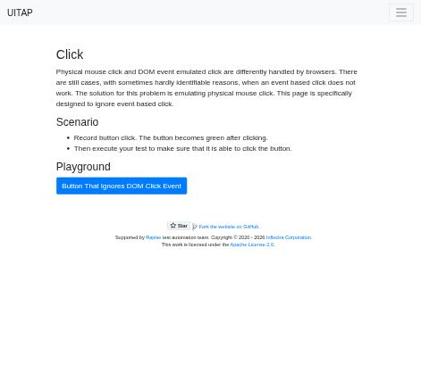
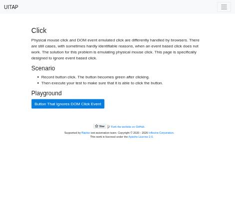
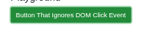

# Claude in Chrome · Click · round 2

**Goal met (read from the page): yes** (turned green) · claimed success · 4 tool calls · 24.8 s · $0.081

## 1. `tabs_context_mcp`

```json
{
  "createIfEmpty": true
}
```

```
{"availableTabs":[{"tabId":453241865,"title":"New Tab","url":"chrome://newtab/"}],"tabGroupId":1691377871}
```

## 2. `browser_batch`

```json
{
  "actions": [
    {
      "name": "navigate",
      "input": {
        "url": "http://127.0.0.1:40695/click",
        "tabId": 453241865
      }
    },
    {
      "name": "computer",
      "input": {
        "action": "screenshot",
        "tabId": 453241865,
        "scale": 0.5
      }
    }
  ]
}
```

```
[navigate] Navigated to http://127.0.0.1:40695/click
```

```
[computer:screenshot] Successfully captured screenshot (471x427, jpeg) - ID: ss_6355l31hx — 0.5-scale view; coordinate frame: 941x853.
```



## 3. `browser_batch`

```json
{
  "actions": [
    {
      "name": "computer",
      "input": {
        "action": "left_click",
        "coordinate": [
          271,
          415
        ],
        "tabId": 453241865
      }
    },
    {
      "name": "javascript_tool",
      "input": {
        "action": "javascript_exec",
        "text": "document.getElementById('badButton').className",
        "tabId": 453241865
      }
    },
    {
      "name": "computer",
      "input": {
        "action": "screenshot",
        "tabId": 453241865,
        "scale": 0.5
      }
    }
  ]
}
```

```
[computer:left_click] Clicked at (271, 415)
```

```
[javascript_tool:javascript_exec] btn btn-success
```

```
[computer:screenshot] Successfully captured screenshot (471x427, jpeg) - ID: ss_1348nn871 — 0.5-scale view; coordinate frame: 941x853.
```



## 4. `browser_batch`

```json
{
  "actions": [
    {
      "name": "computer",
      "input": {
        "action": "left_click",
        "coordinate": [
          700,
          600
        ],
        "tabId": 453241865
      }
    },
    {
      "name": "computer",
      "input": {
        "action": "zoom",
        "region": [
          100,
          380,
          500,
          450
        ],
        "tabId": 453241865,
        "scale": 0.6
      }
    },
    {
      "name": "javascript_tool",
      "input": {
        "action": "javascript_exec",
        "text": "const b=document.getElementById('badButton'); b.className + ' | ' + getComputedStyle(b).backgroundColor",
        "tabId": 453241865
      }
    }
  ]
}
```

```
[computer:left_click] Clicked at (700, 600)
```

```
[computer:zoom] Successfully captured zoomed screenshot of region (100,380) to (500,450) - 240x42 pixels
```

```
[javascript_tool:javascript_exec] btn btn-success | rgb(34, 141, 58)
```



## Final answer

```
I clicked the "Button That Ignores DOM Click Event" button with a real mouse click, and it turned green.

- **Class:** the button's class changed to `btn btn-success`.
- **Color:** its background color is now green (`rgb(34, 141, 58)`).
- **Screenshot:** a close-up confirms it. The first screenshot right after the click still showed it blue. It was probably taken before the page redrew.

RESULT: success
```
