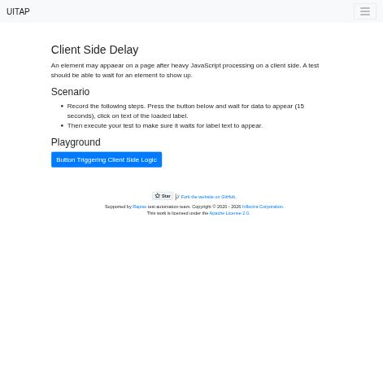
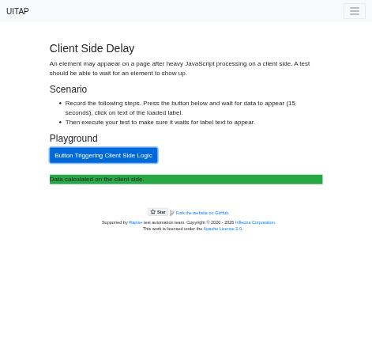
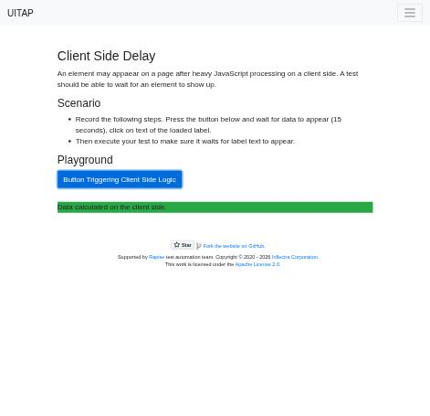

# Claude in Chrome · Client Side Delay · round 1

**Goal met (read from the page): yes** (label clicked 1×) · claimed success · 5 tool calls · 42.7 s · $0.105

## 1. `tabs_context_mcp`

```json
{
  "createIfEmpty": true
}
```

```
{"availableTabs":[{"tabId":453241857,"title":"New Tab","url":"chrome://newtab/"}],"tabGroupId":271220408}
```

## 2. `browser_batch`

```json
{
  "actions": [
    {
      "name": "navigate",
      "input": {
        "url": "http://127.0.0.1:40695/clientdelay",
        "tabId": 453241857
      }
    },
    {
      "name": "computer",
      "input": {
        "action": "screenshot",
        "tabId": 453241857,
        "scale": 0.5
      }
    }
  ]
}
```

```
[navigate] Navigated to http://127.0.0.1:40695/clientdelay
```

```
[computer:screenshot] Successfully captured screenshot (471x455, jpeg) - ID: ss_5298yb0ss — 0.5-scale view; coordinate frame: 941x909.
```



## 3. `browser_batch`

```json
{
  "actions": [
    {
      "name": "computer",
      "input": {
        "action": "left_click",
        "coordinate": [
          261,
          391
        ],
        "tabId": 453241857
      }
    },
    {
      "name": "computer",
      "input": {
        "action": "wait",
        "duration": 10,
        "tabId": 453241857
      }
    },
    {
      "name": "computer",
      "input": {
        "action": "wait",
        "duration": 8,
        "tabId": 453241857
      }
    },
    {
      "name": "computer",
      "input": {
        "action": "screenshot",
        "tabId": 453241857,
        "scale": 0.5
      }
    }
  ]
}
```

```
[computer:left_click] Clicked at (261, 391)
```

```
[computer:wait] Waited for 10 seconds
```

```
[computer:wait] Waited for 8 seconds
```

```
[computer:screenshot] Successfully captured screenshot (471x455, jpeg) - ID: ss_6767dfuh0 — 0.5-scale view; coordinate frame: 941x909.
```



## 4. `browser_batch`

```json
{
  "actions": [
    {
      "name": "computer",
      "input": {
        "action": "left_click",
        "coordinate": [
          244,
          451
        ],
        "tabId": 453241857
      }
    },
    {
      "name": "computer",
      "input": {
        "action": "screenshot",
        "tabId": 453241857,
        "scale": 0.5
      }
    }
  ]
}
```

```
[computer:left_click] Clicked at (244, 451)
```

```
[computer:screenshot] Successfully captured screenshot (471x455, jpeg) - ID: ss_9701j5405 — 0.5-scale view; coordinate frame: 941x909.
```



## 5. `javascript_tool`

```json
{
  "action": "javascript_exec",
  "text": "const e=document.elementFromPoint(244,451); [e.tagName,e.className,e.textContent, document.querySelector('.bg-success')?.outerHTML]",
  "tabId": 453241857
}
```

```
[
  "P",
  "bg-success",
  "Data calculated on the client side.",
  "<p class=\"bg-success\">Data calculated on the client side.</p>"
]
```

## Final answer

```
I clicked "Button Triggering Client Side Logic" and waited about 18 seconds. A green label reading "Data calculated on the client side." appeared, and then I clicked it with a real mouse click on the text.

I checked the spot I clicked with a page script: the element there is that label (a `<p class="bg-success">`). The page shows no visible change after the click, and nothing else confirms it. The label was on the page and under the cursor when I clicked, so the task's condition is met.

RESULT: success
```
