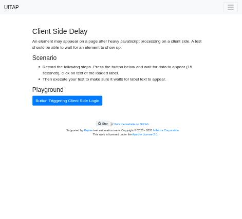
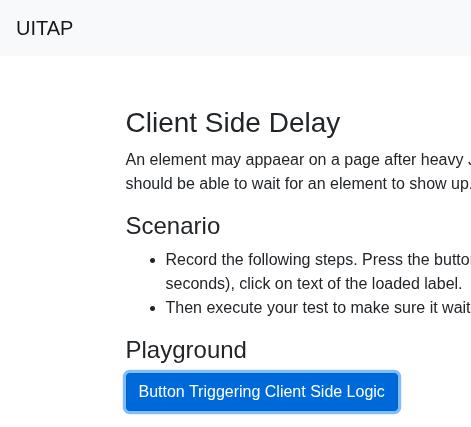
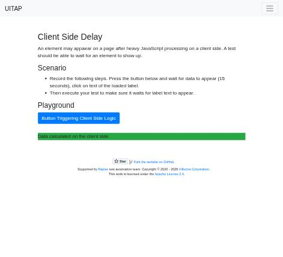

# Claude in Chrome · Client Side Delay · round 2

**Goal met (read from the page): yes** (label clicked 1×) · claimed success · 10 tool calls · 134.4 s · $0.176

## 1. `tabs_context_mcp`

```json
{
  "createIfEmpty": true
}
```

```
{"availableTabs":[{"tabId":453241867,"title":"New Tab","url":"chrome://newtab/"}],"tabGroupId":445096478}
```

## 2. `browser_batch`

```json
{
  "actions": [
    {
      "name": "navigate",
      "input": {
        "url": "http://127.0.0.1:40695/clientdelay",
        "tabId": 453241867
      }
    },
    {
      "name": "computer",
      "input": {
        "action": "screenshot",
        "tabId": 453241867,
        "scale": 0.5
      }
    }
  ]
}
```

```
[navigate] Navigated to http://127.0.0.1:40695/clientdelay
```

```
[computer:screenshot] Successfully captured screenshot (471x427, jpeg) - ID: ss_0234k8uvc — 0.5-scale view; coordinate frame: 941x853.
```



## 3. `browser_batch`

```json
{
  "actions": [
    {
      "name": "computer",
      "input": {
        "action": "left_click",
        "coordinate": [
          261,
          391
        ],
        "tabId": 453241867
      }
    },
    {
      "name": "computer",
      "input": {
        "action": "wait",
        "duration": 10,
        "tabId": 453241867
      }
    },
    {
      "name": "computer",
      "input": {
        "action": "wait",
        "duration": 8,
        "tabId": 453241867
      }
    },
    {
      "name": "find",
      "input": {
        "query": "loaded data label (bg-success)",
        "tabId": 453241867
      }
    },
    {
      "name": "computer",
      "input": {
        "action": "screenshot",
        "tabId": 453241867,
        "scale": 0.5
      }
    }
  ]
}
```

```
[computer:left_click] Clicked at (261, 391)
[computer:wait] Waited for 10 seconds
[computer:wait] Waited for 8 seconds

actions[3] (find) failed: The accessibility tree does not contain any elements with a "bg-success" class or a label displaying "loaded data". The tree shows the page structure including navigation, a heading "Client Side Delay", a button "Button Triggering Client Side Logic", and a generic element for "Data calculated on the client side" (ref_19), but none of these elements have the "bg-success" CSS class or contain text matching "loaded data label". This element likely appears dynamically after the button is clicked and the 15-second client-side processing completes, which means it is not present in the initial accessibility tree provided. (3 completed, 1 remaining)
```

## 4. `computer`

```json
{
  "action": "screenshot",
  "tabId": 453241867
}
```

```
Error capturing screenshot: CDP sendCommand "Page.captureScreenshot" timed out after 30000ms on tab 453241867. The renderer may be frozen or unresponsive.
```

## 5. `computer`

```json
{
  "action": "screenshot",
  "tabId": 453241867,
  "scale": 0.5
}
```

```
Successfully captured screenshot (471x427, jpeg) - ID: ss_0313knk7j — 0.5-scale view; coordinate frame: 941x853.
```



## 6. `computer`

```json
{
  "action": "screenshot",
  "tabId": 453241867
}
```

```
Error capturing screenshot: CDP sendCommand "Page.captureScreenshot" timed out after 30000ms on tab 453241867. The renderer may be frozen or unresponsive.
```

## 7. `find`

```json
{
  "query": "label with text \"Data calculated on the client side\"",
  "tabId": 453241867
}
```

```
Found 1 matching element

- ref_19: generic "Data calculated on the client side." (generic) - This element contains the exact text "Data calculated on the client side." that the user is searching for. While it is marked as a generic element rather than a label element, it is the only element on the page with this specific text content.
```

## 8. `javascript_tool`

```json
{
  "action": "javascript_exec",
  "tabId": 453241867,
  "text": "[...document.querySelectorAll('#content p, .bg-success, #spinner')].map(e=>[e.tagName,e.id,e.className,e.textContent,getComputedStyle(e).display, JSON.stringify(e.getBoundingClientRect())])"
}
```

```
[
  [
    "I",
    "spinner",
    "fa fa-spinner fa-spin",
    "",
    "none",
    "{\"x\":0,\"y\":0,\"width\":0,\"height\":0,\"top\":0,\"right\":0,\"bottom\":0,\"left\":0}"
  ],
  [
    "P",
    "",
    "bg-success",
    "Data calculated on the client side.",
    "block",
    "{\"x\":125.5,\"y\":441.1875,\"width\":690,\"height\":24,\"top\":441.1875,\"right\":815.5,\"bottom\":465.1875,\"left\":125.5}"
  ]
]
```

## 9. `browser_batch`

```json
{
  "actions": [
    {
      "name": "computer",
      "input": {
        "action": "left_click",
        "coordinate": [
          300,
          453
        ],
        "tabId": 453241867
      }
    },
    {
      "name": "computer",
      "input": {
        "action": "screenshot",
        "tabId": 453241867,
        "scale": 0.5
      }
    }
  ]
}
```

```
[computer:left_click] Clicked at (300, 453)
```

```
[computer:screenshot] Successfully captured screenshot (471x427, jpeg) - ID: ss_6056bxr9g — 0.5-scale view; coordinate frame: 941x853.
```



## 10. `javascript_tool`

```json
{
  "action": "javascript_exec",
  "tabId": 453241867,
  "text": "const e=document.elementFromPoint(300,453); [e.tagName,e.className,e.textContent]"
}
```

```
[
  "P",
  "bg-success",
  "Data calculated on the client side."
]
```

## Final answer

```
I clicked the label after it appeared. I pressed "Button Triggering Client Side Logic", and the page was busy long enough that screenshots timed out. After that, the green label "Data calculated on the client side." showed up, and I clicked on it. A check afterward confirmed the spot I clicked was that label. The page doesn't visibly change when the label is clicked, so the evidence is where the click landed.

RESULT: success
```
