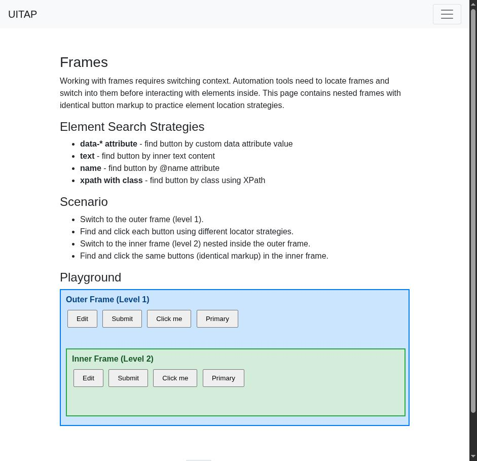
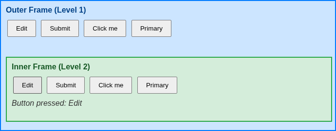

# Claude in Chrome · Frames · round 1

**Goal met (read from the page): yes** (inner "Button pressed: Edit", outer "") · claimed success · 3 tool calls · 16.3 s · $0.072

## 1. `tabs_context_mcp`

```json
{
  "createIfEmpty": true
}
```

```
{"availableTabs":[{"tabId":453241861,"title":"New Tab","url":"chrome://newtab/"}],"tabGroupId":2044096010}
```

## 2. `browser_batch`

```json
{
  "actions": [
    {
      "name": "navigate",
      "input": {
        "url": "http://127.0.0.1:40695/frames",
        "tabId": 453241861
      }
    },
    {
      "name": "computer",
      "input": {
        "action": "screenshot",
        "tabId": 453241861
      }
    }
  ]
}
```

```
[navigate] Navigated to http://127.0.0.1:40695/frames
```

```
[computer:screenshot] Successfully captured screenshot (941x909, jpeg) - ID: ss_9524r15ls
```



## 3. `browser_batch`

```json
{
  "actions": [
    {
      "name": "computer",
      "input": {
        "action": "left_click",
        "coordinate": [
          174,
          745
        ],
        "tabId": 453241861
      }
    },
    {
      "name": "computer",
      "input": {
        "action": "zoom",
        "region": [
          118,
          570,
          808,
          840
        ],
        "tabId": 453241861
      }
    }
  ]
}
```

```
[computer:left_click] Clicked at (174, 745)
```

```
[computer:zoom] Successfully captured zoomed screenshot of region (118,570) to (808,840) - 690x270 pixels
```



## Final answer

```
I clicked the Edit button in the inner frame (Level 2). The inner frame now shows "Button pressed: Edit". The outer frame (Level 1) shows no pressed message, so its Edit button wasn't triggered.

RESULT: success
```
