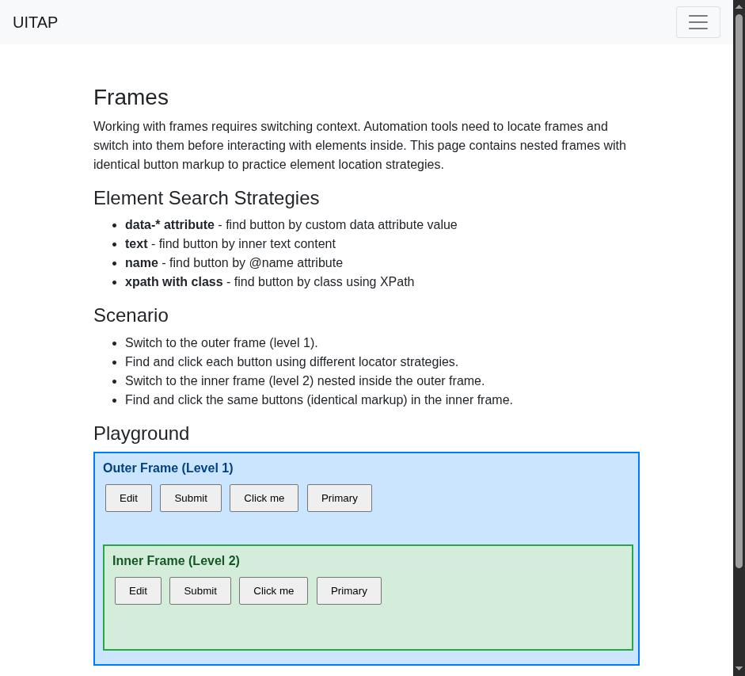
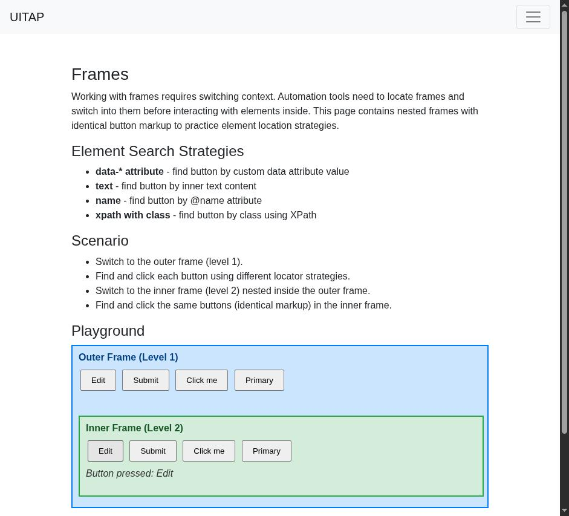

# Claude in Chrome · Frames · round 2

**Goal met (read from the page): yes** (inner "Button pressed: Edit", outer "") · claimed success · 3 tool calls · 18.5 s · $0.073

## 1. `tabs_context_mcp`

```json
{
  "createIfEmpty": true
}
```

```
{"availableTabs":[{"tabId":453241871,"title":"New Tab","url":"chrome://newtab/"}],"tabGroupId":988922270}
```

## 2. `browser_batch`

```json
{
  "actions": [
    {
      "name": "navigate",
      "input": {
        "url": "http://127.0.0.1:40695/frames",
        "tabId": 453241871
      }
    },
    {
      "name": "computer",
      "input": {
        "action": "screenshot",
        "tabId": 453241871
      }
    }
  ]
}
```

```
[navigate] Navigated to http://127.0.0.1:40695/frames
```

```
[computer:screenshot] Successfully captured screenshot (941x853, jpeg) - ID: ss_529724kof
```



## 3. `browser_batch`

```json
{
  "actions": [
    {
      "name": "computer",
      "input": {
        "action": "left_click",
        "coordinate": [
          174,
          745
        ],
        "tabId": 453241871
      }
    },
    {
      "name": "computer",
      "input": {
        "action": "screenshot",
        "tabId": 453241871
      }
    }
  ]
}
```

```
[computer:left_click] Clicked at (174, 745)
```

```
[computer:screenshot] Successfully captured screenshot (941x853, jpeg) - ID: ss_8223vhfrw
```



## Final answer

```
I clicked the Edit button in the inner frame (level 2). The inner frame now says "Button pressed: Edit". The outer frame (level 1) shows no "Button pressed" message, so its Edit button wasn't pressed. I checked this from a screenshot only, not by reading the page code inside the frames.

RESULT: success
```
