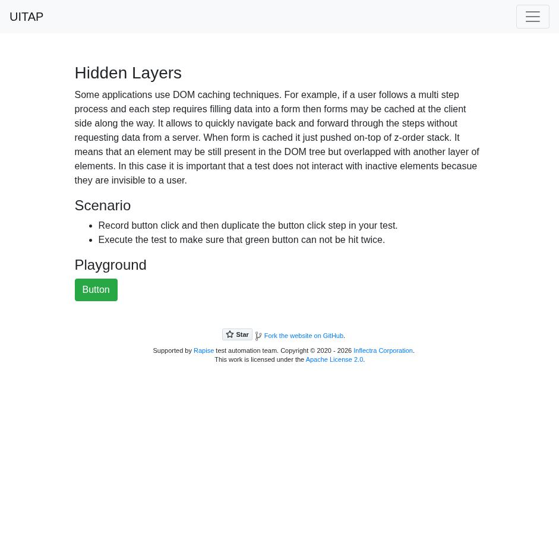
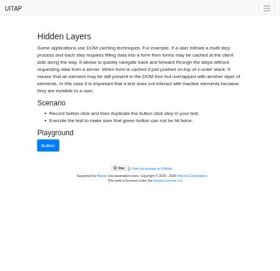
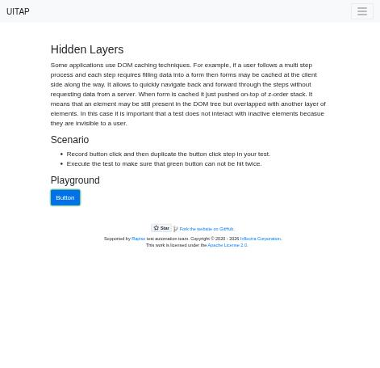

# Claude in Chrome · Hidden Layers · round 1

**Goal met (read from the page): yes** (green pressed 1×) · claimed success · 5 tool calls · 25.6 s · $0.141

## 1. `tabs_context_mcp`

```json
{
  "createIfEmpty": true
}
```

```
{"availableTabs":[{"tabId":453241852,"title":"New Tab","url":"chrome://newtab/"}],"tabGroupId":1277004405}
```

## 2. `browser_batch`

```json
{
  "actions": [
    {
      "name": "navigate",
      "input": {
        "url": "http://127.0.0.1:40695/hiddenlayers",
        "tabId": 453241852
      }
    },
    {
      "name": "computer",
      "input": {
        "action": "screenshot",
        "tabId": 453241852
      }
    }
  ]
}
```

```
[navigate] Navigated to http://127.0.0.1:40695/hiddenlayers
```

```
[computer:screenshot] Successfully captured screenshot (941x909, jpeg) - ID: ss_685325l4j
```



## 3. `javascript_tool`

```json
{
  "action": "javascript_exec",
  "tabId": 453241852,
  "text": "window.__clicks=[];document.addEventListener('click',e=>window.__clicks.push({id:e.target.id,cls:e.target.className,text:e.target.textContent.trim()}),true);document.querySelector('#greenButton')?.outerHTML"
}
```

```
<button class="btn btn-success" type="button" id="greenButton">Button</button>
```

## 4. `computer`

```json
{
  "action": "left_click",
  "coordinate": [
    161,
    487
  ],
  "tabId": 453241852
}
```

```
Clicked at (161, 487)
```

## 5. `browser_batch`

```json
{
  "actions": [
    {
      "name": "computer",
      "input": {
        "action": "screenshot",
        "tabId": 453241852,
        "scale": 0.5
      }
    },
    {
      "name": "javascript_tool",
      "input": {
        "action": "javascript_exec",
        "tabId": 453241852,
        "text": "const el=document.elementFromPoint(161,487); JSON.stringify({clicks:window.__clicks, top:el.outerHTML})"
      }
    },
    {
      "name": "computer",
      "input": {
        "action": "left_click",
        "coordinate": [
          161,
          487
        ],
        "tabId": 453241852
      }
    },
    {
      "name": "javascript_tool",
      "input": {
        "action": "javascript_exec",
        "tabId": 453241852,
        "text": "JSON.stringify(window.__clicks)"
      }
    },
    {
      "name": "computer",
      "input": {
        "action": "screenshot",
        "tabId": 453241852,
        "scale": 0.5
      }
    }
  ]
}
```

```
[computer:screenshot] Successfully captured screenshot (471x455, jpeg) - ID: ss_81478kse8 — 0.5-scale view; coordinate frame: 941x909.
```

```
[javascript_tool:javascript_exec] {"clicks":[{"id":"greenButton","cls":"btn btn-success","text":"Button"}],"top":"<button type=\"button\" class=\"btn btn-primary\" id=\"blueButton\">Button</button>"}
```

```
[computer:left_click] Clicked at (161, 487)
```

```
[javascript_tool:javascript_exec] [{"id":"greenButton","cls":"btn btn-success","text":"Button"},{"id":"blueButton","cls":"btn btn-primary","text":"Button"}]
```

```
[computer:screenshot] Successfully captured screenshot (471x455, jpeg) - ID: ss_82851gmuo — 0.5-scale view; coordinate frame: 941x909.
```





## Final answer

```
The green button was pressed exactly once.

1. **First press:** I clicked the green button. A click listener I added to the page recorded that the click landed on `#greenButton`.
2. **After that press:** A blue button (`#blueButton`) appeared right on top of the green one. I checked which element is on top at that spot, and it's the blue button. The green button is still on the page, just hidden under it.
3. **Second press:** I clicked the same spot again. The listener recorded that this click landed on `#blueButton`, not the green button.

The green button didn't register a second click, so the page did what the scenario asks.

RESULT: success
```
