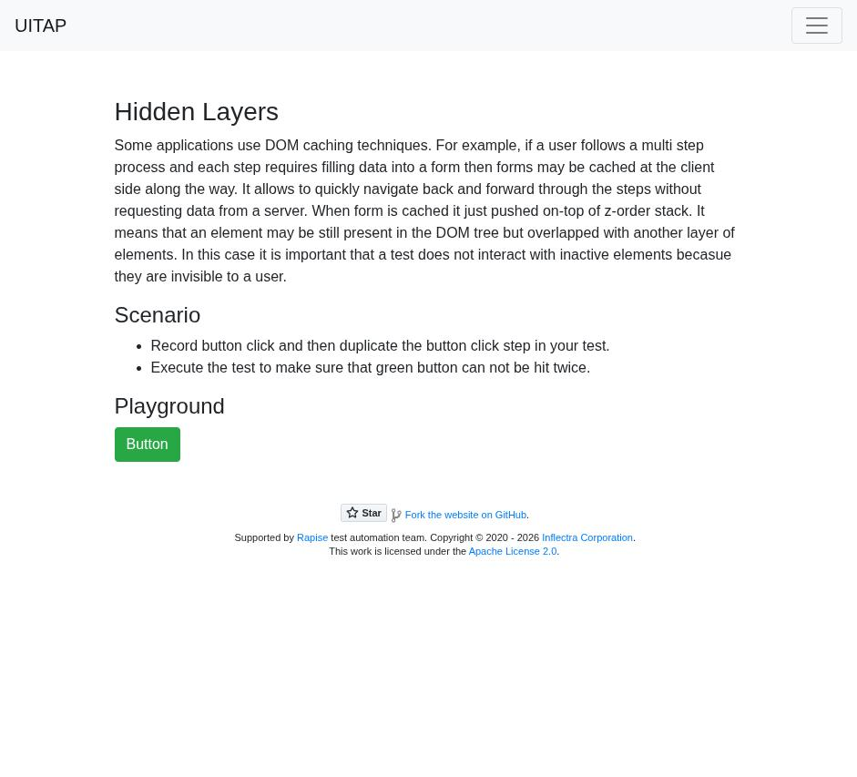
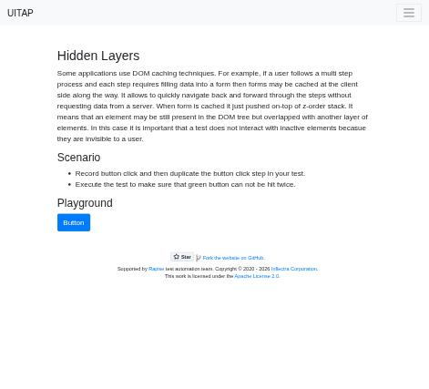

# Claude in Chrome · Hidden Layers · round 2

**Goal met (read from the page): yes** (green pressed 1×) · claimed success · 4 tool calls · 23.8 s · $0.090

## 1. `tabs_context_mcp`

```json
{
  "createIfEmpty": true
}
```

```
{"availableTabs":[{"tabId":453241862,"title":"New Tab","url":"chrome://newtab/"}],"tabGroupId":1414451779}
```

## 2. `browser_batch`

```json
{
  "actions": [
    {
      "name": "navigate",
      "input": {
        "url": "http://127.0.0.1:40695/hiddenlayers",
        "tabId": 453241862
      }
    },
    {
      "name": "computer",
      "input": {
        "action": "screenshot",
        "tabId": 453241862
      }
    }
  ]
}
```

```
[navigate] Navigated to http://127.0.0.1:40695/hiddenlayers
```

```
[computer:screenshot] Successfully captured screenshot (941x853, jpeg) - ID: ss_2812bp7f4
```



## 3. `javascript_tool`

```json
{
  "action": "javascript_exec",
  "text": "window.__hits=[]; document.addEventListener('click',e=>window.__hits.push(e.target.id+'|'+e.target.className),true); [...document.querySelectorAll('button')].map(b=>b.id+'|'+b.className).join('\\n')",
  "tabId": 453241862
}
```

```
|navbar-toggler
greenButton|btn btn-success
```

## 4. `browser_batch`

```json
{
  "actions": [
    {
      "name": "computer",
      "input": {
        "action": "left_click",
        "coordinate": [
          161,
          487
        ],
        "tabId": 453241862
      }
    },
    {
      "name": "computer",
      "input": {
        "action": "screenshot",
        "tabId": 453241862,
        "scale": 0.5
      }
    },
    {
      "name": "computer",
      "input": {
        "action": "left_click",
        "coordinate": [
          161,
          487
        ],
        "tabId": 453241862
      }
    },
    {
      "name": "javascript_tool",
      "input": {
        "action": "javascript_exec",
        "text": "JSON.stringify(window.__hits)+' '+[...document.querySelectorAll('button')].map(b=>b.id+'|'+b.className).join(';')",
        "tabId": 453241862
      }
    }
  ]
}
```

```
[computer:left_click] Clicked at (161, 487)
```

```
[computer:screenshot] Successfully captured screenshot (471x427, jpeg) - ID: ss_2791vv32t — 0.5-scale view; coordinate frame: 941x853.
```

```
[computer:left_click] Clicked at (161, 487)
```

```
[javascript_tool:javascript_exec] ["greenButton|btn btn-success","blueButton|btn btn-primary"] |navbar-toggler;greenButton|btn btn-success;blueButton|btn btn-primary
```



## Final answer

```
The green button was pressed exactly once.

1. **First press:** I clicked the green button (`greenButton`). A click listener I added to the page recorded that it got the click. After that, the page put a blue button (`blueButton`) on top of the green one.
2. **Second press:** I clicked the same spot again. The click went to the blue button, not the green one. The green button is still on the page, but it's covered and can't be clicked.

Click log: `["greenButton", "blueButton"]`.

RESULT: success
```
