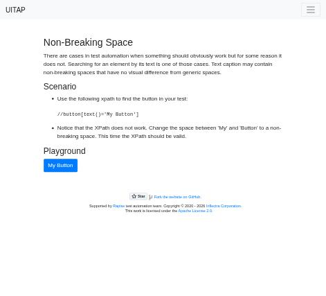

# Claude in Chrome · Non-Breaking Space · round 1

**Goal met (read from the page): yes** (My Button clicked 1×) · claimed success · 3 tool calls · 20.6 s · $0.075

## 1. `tabs_context_mcp`

```json
{
  "createIfEmpty": true
}
```

```
{"availableTabs":[{"tabId":453241858,"title":"New Tab","url":"chrome://newtab/"}],"tabGroupId":1564990012}
```

## 2. `browser_batch`

```json
{
  "actions": [
    {
      "name": "navigate",
      "input": {
        "url": "http://127.0.0.1:40695/nbsp",
        "tabId": 453241858
      }
    },
    {
      "name": "read_page",
      "input": {
        "tabId": 453241858,
        "filter": "all"
      }
    },
    {
      "name": "computer",
      "input": {
        "action": "screenshot",
        "tabId": 453241858,
        "scale": 0.5
      }
    }
  ]
}
```

```
[navigate] Navigated to http://127.0.0.1:40695/nbsp
```

```
[read_page] navigation [ref_1]
 link "UITAP" [ref_2] href="/"
 button "Toggle navigation" [ref_3] type="button"
 list [ref_4]
  listitem [ref_5]
   link "Home" [ref_6] href="/home"
  listitem [ref_7]
   link "Resources" [ref_8] href="/resources"
region [ref_9]
 heading "Non-Breaking Space" [ref_10]
 generic "There are cases in test automation when something should obviously work but for some reason it does " [ref_11]
 heading "Scenario" [ref_12]
 list [ref_13]
  listitem "Use the following xpath to find the button in your test:" [ref_14]
   generic "//button[text()='My Button']" [ref_15]
  listitem "Notice that the XPath does not work. Change the space between 'My' and 'Button' to a non-breaking sp" [ref_16]
 heading "Playground" [ref_17]
 button "My Button" [ref_18] type="button"
contentinfo [ref_19]
 link "Fork the website on GitHub" [ref_20] href="https://github.com/inflectra/ui-test-automation-playground"
 generic "Supported by test automation team. Copyright © 2020 - 2026 ." [ref_21]
  link "Rapise" [ref_22] href="https://www.inflectra.com/Rapise/"
  link "Inflectra Corporation" [ref_23] href="https://www.inflectra.com/"
 generic "This work is licensed under the ." [ref_24]
  link "Apache License 2.0" [ref_25] href="https://www.apache.org/licenses/LICENSE-2.0"

Viewport: 941x853
```

```
[computer:screenshot] Successfully captured screenshot (471x427, jpeg) - ID: ss_0208xx3i4 — 0.5-scale view; coordinate frame: 941x853.
```



## 3. `browser_batch`

```json
{
  "actions": [
    {
      "name": "javascript_tool",
      "input": {
        "action": "javascript_exec",
        "tabId": 453241858,
        "text": "window.__c=0; const b=[...document.querySelectorAll('button')].find(x=>x.textContent.replace(/\u00a0/g,' ').trim()==='My Button'); b.addEventListener('click',()=>window.__c++); JSON.stringify(b.textContent)"
      }
    },
    {
      "name": "computer",
      "input": {
        "action": "left_click",
        "ref": "ref_18",
        "tabId": 453241858
      }
    },
    {
      "name": "javascript_tool",
      "input": {
        "action": "javascript_exec",
        "tabId": 453241858,
        "text": "window.__c"
      }
    }
  ]
}
```

```
[javascript_tool:javascript_exec] "My Button"
```

```
[computer:left_click] Clicked on element ref_18
```

```
[javascript_tool:javascript_exec] 1
```

## Final answer

```
I clicked "My Button" on the page, and the click went through. The button doesn't change anything visible when clicked, so before clicking I attached a click counter to it with JavaScript. After the click, the counter read 1.

As the page's title suggests, the space in the button's label is a non-breaking space rather than a normal one. That's why the page says an XPath search for the exact text `My Button` fails. I found the button through the page's accessibility tree instead, where its name reads "My Button".

RESULT: success
```
