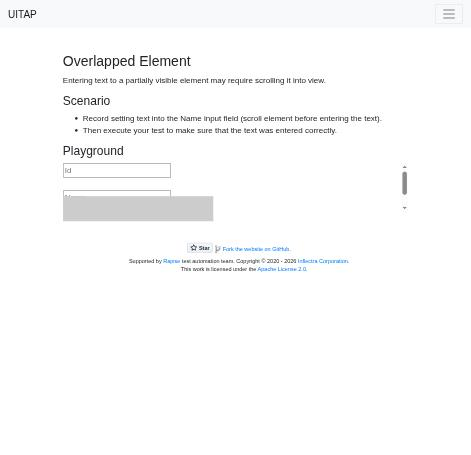
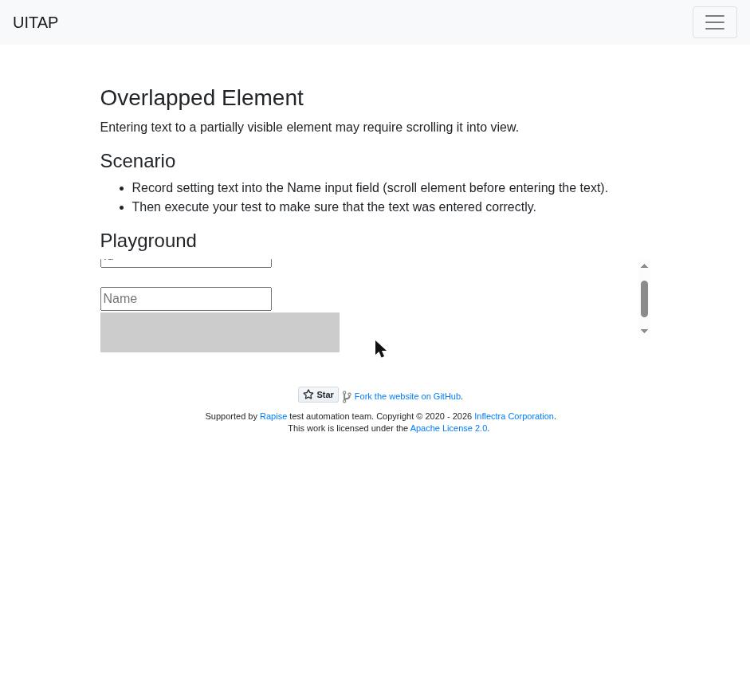
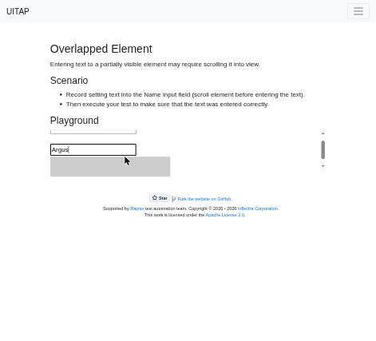

# Claude in Chrome · Overlapped · round 1

**Goal met (read from the page): yes** (name = "Argus") · claimed success · 4 tool calls · 23.7 s · $0.100

## 1. `tabs_context_mcp`

```json
{
  "createIfEmpty": true
}
```

```
{"availableTabs":[{"tabId":453241853,"title":"New Tab","url":"chrome://newtab/"}],"tabGroupId":513866102}
```

## 2. `browser_batch`

```json
{
  "actions": [
    {
      "name": "navigate",
      "input": {
        "url": "http://127.0.0.1:40695/overlapped",
        "tabId": 453241853
      }
    },
    {
      "name": "computer",
      "input": {
        "action": "screenshot",
        "tabId": 453241853,
        "scale": 0.5
      }
    },
    {
      "name": "read_page",
      "input": {
        "tabId": 453241853,
        "filter": "interactive"
      }
    }
  ]
}
```

```
[navigate] Navigated to http://127.0.0.1:40695/overlapped
```

```
[computer:screenshot] Successfully captured screenshot (471x455, jpeg) - ID: ss_32345p15h — 0.5-scale view; coordinate frame: 941x909.
```

```
[read_page] link "UITAP" [ref_1] href="/"
button "Toggle navigation" [ref_2] type="button"
textbox "Id" [ref_3] type="text" placeholder="Id"
textbox "Name" [ref_4] type="text" placeholder="Name"
textbox "Subject" [ref_5] type="text" placeholder="Subject"
link "Fork the website on GitHub" [ref_6] href="https://github.com/inflectra/ui-test-automation-playground"
link "Rapise" [ref_7] href="https://www.inflectra.com/Rapise/"
link "Inflectra Corporation" [ref_8] href="https://www.inflectra.com/"
link "Apache License 2.0" [ref_9] href="https://www.apache.org/licenses/LICENSE-2.0"

Viewport: 941x909
```



## 3. `browser_batch`

```json
{
  "actions": [
    {
      "name": "computer",
      "input": {
        "action": "scroll_to",
        "ref": "ref_4",
        "tabId": 453241853
      }
    },
    {
      "name": "computer",
      "input": {
        "action": "screenshot",
        "tabId": 453241853
      }
    }
  ]
}
```

```
[computer:scroll_to] Scrolled to element with reference: ref_4
```

```
[computer:screenshot] Successfully captured screenshot (941x853, jpeg) - ID: ss_6008tpt3n
```



## 4. `browser_batch`

```json
{
  "actions": [
    {
      "name": "computer",
      "input": {
        "action": "triple_click",
        "coordinate": [
          232,
          374
        ],
        "tabId": 453241853
      }
    },
    {
      "name": "computer",
      "input": {
        "action": "type",
        "text": "Argus",
        "tabId": 453241853
      }
    },
    {
      "name": "javascript_tool",
      "input": {
        "action": "javascript_exec",
        "text": "[...document.querySelectorAll('input')].map(i=>i.placeholder+'='+JSON.stringify(i.value)).join(', ')",
        "tabId": 453241853
      }
    },
    {
      "name": "computer",
      "input": {
        "action": "screenshot",
        "tabId": 453241853,
        "scale": 0.5
      }
    }
  ]
}
```

```
[computer:triple_click] Triple-clicked at (232, 374)
```

```
[computer:type] Typed "Argus"
```

```
[javascript_tool:javascript_exec] Id="", Name="Argus", Subject=""
```

```
[computer:screenshot] Successfully captured screenshot (471x427, jpeg) - ID: ss_1856zui5a — 0.5-scale view; coordinate frame: 941x853.
```



## Final answer

```
The Name field now holds exactly "Argus". A grey box was partly covering the field, so I scrolled it into view before clicking and typing. Afterwards I read the values straight from the page: Name is "Argus", and the Id and Subject fields are still empty.

RESULT: success
```
