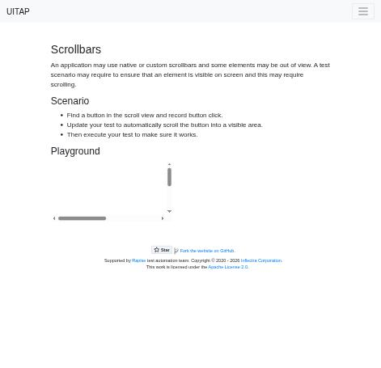
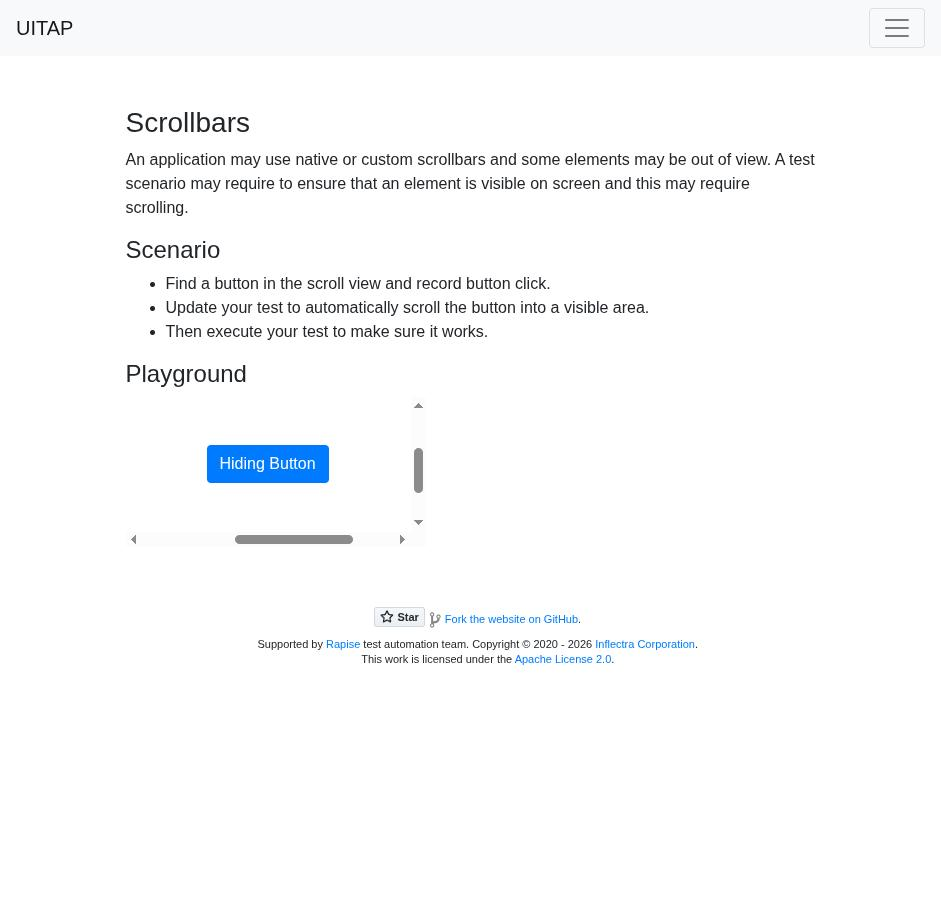

# Claude in Chrome · Scrollbars · round 1

**Goal met (read from the page): yes** (hidden button clicked 1×) · claimed success · 4 tool calls · 25.9 s · $0.096

## 1. `tabs_context_mcp`

```json
{
  "createIfEmpty": true
}
```

```
{"availableTabs":[{"tabId":453241859,"title":"New Tab","url":"chrome://newtab/"}],"tabGroupId":202720333}
```

## 2. `browser_batch`

```json
{
  "actions": [
    {
      "name": "navigate",
      "input": {
        "url": "http://127.0.0.1:40695/scrollbars",
        "tabId": 453241859
      }
    },
    {
      "name": "find",
      "input": {
        "query": "button inside scrollable area",
        "tabId": 453241859
      }
    },
    {
      "name": "computer",
      "input": {
        "action": "screenshot",
        "tabId": 453241859,
        "scale": 0.5
      }
    }
  ]
}
```

```
[navigate] Navigated to http://127.0.0.1:40695/scrollbars
```

```
[find] Found 1 matching element

- ref_20: button "Hiding Button" (button) - This button is located inside a table [ref_19] which is contained within a scrollable region [ref_10] labeled "Playground", matching the query for "button inside scrollable area"
```

```
[computer:screenshot] Successfully captured screenshot (471x455, jpeg) - ID: ss_21136jbsa — 0.5-scale view; coordinate frame: 941x909.
```



## 3. `browser_batch`

```json
{
  "actions": [
    {
      "name": "computer",
      "input": {
        "action": "scroll_to",
        "ref": "ref_20",
        "tabId": 453241859
      }
    },
    {
      "name": "computer",
      "input": {
        "action": "screenshot",
        "tabId": 453241859
      }
    }
  ]
}
```

```
[computer:scroll_to] Scrolled to element with reference: ref_20
```

```
[computer:screenshot] Successfully captured screenshot (941x909, jpeg) - ID: ss_7895xcpsq
```



## 4. `browser_batch`

```json
{
  "actions": [
    {
      "name": "javascript_tool",
      "input": {
        "action": "javascript_exec",
        "tabId": 453241859,
        "text": "window.__clicked=0; document.getElementById('hidingButton')?.addEventListener('click',()=>window.__clicked++); [...document.querySelectorAll('button')].map(b=>b.id+':'+b.textContent)"
      }
    },
    {
      "name": "computer",
      "input": {
        "action": "left_click",
        "coordinate": [
          267,
          463
        ],
        "tabId": 453241859
      }
    },
    {
      "name": "javascript_tool",
      "input": {
        "action": "javascript_exec",
        "tabId": 453241859,
        "text": "window.__clicked"
      }
    }
  ]
}
```

```
[javascript_tool:javascript_exec] [
  ":",
  "hidingButton:Hiding Button"
]
```

```
[computer:left_click] Clicked at (267, 463)
```

```
[javascript_tool:javascript_exec] 1
```

## Final answer

```
I clicked the "Hiding Button". It was out of sight inside the scrollable "Playground" box, so I scrolled it into view first, then clicked it with the mouse.

The page shows nothing when the button is clicked. To confirm the click happened, I added a small click counter to the button (`#hidingButton`) just before clicking. It went up to 1, so the button got the click.

RESULT: success
```
