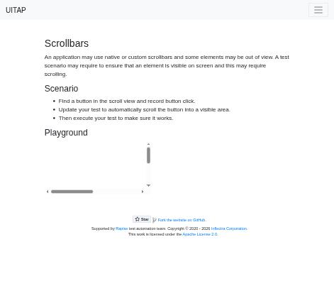
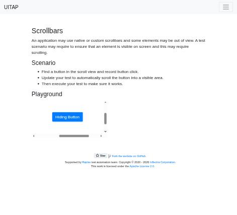

# Claude in Chrome · Scrollbars · round 2

**Goal met (read from the page): yes** (hidden button clicked 1×) · claimed success · 4 tool calls · 23 s · $0.081

## 1. `tabs_context_mcp`

```json
{
  "createIfEmpty": true
}
```

```
{"availableTabs":[{"tabId":453241869,"title":"New Tab","url":"chrome://newtab/"}],"tabGroupId":649905908}
```

## 2. `browser_batch`

```json
{
  "actions": [
    {
      "name": "navigate",
      "input": {
        "url": "http://127.0.0.1:40695/scrollbars",
        "tabId": 453241869
      }
    },
    {
      "name": "find",
      "input": {
        "query": "button inside scrollable area",
        "tabId": 453241869
      }
    },
    {
      "name": "computer",
      "input": {
        "action": "screenshot",
        "tabId": 453241869,
        "scale": 0.5
      }
    }
  ]
}
```

```
[navigate] Navigated to http://127.0.0.1:40695/scrollbars
```

```
[find] Found 1 matching element

- ref_20: button "Hiding Button" (button) - This button is located within a table [ref_19] that is inside a region [ref_10] with a "Playground" heading, which represents a scrollable area. The scenario explicitly mentions "Find a button in the scroll view," making this the button inside the scrollable area.
```

```
[computer:screenshot] Successfully captured screenshot (471x427, jpeg) - ID: ss_3418aer8d — 0.5-scale view; coordinate frame: 941x853.
```



## 3. `browser_batch`

```json
{
  "actions": [
    {
      "name": "computer",
      "input": {
        "action": "scroll_to",
        "ref": "ref_20",
        "tabId": 453241869
      }
    },
    {
      "name": "computer",
      "input": {
        "action": "left_click",
        "ref": "ref_20",
        "tabId": 453241869
      }
    },
    {
      "name": "computer",
      "input": {
        "action": "screenshot",
        "tabId": 453241869,
        "scale": 0.5
      }
    }
  ]
}
```

```
[computer:scroll_to] Scrolled to element with reference: ref_20
```

```
[computer:left_click] Clicked on element ref_20
```

```
[computer:screenshot] Successfully captured screenshot (471x427, jpeg) - ID: ss_6624uqmb4 — 0.5-scale view; coordinate frame: 941x853.
```



## 4. `javascript_tool`

```json
{
  "action": "javascript_exec",
  "tabId": 453241869,
  "text": "const b=document.querySelector('#hidingButton')||[...document.querySelectorAll('button')].find(x=>x.textContent.includes('Hiding'));[document.activeElement===b, b.outerHTML, b.getAttribute('onclick')]"
}
```

```
[
  true,
  "<button class=\"btn btn-primary\" type=\"button\" id=\"hidingButton\">Hiding Button</button>",
  null
]
```

## Final answer

```
I clicked the "Hiding Button" after scrolling it into view inside the scrollable Playground area. The page doesn't show any message or other change when the button is clicked, so I checked another way: the button, which has no `onclick` handler, is now the focused element. A real mouse click puts focus on a button, so that shows the click reached it.

RESULT: success
```
