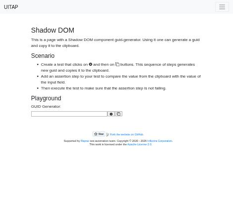
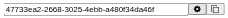

# Claude in Chrome · Shadow DOM · round 1

**Goal met (read from the page): yes** (field "47733ea2-2668-3025-4ebb-a480f34da46f", reported 47733ea2-2668-3025-4ebb-a480f34da46f) · claimed success · 3 tool calls · 18.2 s · $0.069

## 1. `tabs_context_mcp`

```json
{
  "createIfEmpty": true
}
```

```
{"availableTabs":[{"tabId":453241860,"title":"New Tab","url":"chrome://newtab/"}],"tabGroupId":6304622}
```

## 2. `browser_batch`

```json
{
  "actions": [
    {
      "name": "navigate",
      "input": {
        "url": "http://127.0.0.1:40695/shadowdom",
        "tabId": 453241860
      }
    },
    {
      "name": "computer",
      "input": {
        "action": "screenshot",
        "tabId": 453241860,
        "scale": 0.5
      }
    }
  ]
}
```

```
[navigate] Navigated to http://127.0.0.1:40695/shadowdom
```

```
[computer:screenshot] Successfully captured screenshot (471x427, jpeg) - ID: ss_6983afzdi — 0.5-scale view; coordinate frame: 941x853.
```



## 3. `browser_batch`

```json
{
  "actions": [
    {
      "name": "computer",
      "input": {
        "action": "left_click",
        "coordinate": [
          448,
          460
        ],
        "tabId": 453241860
      }
    },
    {
      "name": "javascript_tool",
      "input": {
        "action": "javascript_exec",
        "text": "const h=document.querySelector('guid-generator'); const r=h&&h.shadowRoot; r? [...r.querySelectorAll('input')].map(i=>i.id+':'+i.value) : [...document.querySelectorAll('*')].filter(e=>e.shadowRoot).map(e=>e.tagName+':'+[...e.shadowRoot.querySelectorAll('input')].map(i=>i.value))",
        "tabId": 453241860
      }
    },
    {
      "name": "computer",
      "input": {
        "action": "zoom",
        "region": [
          120,
          445,
          500,
          475
        ],
        "tabId": 453241860,
        "scale": 0.6
      }
    }
  ]
}
```

```
[computer:left_click] Clicked at (448, 460)
```

```
[javascript_tool:javascript_exec] [
  "editField:47733ea2-2668-3025-4ebb-a480f34da46f"
]
```

```
[computer:zoom] Successfully captured zoomed screenshot of region (120,445) to (500,475) - 228x18 pixels
```



## Final answer

```
I clicked the gear button in the GUID generator, and it filled the field with a new GUID. I checked the value by reading the input inside the component's shadow DOM, and the field on screen shows the same value.

GUID: 47733ea2-2668-3025-4ebb-a480f34da46f

RESULT: success
```
