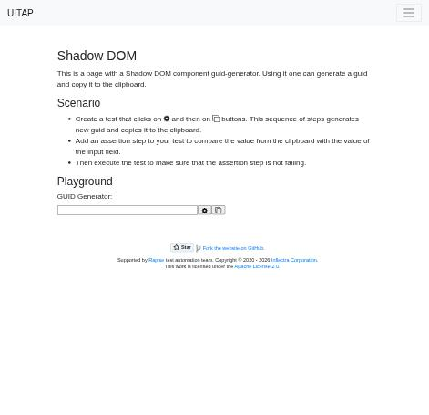
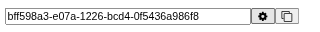

# Claude in Chrome · Shadow DOM · round 2

**Goal met (read from the page): yes** (field "bff598a3-e07a-1226-bcd4-0f5436a986f8", reported bff598a3-e07a-1226-bcd4-0f5436a986f8) · claimed success · 4 tool calls · 51.6 s · $0.077

## 1. `tabs_context_mcp`

```json
{
  "createIfEmpty": true
}
```

```
{"availableTabs":[{"tabId":453241870,"title":"New Tab","url":"chrome://newtab/"}],"tabGroupId":1770034021}
```

## 2. `browser_batch`

```json
{
  "actions": [
    {
      "name": "navigate",
      "input": {
        "url": "http://127.0.0.1:40695/shadowdom",
        "tabId": 453241870
      }
    },
    {
      "name": "computer",
      "input": {
        "action": "screenshot",
        "tabId": 453241870,
        "scale": 0.5
      }
    }
  ]
}
```

```
[navigate] Navigated to http://127.0.0.1:40695/shadowdom
```

```
[computer:screenshot] Successfully captured screenshot (471x455, jpeg) - ID: ss_9977bfg19 — 0.5-scale view; coordinate frame: 941x909.
```



## 3. `browser_batch`

```json
{
  "actions": [
    {
      "name": "computer",
      "input": {
        "action": "left_click",
        "coordinate": [
          448,
          460
        ],
        "tabId": 453241870
      }
    },
    {
      "name": "javascript_tool",
      "input": {
        "action": "javascript_exec",
        "text": "const h=document.querySelector('guid-generator'); const r=h&&h.shadowRoot; r? [...r.querySelectorAll('input')].map(i=>i.value) : [...document.querySelectorAll('*')].filter(e=>e.shadowRoot).map(e=>e.tagName)",
        "tabId": 453241870
      }
    },
    {
      "name": "computer",
      "input": {
        "action": "zoom",
        "region": [
          120,
          440,
          520,
          480
        ],
        "tabId": 453241870,
        "scale": 0.8
      }
    }
  ]
}
```

```
[computer:left_click] Clicked at (448, 460)
[javascript_tool:javascript_exec] [
  "bff598a3-e07a-1226-bcd4-0f5436a986f8"
]

actions[2] (computer:zoom) failed: Error capturing zoomed screenshot: CDP sendCommand "Page.captureScreenshot" timed out after 30000ms on tab 453241870. The renderer may be frozen or unresponsive. (2 completed, 0 remaining)
```

## 4. `computer`

```json
{
  "action": "zoom",
  "region": [
    120,
    440,
    520,
    480
  ],
  "tabId": 453241870,
  "scale": 0.8
}
```

```
Successfully captured zoomed screenshot of region (120,440) to (520,480) - 320x32 pixels
```



## Final answer

```
I clicked the gear button and it put a GUID into the generator's field. I checked the value two ways: by reading the input inside the shadow DOM, and in a zoomed screenshot of the field. Both showed the same value.

One zoomed screenshot attempt timed out once, but the retry worked.

GUID: bff598a3-e07a-1226-bcd4-0f5436a986f8

RESULT: success
```
