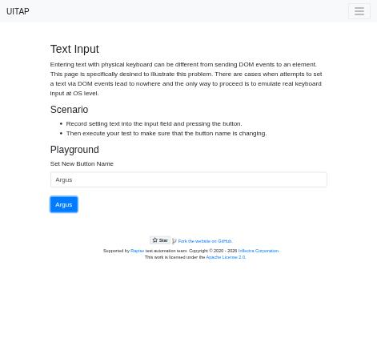

# Claude in Chrome · Text Input · round 1

**Goal met (read from the page): yes** (button reads "Argus") · claimed success · 3 tool calls · 20.6 s · $0.067

## 1. `tabs_context_mcp`

```json
{
  "createIfEmpty": true
}
```

```
{"availableTabs":[{"tabId":453241856,"title":"New Tab","url":"chrome://newtab/"}],"tabGroupId":319883692}
```

## 2. `browser_batch`

```json
{
  "actions": [
    {
      "name": "navigate",
      "input": {
        "url": "http://127.0.0.1:40695/textinput",
        "tabId": 453241856
      }
    },
    {
      "name": "find",
      "input": {
        "query": "text input field and button",
        "tabId": 453241856
      }
    }
  ]
}
```

```
[navigate] Navigated to http://127.0.0.1:40695/textinput
```

```
[find] Found 2 matching elements

- ref_20: textbox "MyButton" (text) - This is a text input field with type="text" that matches the user's search for "text input field"
- ref_21: button "Button That Should Change it's Name Based on Input Value" (button) - This is a button element that matches the user's search for "button"
```

## 3. `browser_batch`

```json
{
  "actions": [
    {
      "name": "computer",
      "input": {
        "action": "left_click",
        "ref": "ref_20",
        "tabId": 453241856
      }
    },
    {
      "name": "computer",
      "input": {
        "action": "type",
        "text": "Argus",
        "tabId": 453241856
      }
    },
    {
      "name": "computer",
      "input": {
        "action": "left_click",
        "ref": "ref_21",
        "tabId": 453241856
      }
    },
    {
      "name": "javascript_tool",
      "input": {
        "action": "javascript_exec",
        "text": "[...document.querySelectorAll('button')].map(b=>b.textContent)",
        "tabId": 453241856
      }
    },
    {
      "name": "computer",
      "input": {
        "action": "screenshot",
        "scale": 0.5,
        "tabId": 453241856
      }
    }
  ]
}
```

```
[computer:left_click] Clicked on element ref_20
```

```
[computer:type] Typed "Argus"
```

```
[computer:left_click] Clicked on element ref_21
```

```
[javascript_tool:javascript_exec] [
  "",
  "Argus"
]
```

```
[computer:screenshot] Successfully captured screenshot (471x427, jpeg) - ID: ss_9314eutcb — 0.5-scale view; coordinate frame: 941x853.
```



## Final answer

```
The button now says "Argus". I clicked the text field, typed "Argus" with real keystrokes and clicked the button. I confirmed the new label in two ways: by reading the button's text from the page and by looking at a screenshot.

RESULT: success
```
