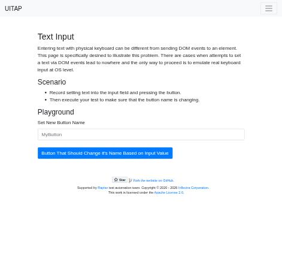
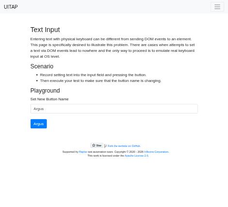

# Claude in Chrome · Text Input · round 2

**Goal met (read from the page): yes** (button reads "Argus") · claimed success · 3 tool calls · 19 s · $0.065

## 1. `tabs_context_mcp`

```json
{
  "createIfEmpty": true
}
```

```
{"availableTabs":[{"tabId":453241866,"title":"New Tab","url":"chrome://newtab/"}],"tabGroupId":11097844}
```

## 2. `browser_batch`

```json
{
  "actions": [
    {
      "name": "navigate",
      "input": {
        "url": "http://127.0.0.1:40695/textinput",
        "tabId": 453241866
      }
    },
    {
      "name": "find",
      "input": {
        "query": "text input field and button",
        "tabId": 453241866
      }
    },
    {
      "name": "computer",
      "input": {
        "action": "screenshot",
        "tabId": 453241866,
        "scale": 0.5
      }
    }
  ]
}
```

```
[navigate] Navigated to http://127.0.0.1:40695/textinput
```

```
[find] Found 2 matching elements

- ref_20: textbox "MyButton" (text) - This is a text input field with type="text" that matches the user's search query
- ref_21: button "Button That Should Change it's Name Based on Input Value" (button) - This is a button element that matches the user's search query
```

```
[computer:screenshot] Successfully captured screenshot (471x427, jpeg) - ID: ss_1272tfso1 — 0.5-scale view; coordinate frame: 941x853.
```



## 3. `browser_batch`

```json
{
  "actions": [
    {
      "name": "computer",
      "input": {
        "action": "left_click",
        "coordinate": [
          470,
          447
        ],
        "tabId": 453241866
      }
    },
    {
      "name": "computer",
      "input": {
        "action": "type",
        "text": "Argus",
        "tabId": 453241866
      }
    },
    {
      "name": "computer",
      "input": {
        "action": "left_click",
        "coordinate": [
          350,
          509
        ],
        "tabId": 453241866
      }
    },
    {
      "name": "javascript_tool",
      "input": {
        "action": "javascript_exec",
        "text": "document.querySelector('button.btn-primary, #updatingButton')?.textContent",
        "tabId": 453241866
      }
    },
    {
      "name": "computer",
      "input": {
        "action": "screenshot",
        "tabId": 453241866,
        "scale": 0.5
      }
    }
  ]
}
```

```
[computer:left_click] Clicked at (470, 447)
```

```
[computer:type] Typed "Argus"
```

```
[computer:left_click] Clicked at (350, 509)
```

```
[javascript_tool:javascript_exec] Argus
```

```
[computer:screenshot] Successfully captured screenshot (471x427, jpeg) - ID: ss_6853vnd6z — 0.5-scale view; coordinate frame: 941x853.
```



## Final answer

```
The button now says "Argus". I clicked the text field, typed "Argus" with the keyboard and clicked the button. I checked the button's text on the page and in a screenshot, and both show "Argus".

RESULT: success
```
