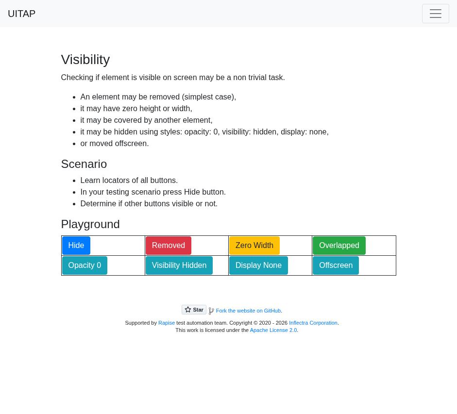
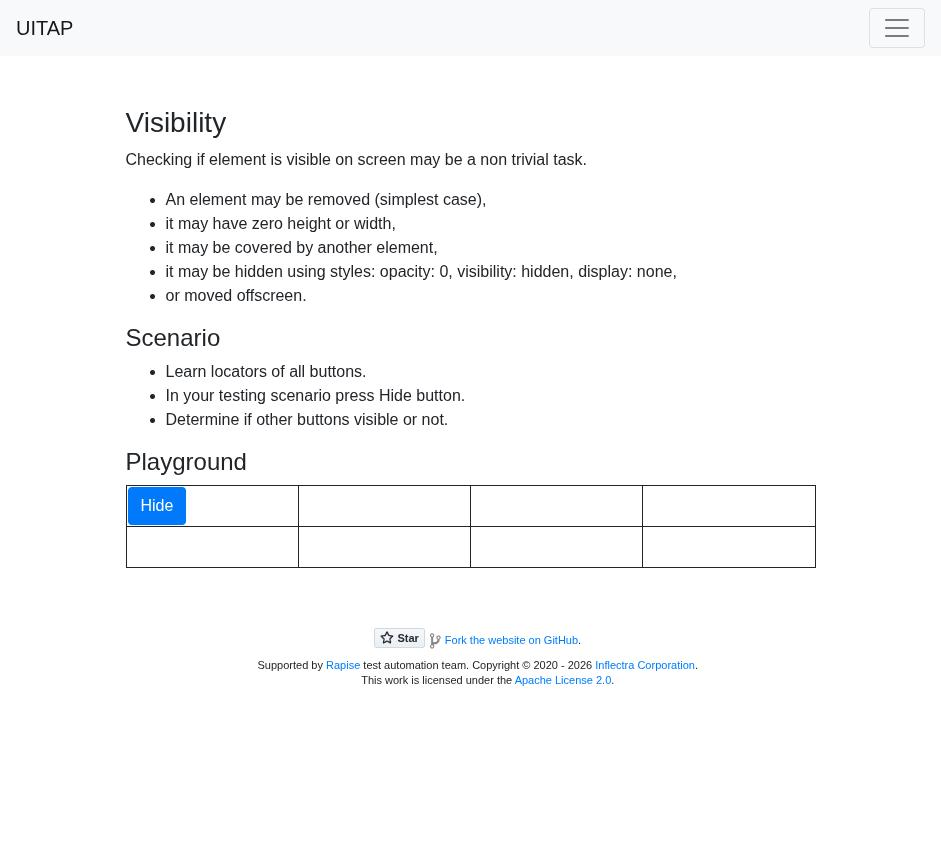

# Claude in Chrome · Visibility · round 1

**Goal met (read from the page): yes** (Hide applied; 7/7 answered not clickable) · claimed success · 4 tool calls · 33.3 s · $0.138

## 1. `tabs_context_mcp`

```json
{
  "createIfEmpty": true
}
```

```
{"availableTabs":[{"tabId":453241854,"title":"New Tab","url":"chrome://newtab/"}],"tabGroupId":39314628}
```

## 2. `browser_batch`

```json
{
  "actions": [
    {
      "name": "navigate",
      "input": {
        "url": "http://127.0.0.1:40695/visibility",
        "tabId": 453241854
      }
    },
    {
      "name": "computer",
      "input": {
        "action": "screenshot",
        "tabId": 453241854
      }
    }
  ]
}
```

```
[navigate] Navigated to http://127.0.0.1:40695/visibility
```

```
[computer:screenshot] Successfully captured screenshot (941x853, jpeg) - ID: ss_6980sw2v1
```



## 3. `browser_batch`

```json
{
  "actions": [
    {
      "name": "computer",
      "input": {
        "action": "left_click",
        "coordinate": [
          156,
          505
        ],
        "tabId": 453241854
      }
    },
    {
      "name": "computer",
      "input": {
        "action": "screenshot",
        "tabId": 453241854
      }
    },
    {
      "name": "javascript_tool",
      "input": {
        "action": "javascript_exec",
        "tabId": 453241854,
        "text": "[...document.querySelectorAll('table button, button')].map(b=>{const r=b.getBoundingClientRect();const cs=getComputedStyle(b);const cx=r.left+r.width/2, cy=r.top+r.height/2;const top=document.elementFromPoint(cx,cy);return {id:b.id,text:b.textContent.trim(),cls:b.className,style:b.getAttribute('style'),rect:[r.left,r.top,r.width,r.height],op:cs.opacity,vis:cs.visibility,disp:cs.display,pe:cs.pointerEvents,top:top&&(top===b||b.contains(top))?'self':(top?top.outerHTML.slice(0,150):null)}})"
      }
    },
    {
      "name": "javascript_tool",
      "input": {
        "action": "javascript_exec",
        "tabId": 453241854,
        "text": "document.querySelector('table')?.outerHTML"
      }
    }
  ]
}
```

```
[computer:left_click] Clicked at (156, 505)
```

```
[computer:screenshot] Successfully captured screenshot (941x853, jpeg) - ID: ss_5827iqwva
```

```
[javascript_tool:javascript_exec] [
  {
    "cls": "navbar-toggler",
    "disp": "block",
    "id": "",
    "op": "1",
    "pe": "auto",
    "rect": [
      869,
      8,
      56,
      40
    ],
    "style": null,
    "text": "",
    "top": "self",
    "vis": "visible"
  },
  {
    "cls": "btn btn-primary",
    "disp": "inline-block",
    "id": "hideButton",
    "op": "1",
    "pe": "auto",
    "rect": [
      127.5,
      487.1875,
      58.90625,
      38
    ],
    "style": null,
    "text": "Hide",
    "top": "self",
    "vis": "visible"
  },
  {
    "cls": "btn btn-warning zerowidth",
    "disp": "inline-block",
    "id": "zeroWidthButton",
    "op": "1",
    "pe": "auto",
    "rect": [
      472,
      487.1875,
      0,
      38
    ],
    "style": null,
    "text": "Zero Width",
    "top": "<td width=\"25%\"><button class=\"btn btn-warning zerowidth\" type=\"button\" id=\"zeroWidthButton\">Zero Width</button></td>",
    "vis": "visible"
  },
  {
    "cls": "btn btn-success",
    "disp": "inline-block",
    "id": "overlappedButton",
    "op": "1",
    "pe": "auto",
    "rect": [
      644.25,
      487.1875,
      108.71875,
      38
    ],
    "style": null,
    "text": "Overlapped",
    "top": "[BLOCKED: Cookie/query string data]",
    "vis": "visible"
  },
  {
    "cls": "btn btn-info",
    "disp": "inline-block",
    "id": "transparentButton",
    "op": "0",
    "pe": "auto",
    "rect": [
      127.5,
      528.1875,
      93.59375,
      38
    ],
    "style": "opacity: 0;",
    "text": "Opacity 0",
    "top": "self",
    "vis": "visible"
  },
  {
    "cls": "btn btn-info",
    "disp": "inline-block",
    "id": "invisibleButton",
    "op": "1",
    "pe": "auto",
    "rect": [
      299.75,
      528.1875,
      138.65625,
      38
    ],
    "style": "visibility: hidden;",
    "text": "Visibility Hidden",
    "top": "[BLOCKED: Cookie/query string data]",
    "vis": "hidden"
  },
  {
    "cls": "btn btn-info",
    "disp": "none",
    "id": "notdisplay…
[truncated]
```

```
[javascript_tool:javascript_exec] [BLOCKED: Cookie/query string data]
```



## 4. `javascript_tool`

```json
{
  "action": "javascript_exec",
  "tabId": 453241854,
  "text": "const o=document.getElementById('overlappedButton').getBoundingClientRect(); const t=document.elementFromPoint(o.left+o.width/2,o.top+o.height/2); JSON.stringify({removed:!!document.getElementById('removedButton'), topTag:t.tagName, topId:t.id, topBg:getComputedStyle(t).backgroundColor, allCount:document.querySelectorAll('button').length})"
}
```

```
{"removed":false,"topTag":"DIV","topId":"hidingLayer","topBg":"rgb(255, 255, 255)","allCount":8}
```

## Final answer

```
I clicked Hide and then checked each of the other seven buttons in the page. After that, none of them can be both seen and clicked:

Removed: not clickable
Zero Width: not clickable
Overlapped: not clickable
Opacity 0: not clickable
Visibility Hidden: not clickable
Display None: not clickable
Offscreen: not clickable

- **Removed:** The button is gone from the page entirely.
- **Zero Width:** The button has zero width, so a click in that spot lands on the table cell around it.
- **Overlapped:** A white layer now sits on top of the button, so clicks hit that layer instead.
- **Opacity 0:** The button is fully transparent. It would still react if you happened to click its exact spot, but you can't see it, so I counted it as not clickable.
- **Visibility Hidden:** The button is hidden and doesn't respond to clicks.
- **Display None:** The button no longer takes up any space on the page.
- **Offscreen:** The button was moved 9999px up and to the left, far outside the visible page.

The screenshot matches: all the table cells are empty except Hide. The page never shows the right answers, so I'm confident in these results but couldn't compare them against an official answer.

RESULT: success
```
