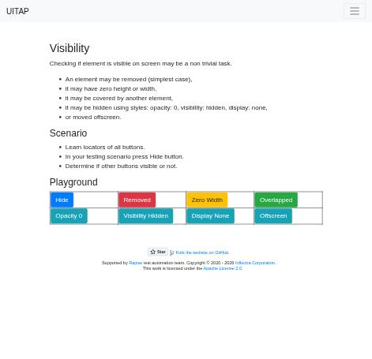
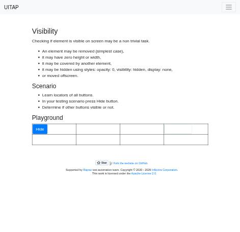

# Claude in Chrome · Visibility · round 2

**Goal met (read from the page): yes** (Hide applied; 7/7 answered not clickable) · claimed success · 4 tool calls · 30.4 s · $0.106

## 1. `tabs_context_mcp`

```json
{
  "createIfEmpty": true
}
```

```
{"availableTabs":[{"tabId":453241864,"title":"New Tab","url":"chrome://newtab/"}],"tabGroupId":1426980116}
```

## 2. `browser_batch`

```json
{
  "actions": [
    {
      "name": "navigate",
      "input": {
        "url": "http://127.0.0.1:40695/visibility",
        "tabId": 453241864
      }
    },
    {
      "name": "computer",
      "input": {
        "action": "screenshot",
        "tabId": 453241864,
        "scale": 0.5
      }
    },
    {
      "name": "find",
      "input": {
        "query": "Hide button",
        "tabId": 453241864
      }
    }
  ]
}
```

```
[navigate] Navigated to http://127.0.0.1:40695/visibility
```

```
[computer:screenshot] Successfully captured screenshot (471x455, jpeg) - ID: ss_47636xp8w — 0.5-scale view; coordinate frame: 941x909.
```

```
[find] Found 1 matching element

- ref_26: button "Hide" (button) - Exact match - this is the "Hide" button located in the Playground section
```



## 3. `browser_batch`

```json
{
  "actions": [
    {
      "name": "computer",
      "input": {
        "action": "left_click",
        "ref": "ref_26",
        "tabId": 453241864
      }
    },
    {
      "name": "computer",
      "input": {
        "action": "screenshot",
        "tabId": 453241864,
        "scale": 0.5
      }
    },
    {
      "name": "javascript_tool",
      "input": {
        "action": "javascript_exec",
        "tabId": 453241864,
        "text": "['Removed','Zero Width','Overlapped','Opacity 0','Visibility Hidden','Display None','Offscreen'].map(n=>{const b=[...document.querySelectorAll('button')].find(x=>x.textContent.trim()===n); if(!b) return n+': MISSING'; const r=b.getBoundingClientRect(); const cs=getComputedStyle(b); const cx=r.left+r.width/2, cy=r.top+r.height/2; const top=document.elementFromPoint(cx,cy); return n+' '+JSON.stringify({r:[r.left,r.top,r.width,r.height],op:cs.opacity,vis:cs.visibility,disp:cs.display,top:top&&(top.outerHTML.slice(0,80)),hit:top===b||b.contains(top), cls:b.className, style:b.getAttribute('style')})}).join('\\n')"
      }
    }
  ]
}
```

```
[computer:left_click] Clicked on element ref_26
```

```
[computer:screenshot] Successfully captured screenshot (471x455, jpeg) - ID: ss_288576xyu — 0.5-scale view; coordinate frame: 941x909.
```

```
[javascript_tool:javascript_exec] [BLOCKED: Cookie/query string data]
```



## 4. `javascript_tool`

```json
{
  "action": "javascript_exec",
  "tabId": 453241864,
  "text": "['Removed','Zero Width','Overlapped','Opacity 0','Visibility Hidden','Display None','Offscreen'].map(n=>{const b=[...document.querySelectorAll('button')].find(x=>x.textContent.trim()===n); if(!b) return n+' missing'; const r=b.getBoundingClientRect(); const cs=getComputedStyle(b); const top=document.elementFromPoint(r.left+r.width/2,r.top+r.height/2); return [n,Math.round(r.left),Math.round(r.top),Math.round(r.width),Math.round(r.height),cs.opacity,cs.visibility,cs.display,top?top.tagName+'#'+top.id:'none',(top===b)].join(' ')}).join(' | ')"
}
```

```
Removed missing | Zero Width 472 487 0 38 1 visible inline-block TD# false | Overlapped 644 487 109 38 1 visible inline-block DIV#hidingLayer false | Opacity 0 128 528 94 38 0 visible inline-block BUTTON#transparentButton true | Visibility Hidden 300 528 139 38 1 hidden inline-block TD# false | Display None 0 0 0 0 1 visible none NAV# false | Offscreen -9999 -9999 95 38 1 visible block none false
```

## Final answer

```
I clicked Hide, and afterward none of the seven buttons can be both seen and clicked. I checked each one's position, size and style in the page, and which element actually sits on top at its centre.

Removed: not clickable
Zero Width: not clickable
Overlapped: not clickable
Opacity 0: not clickable
Visibility Hidden: not clickable
Display None: not clickable
Offscreen: not clickable

- **Removed:** the button is no longer on the page.
- **Zero Width:** it has no width, so there's nothing to see or click.
- **Overlapped:** another layer covers it and takes the click.
- **Opacity 0:** it's fully transparent. It still receives clicks, but a user can't see it. Since the question asks whether they could see *and* click it, I marked it not clickable.
- **Visibility Hidden:** it's hidden, and clicks pass through it.
- **Display None:** it isn't drawn at all.
- **Offscreen:** it has been moved far off the edge of the screen.

A screenshot taken after the click shows the Playground area empty apart from the Hide button.

RESULT: success
```
