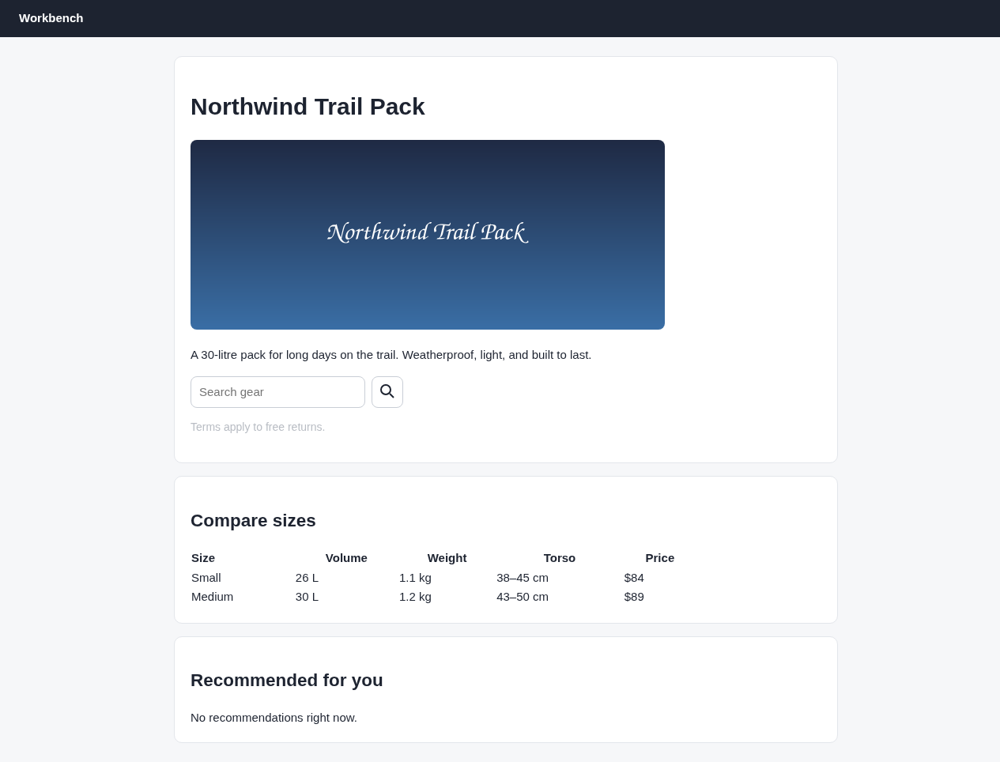

# Argus (its own browser) · Find the defects · round 1

**correct** · goal met (read from the server): yes (found 6/6; 0 not present (none)) · claimed success · 6 tool calls · 18.6 s · $0.102

## 1. `browser_open`

```json
{
  "url": "http://127.0.0.1:37673/audit"
}
```

```
lane main opened
  → http://127.0.0.1:37673/audit
  title "Northwind Trail Pack"
  + "Workbench"
  + "Northwind Trail Pack"
  + "A 30-litre pack for long days on the trail. Weatherproof, light, and built to last."
  + "Terms apply to free returns."
  + "Compare sizes"
  + "Size"
  + "Volume"
  + "Weight"
  + "Torso"
  + "Price"
  + "Small"
  + "26 L"
  + … 10 more
  ! console error: Analytics failed to initialise: missing site key
  ~ GET http://127.0.0.1:37673/api/recommendations 404 56ms

Northwind Trail Pack (1265x800)
landmarks:
  banner e0.19
  main e0.21
headings:
  Northwind Trail Pack e0.24
  Compare sizes e0.43
  Recommended for you e0.84
fields:
  textbox:Search gear e0.5
actions:
  button:button#search-btn e0.34
```

## 2. `browser_open`

```json
{
  "url": "http://127.0.0.1:37673/audit",
  "lane": "phone",
  "viewport": {
    "w": 390,
    "h": 844
  }
}
```

```
lane phone opened
  → http://127.0.0.1:37673/audit
  title "Northwind Trail Pack"
  + "Workbench"
  + "Northwind Trail Pack"
  + "A 30-litre pack for long days on the trail. Weatherproof, light, and built to last."
  + "Terms apply to free returns."
  + "Compare sizes"
  + "Size"
  + "Volume"
  + "Weight"
  + "Torso"
  + "Price"
  + "Small"
  + "26 L"
  + … 10 more
  ! console error: Analytics failed to initialise: missing site key
  ~ GET http://127.0.0.1:37673/api/recommendations 404 58ms

Northwind Trail Pack (390x844)
landmarks:
  banner e0.19
  main e0.21
headings:
  Northwind Trail Pack e0.24
  Compare sizes e0.43
  Recommended for you e0.84
fields:
  textbox:Search gear e0.5
actions:
  button:button#search-btn e0.34
```

## 3. `browser_check`

```json
{}
```

```
score 48/100 · 5 finding(s) · 47 elements
✗ contrast ×1  Text fails WCAG AA contrast. Darken the text or lighten the background.
    e0.39  "Terms apply to free returns."  selector p, contrast 1.89, required 4.5, fontSize 14
✗ unnamed-control ×1  Control has no accessible name; a screen reader announces it as blank.
    e0.34  selector button#search-btn, size 40x40
! img-alt ×1  Image has no alt attribute. Use alt="" if it is decorative.
    e0.27  selector img, src hero.png
✗ console-error ×1  The page logged errors.
    "Analytics failed to initialise: missing site key"  source http://127.0.0.1:37673/audit:24
✗ failed-request ×1  Requests failed.
    "GET http://127.0.0.1:37673/api/recommendations"  status 404
```

## 4. `browser_check`

```json
{
  "lane": "phone"
}
```

```
score 36/100 · 6 finding(s) · 47 elements
✗ contrast ×1  Text fails WCAG AA contrast. Darken the text or lighten the background.
    e0.39  "Terms apply to free returns."  selector p, contrast 1.89, required 4.5, fontSize 14
✗ unnamed-control ×1  Control has no accessible name; a screen reader announces it as blank.
    e0.34  selector button#search-btn, size 40x40
! img-alt ×1  Image has no alt attribute. Use alt="" if it is decorative.
    e0.27  selector img, src hero.png
✗ overflow-x ×8  Page scrolls sideways at 390px wide. Add max-width:100% or let the row wrap.
    e0.57  "th"  overflowPx 291, width 92
    e0.69  "td"  overflowPx 291, width 92
    e0.80  "td"  overflowPx 291, width 92
✗ console-error ×1  The page logged errors.
    "Analytics failed to initialise: missing site key"  source http://127.0.0.1:37673/audit:24
✗ failed-request ×1  Requests failed.
    "GET http://127.0.0.1:37673/api/recommendations"  status 404
```

## 5. `browser_find`

```json
{
  "target": "role:heading"
}
```

```
No role:heading on the page.
```

## 6. `browser_screenshot`

```json
{
  "full": true
}
```

```
1265x964, 1610 image tokens
```



## Final answer

```
I audited the page at desktop width (1265×800) and at a 390×844 phone viewport. I found six problems:

DEFECT: contrast: The "Terms apply to free returns." text under the search field. Its contrast is 1.89:1, and at 14px it needs 4.5:1.
DEFECT: unnamed-control: The search button (`button#search-btn`) has only an icon and no accessible name.
DEFECT: missing-alt: The main product image (`img` with `src` `hero.png`) has no alt attribute.
DEFECT: mobile-overflow: The "Compare sizes" table at 390px wide. Its cells stick out 291px past the screen, so the page scrolls sideways.
DEFECT: console-error: The page logs "Analytics failed to initialise: missing site key" (from the page's own script, `/audit` line 24).
DEFECT: failed-request: `GET /api/recommendations` returns 404, so "Recommended for you" says "No recommendations right now."

The checker found no heading-order, duplicate-id or small-tap-target problems at either size. On the screenshot, the headings look like one top heading with two section headings under it, and the search button is 40×40px, which is big enough. One gap: the tool that looks up headings found none on the page, so I couldn't read their levels directly and am relying on the checker and how they look.

RESULT: success
```
