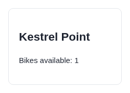
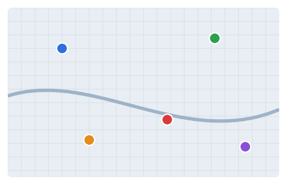

# Argus (its own browser) · Canvas map · round 1

**correct** · goal met (read from the server): yes (opened Kestrel Point; reported Kestrel Point) · claimed success · 5 tool calls · 11.2 s · $0.071

## 1. `browser_open`

```json
{
  "url": "http://127.0.0.1:37673/map"
}
```

```
lane main opened
  → http://127.0.0.1:37673/map
  title "Stations"
  + "Workbench"
  + "Stations"
  + "Select a marker to see the station."
  + "No station selected."

Stations (1280x800)
landmarks:
  banner e0.18
  main e0.20
  complementary e0.30
headings:
  Stations e0.22
canvases (no elements inside; click a point: {"x", "y", "in": ref}):
  canvas#map e0.28 560x350
```

## 2. `browser_look`

```json
{
  "target": "e0.28"
}
```

```
592x382 at (225, 198) in the viewport; image pixel (px, py) is viewport point (225+px, 198+py), 308 image tokens
```


## 3. `browser_click`

```json
{
  "target": {
    "x": 569,
    "y": 444
  }
}
```

```
✓ click generic:canvas#map e0.28  184ms
  + "Kestrel Point"
  + "Bikes available: 1"
  − "No station selected."
```

## 4. `browser_look`

```json
{
  "target": "e0.30"
}
```

```
254x183 at (801, 198) in the viewport; image pixel (px, py) is viewport point (801+px, 198+py), 70 image tokens
```



## 5. `browser_look`

```json
{
  "target": "e0.28"
}
```

```
592x382 at (225, 198) in the viewport; image pixel (px, py) is viewport point (225+px, 198+py), 308 image tokens
```



## Final answer

```
I clicked the center of the red marker on the map. The details panel then showed this station, with 1 bike available. The map doesn't highlight the selected marker, so I couldn't double-check on the map itself. But the click landed right on the red dot, which is well away from the other markers.

STATION: Kestrel Point

RESULT: success
```
