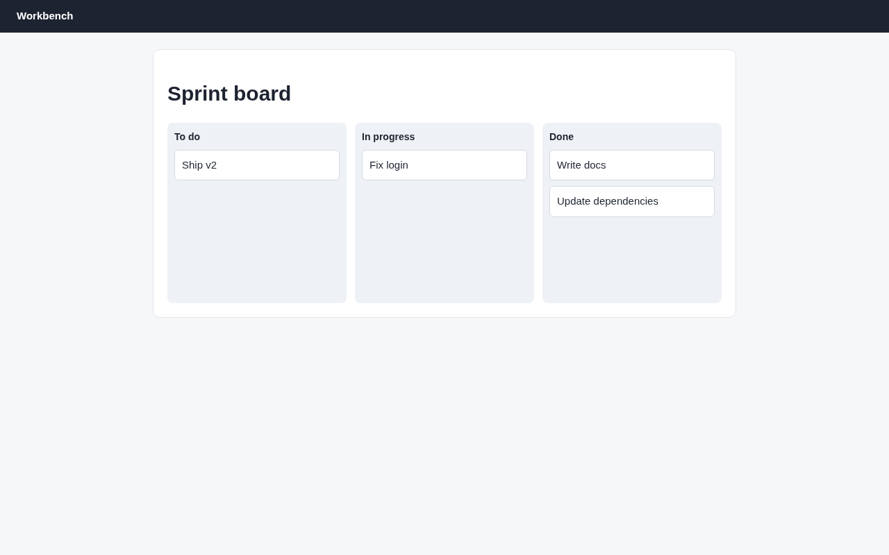

# Argus (its own browser) · Drag and drop · round 1

**correct** · goal met (read from the server): yes (write-docs→done, fix-login→doing, ship-v2→todo, update-deps→done) · claimed success · 3 tool calls · 8.1 s · $0.056

## 1. `browser_open`

```json
{
  "url": "http://127.0.0.1:37673/board"
}
```

```
lane main opened
  → http://127.0.0.1:37673/board
  title "Board"
  + "Workbench"
  + "Sprint board"
  + "To do"
  + "Write docs"
  + "Ship v2"
  + "In progress"
  + "Fix login"
  + "Done"
  + "Update dependencies"

Board (1280x800)
landmarks:
  banner e0.18
  main e0.20
headings:
  Sprint board e0.22
  To do e0.26
  In progress e0.33
  Done e0.38
```

## 2. `browser_drag`

```json
{
  "from": "Write docs",
  "to": "Update dependencies"
}
```

```
✓ drag generic:div.task e0.28  396ms
```

## 3. `browser_screenshot`

```json
{}
```

```
1280x800 at (0, 0) in the viewport; image pixel (px, py) is viewport point (0+px, 0+py), 1334 image tokens
```



## Final answer

```
I dragged the "Write docs" card from To do into the Done column, and a screenshot of the board afterwards confirms the move:

- **To do:** Ship v2
- **In progress:** Fix login
- **Done:** Write docs, Update dependencies

No other card changed columns. Write docs now sits above Update dependencies in Done, because it went in where I dropped it.

RESULT: success
```
