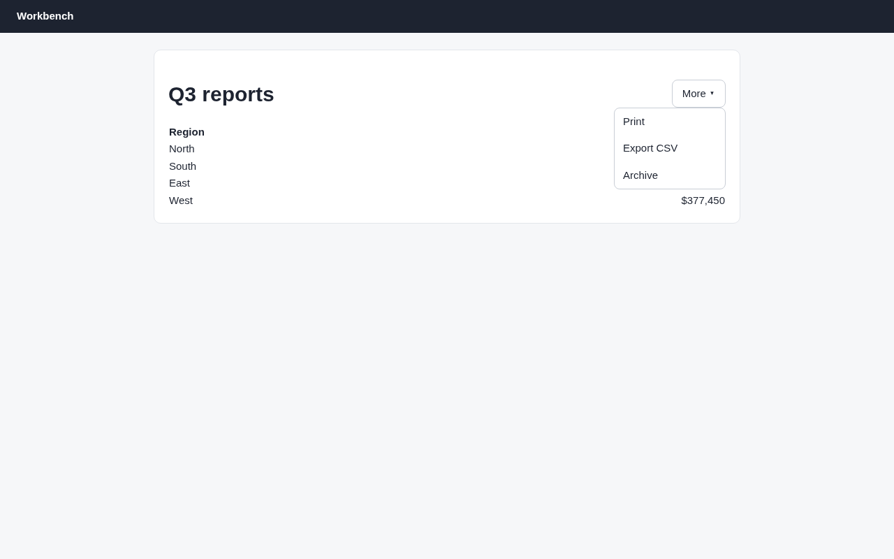
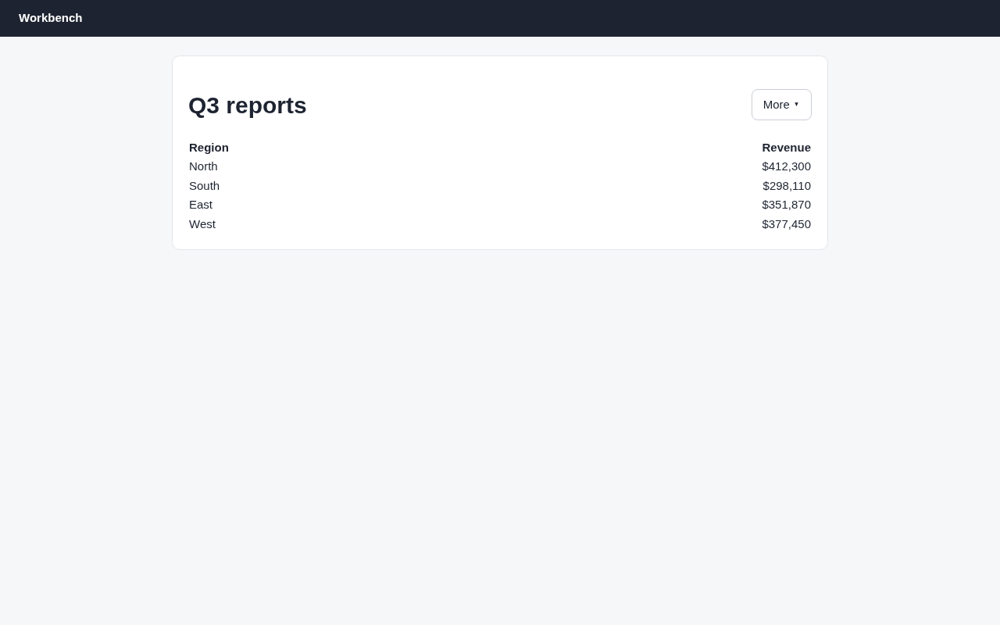

# Argus (its own browser) · Hover menu · round 1

**correct** · goal met (read from the server): yes (exports 1, archives 0) · claimed success · 7 tool calls · 19.2 s · $0.108

## 1. `browser_open`

```json
{
  "url": "http://127.0.0.1:37673/reports"
}
```

```
lane main opened
  → http://127.0.0.1:37673/reports
  title "Reports"
  + "Workbench"
  + "Q3 reports"
  + "More ▾"
  + "Region"
  + "Revenue"
  + "North"
  + "$412,300"
  + "South"
  + "$298,110"
  + "East"
  + "$351,870"
  + "West"
  + … 1 more

Reports (1280x800)
landmarks:
  banner e0.18
  main e0.20
headings:
  Q3 reports e0.23
```

## 2. `browser_click`

```json
{
  "target": "More \u25be"
}
```

```
✓ click generic:span.btn e0.27  158ms
  + "Print"
  + "Export CSV"
  + "Archive"
```

## 3. `browser_find`

```json
{
  "target": "Export CSV"
}
```

```
generic:div.item e0.34 @880,193 158x39
```

## 4. `browser_screenshot`

```json
{}
```

```
1280x800 at (0, 0) in the viewport; image pixel (px, py) is viewport point (0+px, 0+py), 1334 image tokens
```



## 5. `browser_click`

```json
{
  "target": "e0.34"
}
```

```
✓ click generic:div.item e0.34  213ms
  + "Export CSV started."
  − "Print"
  − "Export CSV"
  − "Archive"
```

## 6. `browser_outline`

```json
{}
```

```
Reports (1280x800)
landmarks:
  banner e0.18
  main e0.20
headings:
  Q3 reports e0.23
```

## 7. `browser_screenshot`

```json
{}
```

```
1280x800 at (0, 0) in the viewport; image pixel (px, py) is viewport point (0+px, 0+py), 1334 image tokens
```



## Final answer

```
I started the CSV export and nothing was archived.

I opened the **More ▾** menu, which had Print, Export CSV and Archive, and clicked **Export CSV**. The page showed "Export CSV started." and the menu closed. No archive message showed up, and afterwards the Q3 table still had all four regions (North, South, East, West). That message had already disappeared when I checked the page again, so what I saw right after the click is the only proof the export started.

RESULT: success
```
