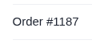
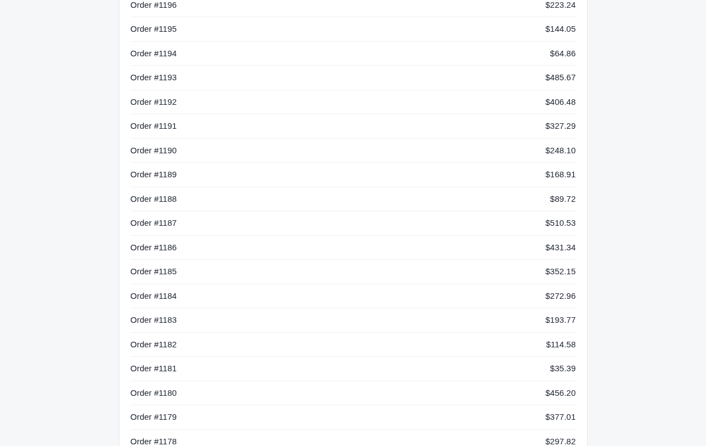

# Argus (its own browser) · Infinite scroll · round 1

**correct** · goal met (read from the server): yes (reported $510.53, shown $510.53) · claimed success · 6 tool calls · 16.8 s · $0.080

## 1. `browser_open`

```json
{
  "url": "http://127.0.0.1:37673/orders"
}
```

```
lane main opened
  → http://127.0.0.1:37673/orders
  title "Orders"
  + "Workbench"
  + "Orders"
  + "Order #1250"
  + "$499.50"
  + "Order #1249"
  + "$420.31"
  + "Order #1248"
  + "$341.12"
  + "Order #1247"
  + "$261.93"
  + "Order #1246"
  + "$182.74"
  + … 31 more

Orders (1265x800)
landmarks:
  banner e0.22
  main e0.6
headings:
  Orders e0.25
```

## 2. `browser_scroll`

```json
{
  "until": "Order #1187"
}
```

```
✓ scroll generic:span e0.345  1350ms
  + "Order #1230"
  + "$415.70"
  + "Order #1229"
  + "$336.51"
  + "Order #1228"
  + "$257.32"
  + "Order #1227"
  + "$178.13"
  + "Order #1226"
  + "$98.94"
  + "Order #1225"
  + "$19.75"
  + … 108 more
```

## 3. `browser_find`

```json
{
  "target": "Order #1187"
}
```

```
generic:span e0.345 @234,389 83x23
```

## 4. `browser_look`

```json
{
  "target": "e0.345"
}
```

```
115x55 at (218, 373) in the viewport; image pixel (px, py) is viewport point (218+px, 373+py), 10 image tokens
```



## 5. `browser_look`

```json
{
  "target": {
    "x": 640,
    "y": 389
  }
}
```

```
A point ({x, y}) is a place, not an element: only click, hover and drag take one. (-32602)
```

## 6. `browser_screenshot`

```json
{}
```

```
1265x800 at (0, 0) in the viewport; image pixel (px, py) is viewport point (0+px, 0+py), 1334 image tokens
```



## Final answer

```
Order #1187 is on the orders page, further down the list. It only came into view after scrolling, since the page loads more orders as you go. Its total is $510.53, which I read from a screenshot of the list.

TOTAL: $510.53

RESULT: success
```
