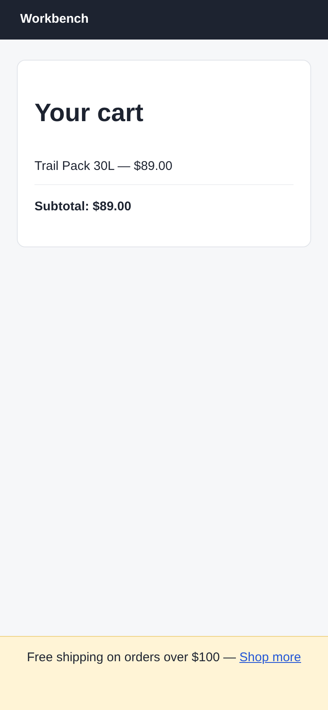

# Argus (its own browser) · Covered on phones · round 1

**correct** · goal met (read from the server): yes (answered no, named the promo bar; truth: covered by the free-shipping bar) · claimed success · 4 tool calls · 12.8 s · $0.073

## 1. `browser_open`

```json
{
  "url": "http://127.0.0.1:37673/cart",
  "viewport": {
    "w": 390,
    "h": 844
  }
}
```

```
lane main opened
  → http://127.0.0.1:37673/cart
  title "Cart"
  + "Workbench"
  + "Your cart"
  + "Trail Pack 30L — $89.00"
  + "Subtotal: $89.00"
  + "Checkout"
  + "Free shipping on orders over $100 — Shop more"

Cart (390x844)
landmarks:
  banner e0.20
  main e0.22
headings:
  Your cart e0.24
actions:
  button:Checkout e0.34 [covered by e0.37 div#promo]
  link:Shop more e0.39
```

## 2. `browser_click`

```json
{
  "target": "button:Checkout"
}
```

```
✗ click button:Checkout e0.34 · covered  6ms
  button "Checkout" is covered by generic div#promo at (195, 795); dismiss or close it first.
  blocker: generic:div#promo e0.37
```

## 3. `browser_screenshot`

```json
{}
```

```
780x1688 at (0, 0) in the viewport; image pixel (px, py) is viewport point (0+px, 0+py), 1708 image tokens
```



## 4. `browser_act`

```json
{
  "steps": [
    {
      "scroll": {
        "by": {
          "x": 0,
          "y": 2000
        }
      }
    },
    {
      "click": "button:Checkout"
    }
  ]
}
```

```
✓ scroll  170ms
✗ click button:Checkout e0.34 · covered  2ms
  button "Checkout" is covered by generic div#promo at (195, 795); dismiss or close it first.
  blocker: generic:div#promo e0.37
```

## Final answer

```
TAPPABLE: no

No, a shopper can't tap Checkout on a 390×844 screen. A promo bar fixed to the bottom of the screen (`div#promo`, reading "Free shipping on orders over $100 — Shop more") sits on top of the button at about (195, 795). A tap there lands on the promo bar, not on Checkout.

I tried clicking Checkout and the click was blocked by `div#promo`. I scrolled to the bottom of the page and tried again, and it was still blocked. The screenshot shows only the promo bar where the button should be. The promo bar has no close button, so the shopper can't get it out of the way.

RESULT: success
```
