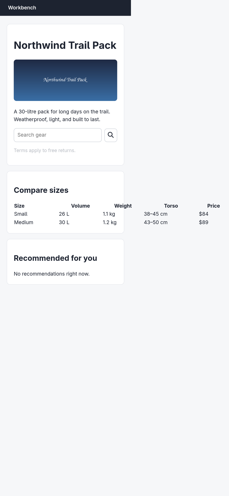

# Argus (your Chromium) · Find the defects · round 1

**correct** · goal met (read from the server): yes (found 6/6; 0 not present (none)) · claimed success · 8 tool calls · 32.7 s · $0.157

## 1. `browser_open`

```json
{
  "url": "http://127.0.0.1:33679/audit",
  "own": true
}
```

```
lane main opened in your browser
  → http://127.0.0.1:33679/audit
  title "Northwind Trail Pack"
  + "Workbench"
  + "Northwind Trail Pack"
  + "A 30-litre pack for long days on the trail. Weatherproof, light, and built to last."
  + "Terms apply to free returns."
  + "Compare sizes"
  + "Size"
  + "Volume"
  + "Weight"
  + "Torso"
  + "Price"
  + "Small"
  + "26 L"
  + … 10 more
  ! console error: Analytics failed to initialise: missing site key
  ~ GET http://127.0.0.1:33679/api/recommendations 404 55ms

Northwind Trail Pack (926x853)
landmarks:
  banner e0.19
  main e0.21
headings:
  Northwind Trail Pack e0.24
  Compare sizes e0.43
  Recommended for you e0.84
fields:
  textbox:Search gear e0.5
actions:
  button:button#search-btn e0.34
```

## 2. `browser_check`

```json
{}
```

```
score 48/100 · 5 finding(s) · 47 elements
✗ contrast ×1  Text fails WCAG AA contrast. Darken the text or lighten the background.
    e0.39  "Terms apply to free returns."  selector p, contrast 1.89, required 4.5, fontSize 14
✗ unnamed-control ×1  Control has no accessible name; a screen reader announces it as blank.
    e0.34  selector button#search-btn, size 40x40
! img-alt ×1  Image has no alt attribute. Use alt="" if it is decorative.
    e0.27  selector img, src hero.png
✗ console-error ×1  The page logged errors.
    "Analytics failed to initialise: missing site key"  source http://127.0.0.1:33679/audit:24
✗ failed-request ×1  Requests failed.
    "GET http://127.0.0.1:33679/api/recommendations"  status 404
```

## 3. `browser_act`

```json
{
  "steps": [
    {
      "viewport": {
        "w": 390,
        "h": 844
      }
    }
  ]
}
```

```
✓ viewport  171ms
```

## 4. `browser_check`

```json
{}
```

```
score 36/100 · 6 finding(s) · 47 elements
✗ contrast ×1  Text fails WCAG AA contrast. Darken the text or lighten the background.
    e0.39  "Terms apply to free returns."  selector p, contrast 1.89, required 4.5, fontSize 14
✗ unnamed-control ×1  Control has no accessible name; a screen reader announces it as blank.
    e0.34  selector button#search-btn, size 38x40
! img-alt ×1  Image has no alt attribute. Use alt="" if it is decorative.
    e0.27  selector img, src hero.png
✗ overflow-x ×8  Page scrolls sideways at 390px wide. Add max-width:100% or let the row wrap.
    e0.57  "th"  overflowPx 291, width 90
    e0.69  "td"  overflowPx 291, width 90
    e0.80  "td"  overflowPx 291, width 90
✗ console-error ×1  The page logged errors.
    "Analytics failed to initialise: missing site key"  source http://127.0.0.1:33679/audit:24
✗ failed-request ×1  Requests failed.
    "GET http://127.0.0.1:33679/api/recommendations"  status 404
```

## 5. `browser_outline`

```json
{
  "budget": 900
}
```

```
Northwind Trail Pack (390x844)
landmarks:
  banner e0.19
  main e0.21
headings:
  Northwind Trail Pack e0.24
  Compare sizes e0.43
  Recommended for you e0.84
fields:
  textbox:Search gear e0.5
actions:
  button:button#search-btn e0.34
```

## 6. `browser_find`

```json
{
  "target": "role:heading"
}
```

```
No role:heading on the page.
```

## 7. `browser_find`

```json
{
  "target": {
    "role": "heading",
    "name": "Compare sizes"
  }
}
```

```
heading:Compare sizes e0.43 @41,548 308x34
```

## 8. `browser_screenshot`

```json
{
  "full": true
}
```

```
1364x2948, 5194 image tokens
```



## Final answer

```
Audit complete — checked at both 926×853 desktop and 390×844 phone viewports.

DEFECT: contrast: paragraph "Terms apply to free returns." in the hero card (ratio 1.89:1, needs 4.5:1 at 14px)
DEFECT: unnamed-control: search icon button `button#search-btn` next to the "Search gear" field
DEFECT: missing-alt: hero image `` in the product card
DEFECT: mobile-overflow: "Compare sizes" table cells (th/td) overflow the viewport by 291px at 390px wide
DEFECT: console-error: "Analytics failed to initialise: missing site key" (audit page, line 24)
DEFECT: failed-request: GET http://127.0.0.1:33679/api/recommendations returns 404 (drives the empty "Recommended for you" section)

No heading-order problem (h1 → h2 → h2 in order), no duplicate ids, and no tap targets under 24px — the search button measures 38×40 on phone.

RESULT: success
```
