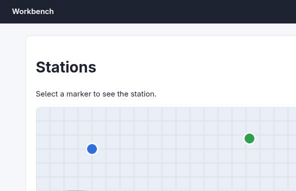
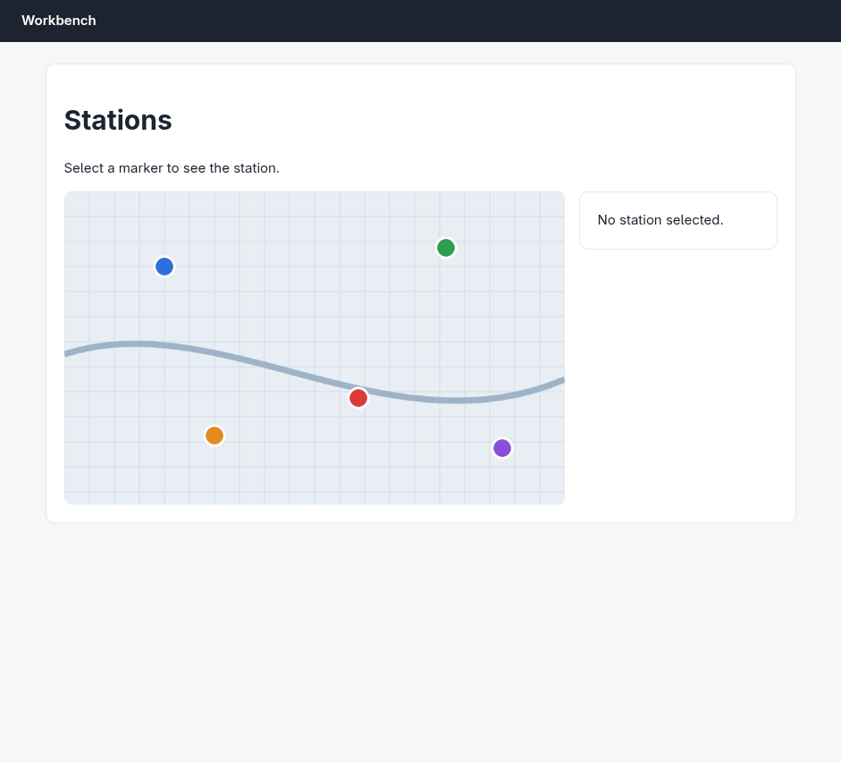
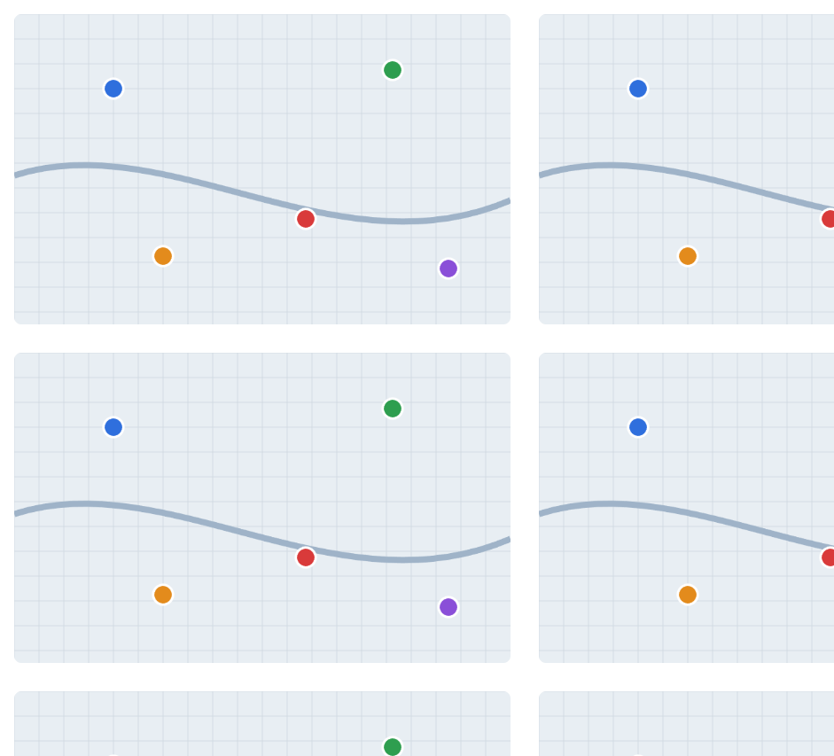
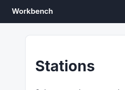
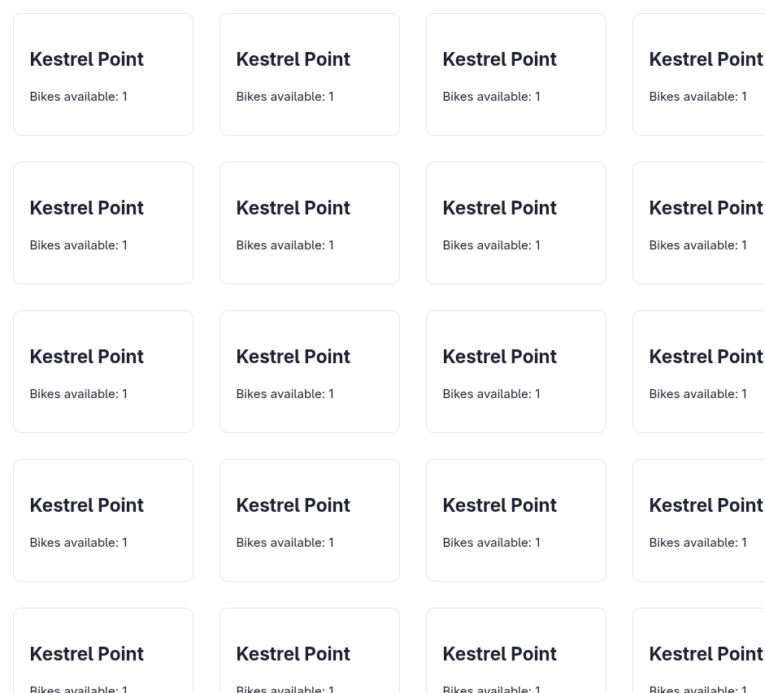

# Argus (your Chromium) · Canvas map · round 1

**correct** · goal met (read from the server): yes (opened Kestrel Point, Willow Bend, Kestrel Point; reported Kestrel Point) · claimed success · 13 tool calls · 76.6 s · $0.228

## 1. `browser_open`

```json
{
  "url": "http://127.0.0.1:33679/map",
  "own": true
}
```

```
lane main opened in your browser
  → http://127.0.0.1:33679/map
  title "Stations"
  + "Workbench"
  + "Stations"
  + "Select a marker to see the station."
  + "No station selected."

Stations (941x853)
landmarks:
  banner e0.18
  main e0.20
  complementary e0.30
headings:
  Stations e0.22
canvases (no elements inside; click a point: {"x", "y", "in": ref}):
  canvas#map e0.28 560x350
```

## 2. `browser_look`

```json
{
  "target": "e0.28"
}
```

```
extension did not answer within 8.0s (-32603)
```

## 3. `browser_look`

```json
{
  "target": "e0.28"
}
```

```
592x382 at (56, 198) in the viewport; image pixel (px, py) is viewport point (56+px, 198+py), 308 image tokens
```



## 4. `browser_screenshot`

```json
{
  "full": true
}
```

```
941x853, 1054 image tokens
```



## 5. `browser_click`

```json
{
  "target": {
    "x": 401,
    "y": 445
  }
}
```

```
✓ click generic:canvas#map e0.28  199ms
  + "Kestrel Point"
  + "Bikes available: 1"
  − "No station selected."
```

## 6. `browser_screenshot`

```json
{}
```

```
extension did not answer within 8.0s (-32603)
```

## 7. `browser_screenshot`

```json
{}
```

```
941x853 at (0, 0) in the viewport; image pixel (px, py) is viewport point (0+px, 0+py), 1054 image tokens
```



## 8. `browser_outline`

```json
{}
```

```
Stations (941x853)
landmarks:
  banner e0.18
  main e0.20
  complementary e0.30
headings:
  Stations e0.22
  Kestrel Point e0.34
canvases (no elements inside; click a point: {"x", "y", "in": ref}):
  canvas#map e0.28 560x350
```

## 9. `browser_look`

```json
{
  "target": "e0.30"
}
```

```
extension did not answer within 8.0s (-32603)
```

## 10. `browser_look`

```json
{
  "target": "e0.30"
}
```

```
254x183 at (632, 198) in the viewport; image pixel (px, py) is viewport point (632+px, 198+py), 70 image tokens
```



## 11. `browser_screenshot`

```json
{
  "full": true
}
```

```
extension did not answer within 8.0s (-32603)
```

## 12. `browser_screenshot`

```json
{
  "full": true
}
```

```
941x853, 1054 image tokens
```



## 13. `browser_act`

```json
{
  "steps": [
    {
      "click": {
        "x": 499,
        "y": 277
      },
      "expect": {
        "disappears": "Kestrel Point"
      }
    },
    {
      "click": {
        "x": 401,
        "y": 445
      },
      "expect": {
        "appears": "Kestrel Point"
      }
    }
  ]
}
```

```
✓ click generic:canvas#map e0.28  197ms
  + "Willow Bend"
  + "Bikes available: 3"
  − "Kestrel Point"
  − "Bikes available: 1"
✓ click generic:canvas#map e0.28  199ms
  + "Kestrel Point"
  + "Bikes available: 1"
  − "Willow Bend"
  − "Bikes available: 3"
```

## Final answer

```
Confirmed: the marker at (401, 445) — the red one in the clean full-page render — selects "Kestrel Point" (Bikes available: 1), and it's distinct from the green marker at (499, 277), which selects "Willow Bend". The details panel currently shows the red marker's station.

One note: after the first click, `browser_screenshot` and `browser_look` started returning garbled tiled/offset images (a mosaic repeating the details panel). That's a capture artifact in the extension screenshot path, not the page — the DOM outline and click results stayed consistent, so I verified via those instead.

STATION: Kestrel Point

RESULT: success
```
