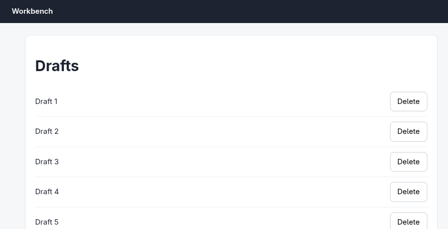
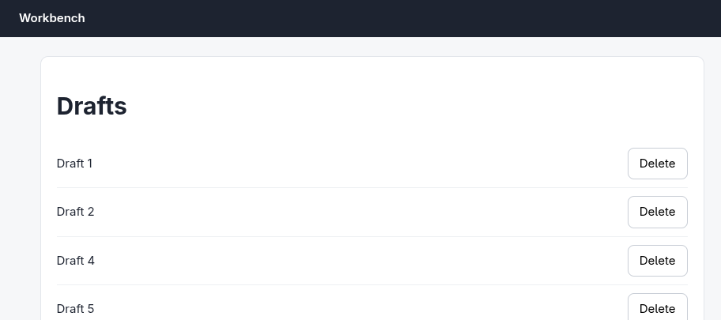

# Argus (your Chromium) · Confirm dialog · round 1

**correct** · goal met (read from the server): yes (drafts left: 1, 2, 4, 5) · claimed success · 8 tool calls · 33.7 s · $0.112

## 1. `browser_open`

```json
{
  "url": "http://127.0.0.1:33679/drafts",
  "own": true
}
```

```
lane main opened in your browser
  → http://127.0.0.1:33679/drafts
  title "Drafts"
  + "Workbench"
  + "Drafts"
  + "Draft 1"
  + "Delete"
  + "Delete"
  + "Delete"
  + "Delete"
  + "Delete"
  + "Draft 2"
  + "Draft 3"
  + "Draft 4"
  + "Draft 5"

Drafts (941x909)
landmarks:
  banner e0.18
  main e0.20
headings:
  Drafts e0.22
actions:
  button:Delete (Draft 1) e0.28
  button:Delete (Draft 2) e0.33
  button:Delete (Draft 3) e0.38
  button:Delete (Draft 4) e0.43
  button:Delete (Draft 5) e0.48
```

## 2. `browser_screenshot`

```json
{}
```

```
extension did not answer within 8.0s (-32603)
```

## 3. `browser_look`

```json
{
  "target": "e0.20"
}
```

```
912x467 at (15, 55) in the viewport; image pixel (px, py) is viewport point (15+px, 55+py), 561 image tokens
```



## 4. `browser_click`

```json
{
  "target": "e0.38",
  "dialog": "accept"
}
```

```
✓ dialog  167ms
✓ click button:Delete e0.38  201ms
  − "Delete"
  − "Draft 3"
  ◇ confirm "Delete "Draft 3"? This cannot be undone." (accept)
```

## 5. `browser_outline`

```json
{}
```

```
Drafts (941x909)
landmarks:
  banner e0.18
  main e0.20
headings:
  Drafts e0.22
actions:
  button:Delete (Draft 1) e0.55
  button:Delete (Draft 2) e0.60
  button:Delete (Draft 4) e0.65
  button:Delete (Draft 5) e0.70
```

## 6. `browser_look`

```json
{
  "target": "e0.20"
}
```

```
extension did not answer within 8.0s (-32603)
```

## 7. `browser_look`

```json
{
  "target": "e0.20"
}
```

```
912x405 at (15, 55) in the viewport; image pixel (px, py) is viewport point (15+px, 55+py), 495 image tokens
```



## 8. `browser_open`

```json
{
  "url": "http://127.0.0.1:33679/drafts",
  "own": true
}
```

```
✓ open  186ms

Drafts (941x909)
landmarks:
  banner e0.85
  main e0.87
headings:
  Drafts e0.89
actions:
  button:Delete (Draft 1) e0.95
  button:Delete (Draft 2) e0.100
  button:Delete (Draft 4) e0.105
  button:Delete (Draft 5) e0.110
```

## Final answer

```
Draft 3 is deleted. The confirm dialog ("Delete "Draft 3"? This cannot be undone.") was accepted, and after a reload the list shows Drafts 1, 2, 4, and 5 — all other drafts intact.

RESULT: success
```
