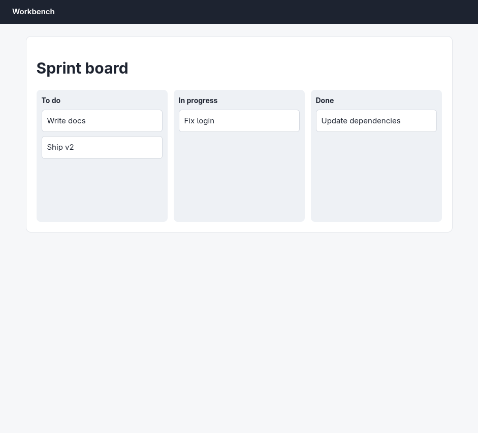
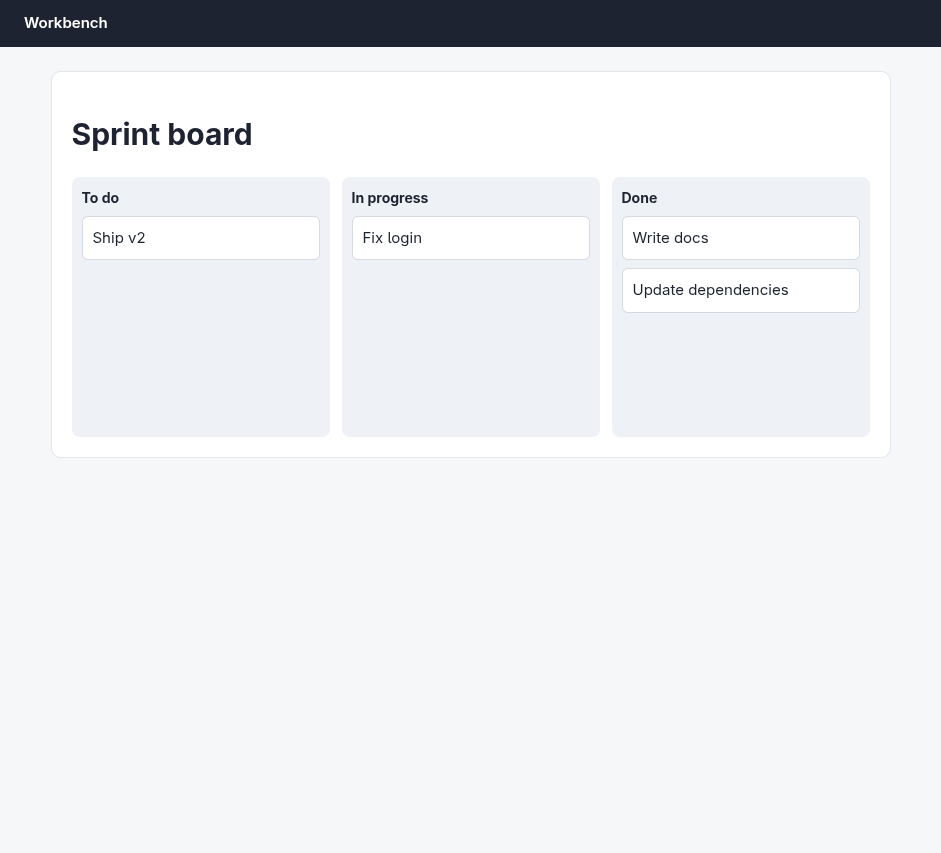

# Argus (your Chromium) · Drag and drop · round 1

**correct** · goal met (read from the server): yes (write-docs→done, fix-login→doing, ship-v2→todo, update-deps→done) · claimed success · 5 tool calls · 24.8 s · $0.085

## 1. `browser_open`

```json
{
  "url": "http://127.0.0.1:33679/board",
  "own": true
}
```

```
lane main opened in your browser
  → http://127.0.0.1:33679/board
  title "Board"
  + "Workbench"
  + "Sprint board"
  + "To do"
  + "Write docs"
  + "Ship v2"
  + "In progress"
  + "Fix login"
  + "Done"
  + "Update dependencies"

Board (941x853)
landmarks:
  banner e0.18
  main e0.20
headings:
  Sprint board e0.22
  To do e0.26
  In progress e0.33
  Done e0.38
```

## 2. `browser_look`

```json
{}
```

```
extension did not answer within 8.0s (-32603)
```

## 3. `browser_screenshot`

```json
{}
```

```
941x853 at (0, 0) in the viewport; image pixel (px, py) is viewport point (0+px, 0+py), 1054 image tokens
```



## 4. `browser_drag`

```json
{
  "from": "Write docs",
  "to": {
    "x": 740,
    "y": 350
  }
}
```

```
✓ drag generic:div.task e0.28  451ms
```

## 5. `browser_screenshot`

```json
{}
```

```
941x853 at (0, 0) in the viewport; image pixel (px, py) is viewport point (0+px, 0+py), 1054 image tokens
```



## Final answer

```
"Write docs" is now in Done, alongside "Update dependencies". The other cards are unchanged: "Ship v2" still in To do, "Fix login" still in In progress.

RESULT: success
```
