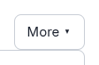
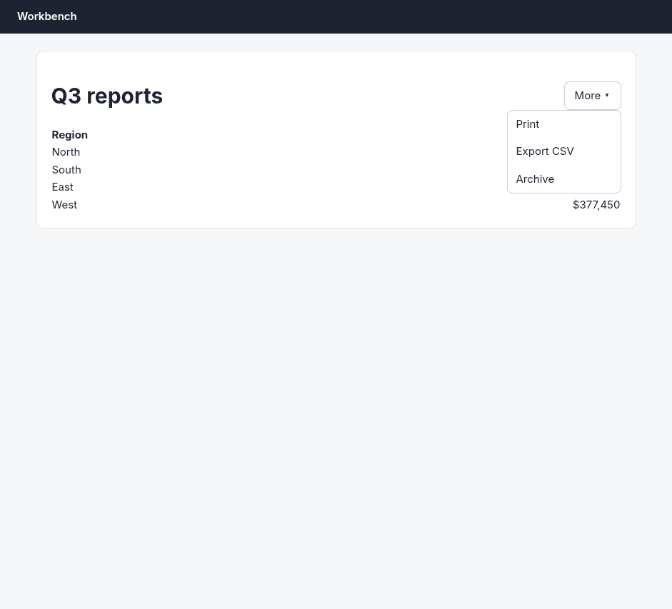
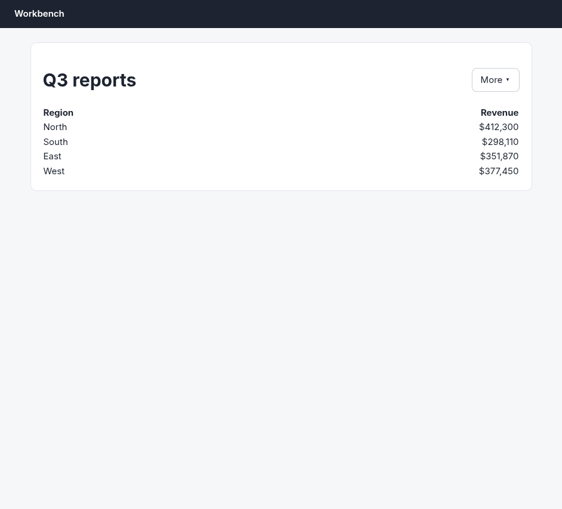

# Argus (your Chromium) · Hover menu · round 1

**correct** · goal met (read from the server): yes (exports 1, archives 0) · claimed success · 11 tool calls · 27.1 s · $0.173

## 1. `browser_open`

```json
{
  "url": "http://127.0.0.1:33679/reports",
  "own": true
}
```

```
lane main opened in your browser
  → http://127.0.0.1:33679/reports
  title "Reports"
  + "Workbench"
  + "Q3 reports"
  + "More ▾"
  + "Region"
  + "Revenue"
  + "North"
  + "$412,300"
  + "South"
  + "$298,110"
  + "East"
  + "$351,870"
  + "West"
  + … 1 more

Reports (941x853)
landmarks:
  banner e0.18
  main e0.20
headings:
  Q3 reports e0.23
```

## 2. `browser_click`

```json
{
  "target": "More \u25be"
}
```

```
✓ click generic:span.btn e0.27  171ms
  + "Print"
  + "Export CSV"
  + "Archive"
```

## 3. `browser_find`

```json
{
  "target": "Export CSV"
}
```

```
generic:div.item e0.34 @711,193 158x39
```

## 4. `browser_look`

```json
{
  "target": "e0.27"
}
```

```
112x73 at (774, 98) in the viewport; image pixel (px, py) is viewport point (774+px, 98+py), 12 image tokens
```



## 5. `browser_screenshot`

```json
{}
```

```
941x853 at (0, 0) in the viewport; image pixel (px, py) is viewport point (0+px, 0+py), 1054 image tokens
```


## 6. `browser_act`

```json
{
  "steps": [
    {
      "hover": "e0.34"
    }
  ]
}
```

```
✓ hover generic:div.item e0.34  167ms
```

## 7. `browser_screenshot`

```json
{}
```

```
941x853 at (0, 0) in the viewport; image pixel (px, py) is viewport point (0+px, 0+py), 1054 image tokens
```



## 8. `browser_click`

```json
{
  "target": "e0.34"
}
```

```
✓ click generic:div.item e0.34  197ms
  + "Export CSV started."
  − "Print"
  − "Export CSV"
  − "Archive"
```

## 9. `browser_screenshot`

```json
{}
```

```
941x853 at (0, 0) in the viewport; image pixel (px, py) is viewport point (0+px, 0+py), 1054 image tokens
```



## 10. `browser_find`

```json
{
  "target": {
    "text": "archived"
  }
}
```

```
No text "archived" on the page.
```

## 11. `browser_trace`

```json
{
  "limit": 10
}
```

```
21:40:13 ✓ act 198ms tmu61zid41p
21:40:10 ✓ act 167ms tmu61zfur1o
21:40:02 ✓ act 172ms tmu61za2r1n
21:40:01 ✓ lane.open 269ms tmu61z9621m
14:36:58 ✓ lane.close 3ms tmu5mv7901b
14:36:47 ✓ act 1350ms tmu5muz1r1a
14:36:44 ✓ lane.open 520ms tmu5muwj719
14:10:33 ✓ lane.close 5ms tmu5lx8na1q
14:10:25 ✓ act 174ms tmu5lx2gx1p
14:10:20 ✓ act 172ms tmu5lwy4p1o
```

## Final answer

```
Done. Steps taken in your own browser:

1. Opened `http://127.0.0.1:33679/reports` ("Q3 reports").
2. Clicked the **More ▾** menu, which revealed Print / Export CSV / Archive.
3. Before clicking, I screenshotted the open menu, hovered **Export CSV**, and re-screenshotted to confirm the items hadn't shifted position under the cursor — they hadn't.
4. Clicked **Export CSV**.

Outcome: the page showed the confirmation **"Export CSV started."** and the menu closed. The report table is unchanged (all four regions still listed with their revenue), and a search for "archived" finds nothing on the page — Archive was never clicked or triggered.

RESULT: success
```
