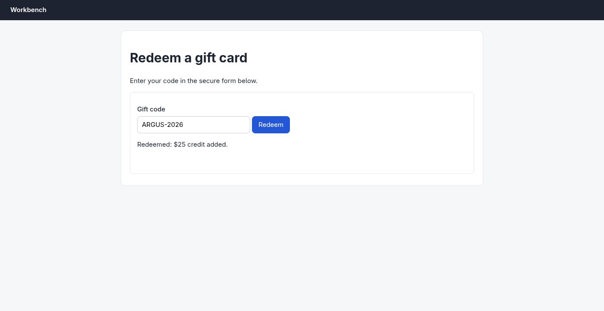

# Argus (your Chromium) · Cross-origin frame · round 1

**correct** · goal met (read from the server): yes (submitted "ARGUS-2026") · claimed success · 6 tool calls · 22.3 s · $0.089

## 1. `browser_open`

```json
{
  "url": "http://127.0.0.1:33679/redeem",
  "own": true
}
```

```
lane main opened in your browser
  → http://127.0.0.1:33679/redeem
  title "Redeem a gift card"
  + "Workbench"
  + "Redeem a gift card"
  + "Enter your code in the secure form below."
  + "Gift code"
  + "Redeem"

Redeem a gift card (1400x723, 2 documents)
landmarks:
  banner e0.21
  main e0.23
headings:
  Redeem a gift card e0.25
fields:
  textbox:Gift code e1.7
actions:
  button:Redeem e1.42
```

## 2. `browser_act`

```json
{
  "steps": [
    {
      "type": [
        "e1.7",
        "ARGUS-2026"
      ]
    },
    {
      "click": "e1.42"
    }
  ]
}
```

```
✓ type textbox:Gift code e1.7  173ms
  = textbox:Gift code: "ARGUS-2026"
✓ click button:Redeem e1.42  1112ms
  + "Redeemed: $25 credit added."
```

## 3. `browser_look`

```json
{
  "target": "e0.23"
}
```

```
extension did not answer within 8.0s (-32603)
```

## 4. `browser_find`

```json
{
  "target": "Redeemed: $25 credit added."
}
```

```
No Redeemed: $25 credit added. on the page.
```

## 5. `browser_outline`

```json
{}
```

```
Redeem a gift card (1400x723, 2 documents)
landmarks:
  banner e0.21
  main e0.23
headings:
  Redeem a gift card e0.25
fields:
  textbox:Gift code e1.7
actions:
  button:Redeem e1.42
```

## 6. `browser_screenshot`

```json
{}
```

```
1400x723 at (0, 0) in the viewport; image pixel (px, py) is viewport point (0+px, 0+py), 1300 image tokens
```



## Final answer

```
The code was entered in the secure form (an iframe) and submitted. The page now shows "Redeemed: $25 credit added." — confirmed by screenshot. The earlier `browser_find` miss was because the text lives inside the iframe, which that lookup didn't reach.

RESULT: success
```
