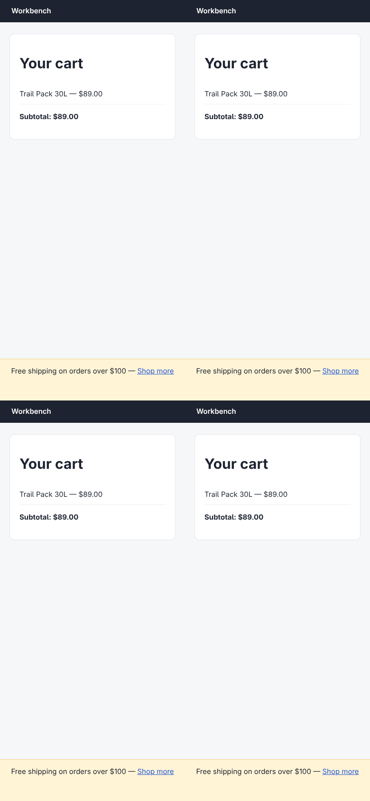

# Argus (your Chromium) · Covered on phones · round 1

**correct** · goal met (read from the server): yes (answered no, named the promo bar; truth: covered by the free-shipping bar) · claimed success · 8 tool calls · 42.9 s · $0.136

## 1. `browser_open`

```json
{
  "url": "http://127.0.0.1:33679/cart",
  "own": true,
  "viewport": {
    "w": 390,
    "h": 844
  }
}
```

```
lane main opened in your browser
  → http://127.0.0.1:33679/cart
  title "Cart"
  + "Workbench"
  + "Your cart"
  + "Trail Pack 30L — $89.00"
  + "Subtotal: $89.00"
  + "Checkout"
  + "Free shipping on orders over $100 — Shop more"

Cart (390x844)
landmarks:
  banner e0.20
  main e0.22
headings:
  Your cart e0.24
actions:
  button:Checkout e0.34 [covered by e0.37 div#promo]
  link:Shop more e0.39
```

## 2. `browser_find`

```json
{
  "target": "button:Checkout"
}
```

```
button:Checkout e0.34 @16,768 358x53
```

## 3. `browser_click`

```json
{
  "target": "button:Checkout"
}
```

```
✗ click button:Checkout e0.34 · covered  15ms
  button "Checkout" is covered by generic div#promo at (195, 795); dismiss or close it first.
  blocker: generic:div#promo e0.37
```

## 4. `browser_screenshot`

```json
{}
```

```
extension did not answer within 8.0s (-32603)
```

## 5. `browser_look`

```json
{}
```

```
780x1688 at (0, 0) in the viewport; image pixel (px, py) is viewport point (0+px, 0+py), 1708 image tokens
```



## 6. `browser_find`

```json
{
  "target": "e0.37"
}
```

```
generic:div#promo e0.37 @0,756 390x88
```

## 7. `browser_act`

```json
{
  "steps": [
    {
      "scroll": {
        "by": {
          "x": 0,
          "y": 600
        }
      }
    },
    {
      "click": "button:Checkout"
    }
  ]
}
```

```
✓ scroll  172ms
✗ click button:Checkout e0.34 · covered  13ms
  button "Checkout" is covered by generic div#promo at (195, 795); dismiss or close it first.
  blocker: generic:div#promo e0.37
```

## 8. `browser_outline`

```json
{}
```

```
Cart (390x844)
landmarks:
  banner e0.20
  main e0.22
headings:
  Your cart e0.24
actions:
  button:Checkout e0.34 [covered by e0.37 div#promo]
  link:Shop more e0.39
```

## Final answer

```
No — at 390×844 the Checkout button is unreachable.

**What I found:**
- Checkout button occupies `y 768–821` (16,768, 358×53).
- `div#promo` — the yellow "Free shipping on orders over $100 — Shop more" bar — is pinned to the bottom at `y 756–844`, full width (0,756, 390×88), and paints over the button.
- The button's entire 53px height sits inside that band, so every pixel of it is covered. Real pointer clicks are intercepted: `button "Checkout" is covered by generic div#promo at (195, 795)`.
- Scrolling doesn't help (the bar is fixed to the bottom of the viewport), and the promo bar has no close/dismiss control — its only interactive element is the "Shop more" link. A tap aimed at Checkout hits the promo bar, and a tap near its center hits "Shop more" instead, navigating the shopper away from the cart.

TAPPABLE: no

RESULT: success
```
