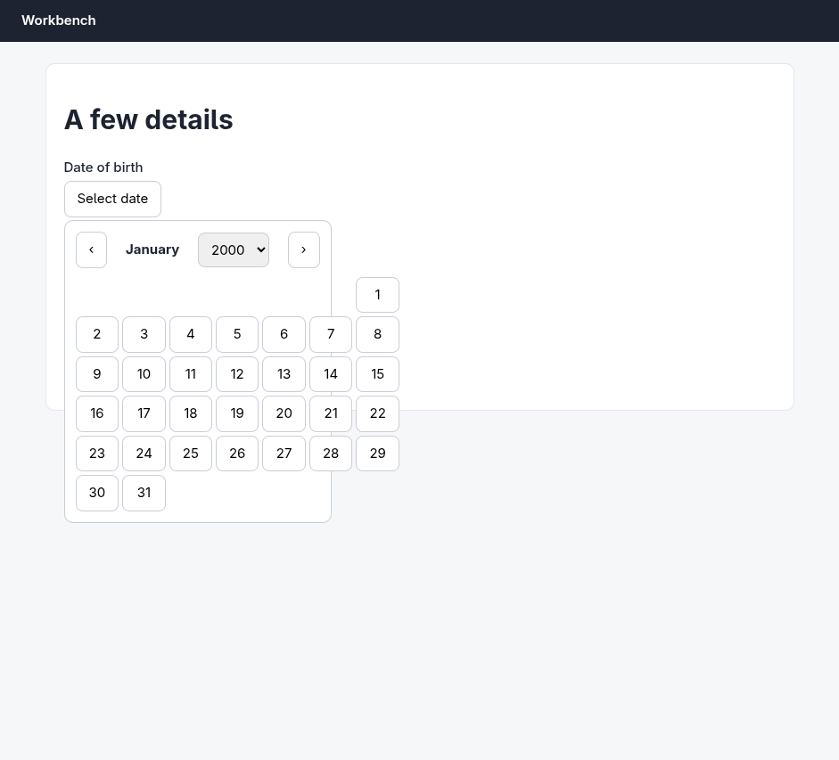
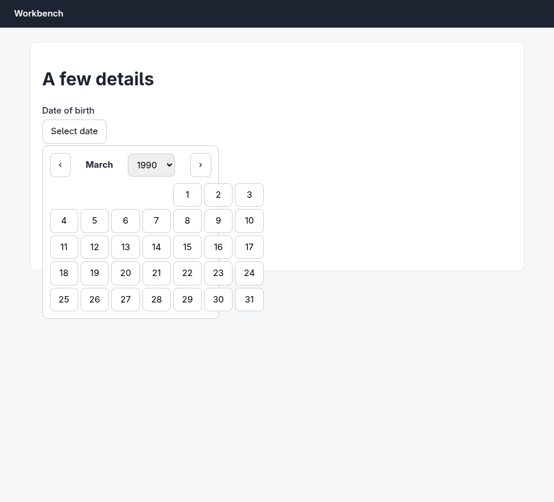
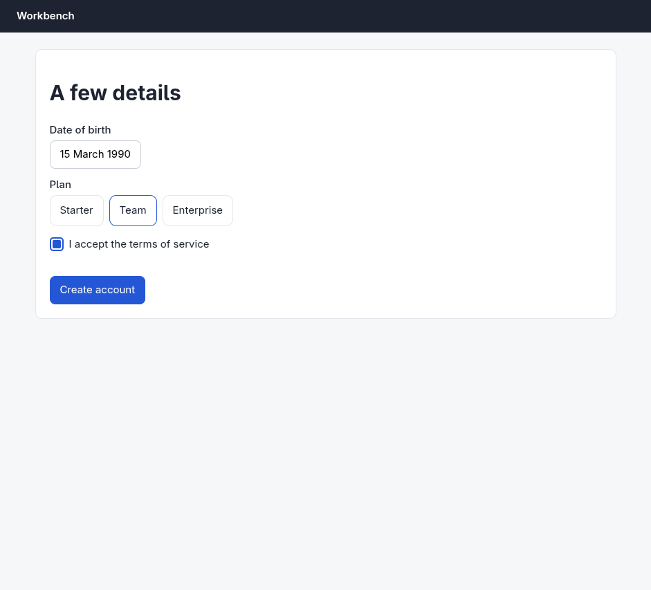
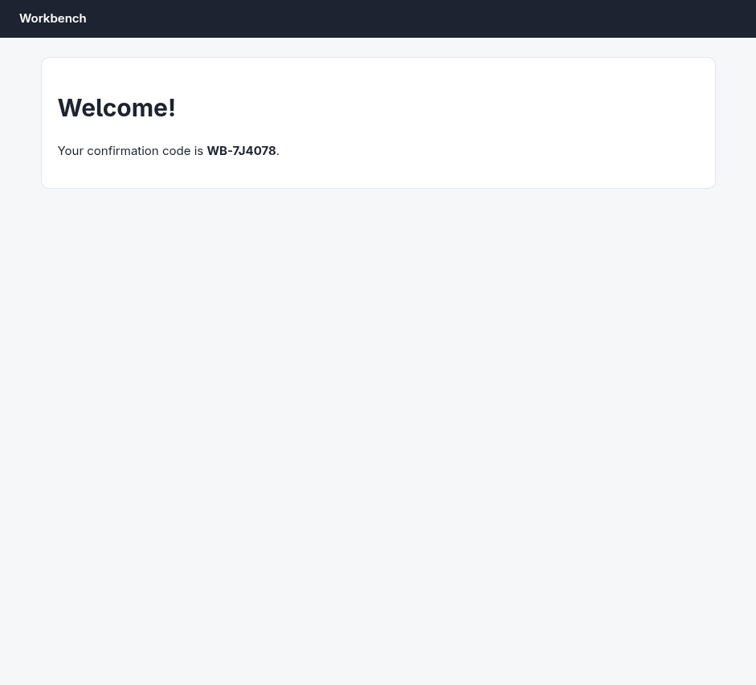

# Argus (your Chromium) · Multi-step form · round 1

**correct** · goal met (read from the server): yes (submitted sam@example.com, dob 15/3/1990, plan Team; code WB-7J4078, reported WB-7J4078) · claimed success · 13 tool calls · 38.8 s · $0.217

## 1. `browser_open`

```json
{
  "url": "http://127.0.0.1:33679/signup",
  "own": true
}
```

```
lane main opened in your browser
  → http://127.0.0.1:33679/signup
  title "Create account"
  + "Workbench"
  + "Create your account"
  + "Email"
  + "Password"
  + "At least 12 characters, including a number."
  + "Next"

Create account (941x853)
landmarks:
  banner e0.24
  main e0.26
headings:
  Create your account e0.29
fields:
  textbox:Email e0.6
  textbox:Password e0.7
actions:
  button:Next e0.43 [disabled]
```

## 2. `browser_act`

```json
{
  "steps": [
    {
      "type": [
        "textbox:Email",
        "sam@example.com"
      ]
    },
    {
      "type": [
        "textbox:Password",
        "correct-horse-42"
      ]
    },
    {
      "click": "button:Next"
    }
  ]
}
```

```
✓ type textbox:Email e0.6  181ms
  = textbox:Email: "sam@example.com"
✓ type textbox:Password e0.7  180ms
  = textbox:Password: "correct-horse-42"
✓ click button:Next e0.43  968ms
  + "A few details"
  + "Date of birth"
  + "Select date"
  + "Plan"
  + "Starter"
  + "Team"
  + "Enterprise"
  + "I accept the terms of service"
  + "Create account"
  − "Create your account"
  − "Email"
  − "Password"
  − "At least 12 characters, including a number."
  − "Next"
```

## 3. `browser_outline`

```json
{
  "budget": 400
}
```

```
Create account (941x853)
landmarks:
  banner e0.24
  main e0.26
headings:
  A few details e0.47
fields:
  radio:Starter e0.286
  radio:Team e0.288
  radio:Enterprise e0.290
  checkbox:I accept the terms of service e0.9 [transparent: click it or its label]
actions:
  button:Select date e0.53
  button:Create account e0.300
```

## 4. `browser_click`

```json
{
  "target": "button:Select date"
}
```

```
✓ click button:Select date e0.53  177ms
  + "‹"
  + "January"
  + "›"
  + "1"
  + "2"
  + "3"
  + "4"
  + "5"
  + "6"
  + "7"
  + "8"
  + "9"
  + … 22 more
```

## 5. `browser_screenshot`

```json
{}
```

```
941x853 at (0, 0) in the viewport; image pixel (px, py) is viewport point (0+px, 0+py), 1054 image tokens
```



## 6. `browser_select`

```json
{
  "target": "combobox",
  "option": "1990"
}
```

```
✓ select combobox:Year e0.8  179ms
  = combobox:Year: "1990"
```

## 7. `browser_act`

```json
{
  "steps": [
    {
      "click": "\u203a"
    },
    {
      "click": "\u203a",
      "expect": {
        "appears": "March"
      }
    }
  ]
}
```

```
✓ click button:Next month e0.278  182ms
  + "February"
  − "January"
  − "29"
  − "30"
  − "31"
✓ click button:Next month e0.278  181ms
  + "March"
  + "29"
  + "30"
  + "31"
  − "February"
```

## 8. `browser_screenshot`

```json
{}
```

```
941x853 at (0, 0) in the viewport; image pixel (px, py) is viewport point (0+px, 0+py), 1054 image tokens
```



## 9. `browser_click`

```json
{
  "target": {
    "x": 318,
    "y": 420
  }
}
```

```
✓ click button:15 March 1990 e0.535  179ms
  + "15 March 1990"
  − "Select date"
  − "‹"
  − "March"
  − "›"
  − "1"
  − "2"
  − "3"
  − "4"
  − "5"
  − "6"
  − "7"
  − "8"
  − … 23 more
```

## 10. `browser_act`

```json
{
  "steps": [
    {
      "click": "radio:Team",
      "expect": {
        "state": [
          "radio:Team",
          "checked"
        ]
      }
    },
    {
      "click": "I accept the terms of service",
      "expect": {
        "state": [
          "checkbox:I accept the terms of service",
          "checked"
        ]
      }
    }
  ]
}
```

```
✓ click radio:Team e0.288  179ms
✓ click label:I accept the terms of service e0.294  176ms
  = checkbox:I accept the terms of service: "unchecked" → "checked"
```

## 11. `browser_screenshot`

```json
{}
```

```
941x853 at (0, 0) in the viewport; image pixel (px, py) is viewport point (0+px, 0+py), 1054 image tokens
```



## 12. `browser_click`

```json
{
  "target": "button:Create account"
}
```

```
✓ click button:Create account e0.300  598ms
  + "Welcome!"
  + "Your confirmation code is WB-7J4078 ."
  − "A few details"
  − "Date of birth"
  − "15 March 1990"
  − "Plan"
  − "Starter"
  − "Team"
  − "Enterprise"
  − "I accept the terms of service"
  − "Create account"
```

## 13. `browser_screenshot`

```json
{}
```

```
941x853 at (0, 0) in the viewport; image pixel (px, py) is viewport point (0+px, 0+py), 1054 image tokens
```



## Final answer

```
Account created with sam@example.com, password correct-horse-42, DOB 15 March 1990, Team plan, terms accepted — each verified on screen before submitting, and the confirmation page loaded.

CODE: WB-7J4078

RESULT: success
```
