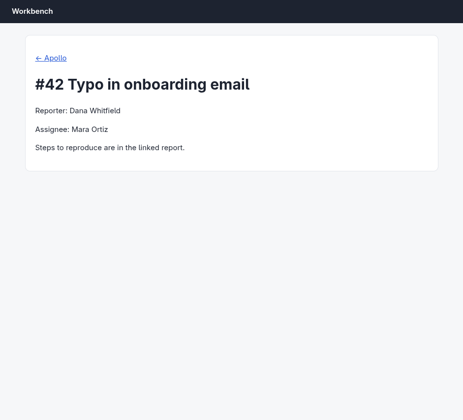

# Argus (your Chromium) · App navigation · round 1

**correct** · goal met (read from the server): yes (reported "Mara Ortiz"; opened apollo/42) · claimed success · 9 tool calls · 20.4 s · $0.223

## 1. `browser_open`

```json
{
  "url": "http://127.0.0.1:33679/app",
  "own": true
}
```

```
lane main opened in your browser
  → http://127.0.0.1:33679/app
  title "Workbench"
  + "Workbench"
  + "Home"
  + "Welcome back."
  + "Projects · Activity"

Workbench (941x853)
landmarks:
  banner e0.18
  main e0.20
  navigation e0.27
headings:
  Home e0.23
actions:
  link:Projects e0.28
  link:Activity e0.31
```

## 2. `browser_click`

```json
{
  "target": "link:Projects"
}
```

```
✓ click link:Projects e0.28  600ms
  → http://127.0.0.1:33679/app/projects
  + "Projects"
  + "Apollo 12 open issues"
  + "Hermes 12 open issues"
  − "Home"
  − "Welcome back."
  − "Projects · Activity"
```

## 3. `browser_click`

```json
{
  "target": "Apollo"
}
```

```
✓ click generic:li e0.39 (substring match)  1169ms
  (nothing changed on the page)
```

## 4. `browser_outline`

```json
{
  "budget": 400
}
```

```
Workbench (941x853)
landmarks:
  banner e0.18
  main e0.20
headings:
  Projects e0.36
actions:
  link:Apollo e0.40
  link:Hermes e0.46
```

## 5. `browser_click`

```json
{
  "target": "e0.40"
}
```

```
✓ click link:Apollo e0.40  1798ms
  → http://127.0.0.1:33679/app/projects/apollo
  + "← Projects"
  + "Apollo issues"
  + "#37 Crash when exporting large files"
  + "#38 Login fails on Safari"
  + "#39 Dark mode colors are off"
  + "#40 Search ignores accents"
  + "#41 Slow dashboard on first load"
  + "#42 Typo in onboarding email"
  + "#43 Avatar upload rotates photos"
  + "#44 Keyboard trap in modal"
  + "#45 Timezone shown as UTC"
  + "#46 Broken link in footer"
  + … 2 more
  − "Projects"
  − "Apollo 12 open issues"
  − "Hermes 12 open issues"
```

## 6. `browser_click`

```json
{
  "target": "#42 Typo in onboarding email"
}
```

```
✓ click generic:li e0.74  510ms
  (nothing changed on the page)
```

## 7. `browser_find`

```json
{
  "target": "link:#42 Typo in onboarding email"
}
```

```
link:#42 Typo in onboarding email e0.75 @72,443 212x19
```

## 8. `browser_click`

```json
{
  "target": "e0.75"
}
```

```
✓ click link:#42 Typo in onboarding email e0.75  1039ms
  → http://127.0.0.1:33679/app/projects/apollo/issues/42
  + "← Apollo"
  + "Reporter: Dana Whitfield"
  + "Assignee: Mara Ortiz"
  + "Steps to reproduce are in the linked report."
  − "← Projects"
  − "Apollo issues"
  − "#37 Crash when exporting large files"
  − "#38 Login fails on Safari"
  − "#39 Dark mode colors are off"
  − "#40 Search ignores accents"
  − "#41 Slow dashboard on first load"
  − "#43 Avatar upload rotates photos"
  − "#44 Keyboard trap in modal"
  − "#45 Timezone shown as UTC"
  − "#46 Broken link in footer"
  − "#47 CSV import drops last row"
  − … 1 more
```

## 9. `browser_screenshot`

```json
{}
```

```
941x853 at (0, 0) in the viewport; image pixel (px, py) is viewport point (0+px, 0+py), 1054 image tokens
```



## Final answer

```
Apollo issue #42 ("Typo in onboarding email") at `/app/projects/apollo/issues/42` lists Reporter: Dana Whitfield and Assignee: Mara Ortiz.

ASSIGNEE: Mara Ortiz

RESULT: success
```
