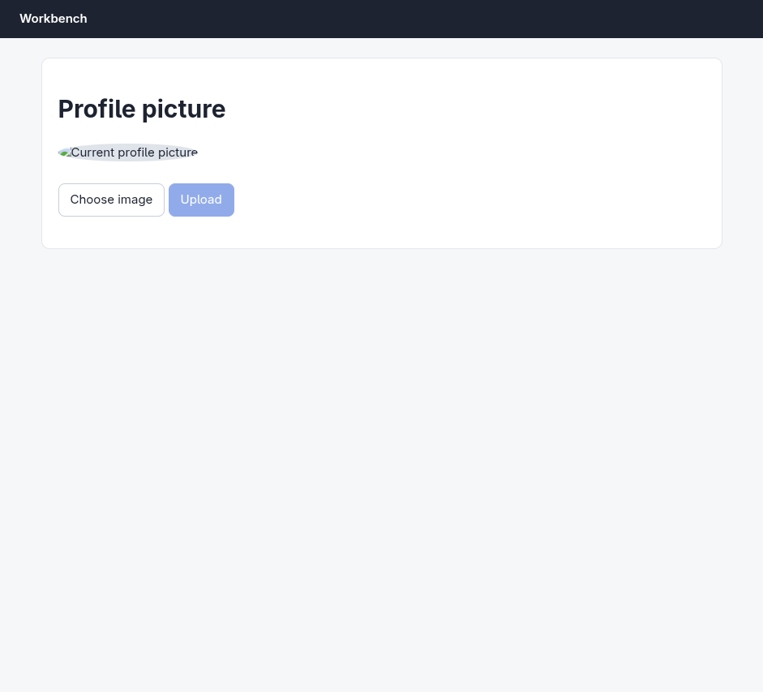
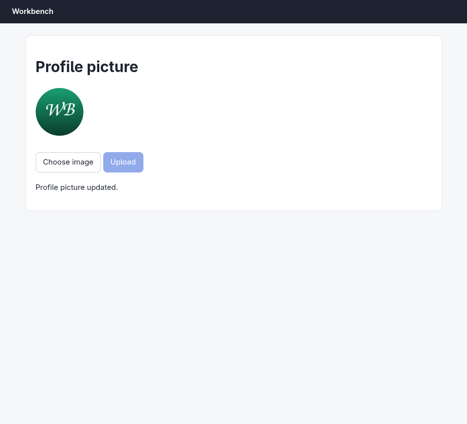

# Argus (your Chromium) · File upload · round 1

**correct** · goal met (read from the server): yes (exact file uploaded) · claimed success · 14 tool calls · 90.6 s · $0.194

## 1. `browser_open`

```json
{
  "url": "http://127.0.0.1:33679/avatar",
  "own": true
}
```

```
lane main opened in your browser
  → http://127.0.0.1:33679/avatar
  title "Profile picture"
  + "Workbench"
  + "Profile picture"
  + "Choose image"
  + "Upload"

Profile picture (941x853)
landmarks:
  banner e0.18
  main e0.20
headings:
  Profile picture e0.22
actions:
  button:Upload e0.32 [disabled]
```

## 2. `browser_find`

```json
{
  "target": "Choose image"
}
```

```
label:Choose image e0.28 @72,226 132x41
```

## 3. `browser_act`

```json
{
  "steps": [
    {
      "upload": [
        "e0.28",
        "/home/elberacasa/Work/argus/argusd/bench/workbench/assets/avatar.png"
      ]
    }
  ]
}
```

```
✗ upload · probe-error  6ms
  The browser refused the step.
  detail: {"code":-32000,"message":"Node is not a file input element"}
```

## 4. `browser_find`

```json
{
  "target": "input[type=file]"
}
```

```
No text "input[type=file]" on the page.
```

## 5. `browser_screenshot`

```json
{}
```

```
extension did not answer within 8.0s (-32603)
```

## 6. `browser_look`

```json
{}
```

```
941x853 at (0, 0) in the viewport; image pixel (px, py) is viewport point (0+px, 0+py), 1054 image tokens
```



## 7. `browser_outline`

```json
{
  "budget": 800
}
```

```
Profile picture (941x853)
landmarks:
  banner e0.18
  main e0.20
headings:
  Profile picture e0.22
actions:
  button:Upload e0.32 [disabled]
```

## 8. `browser_find`

```json
{
  "target": {
    "role": "button",
    "name": "Choose image"
  }
}
```

```
No button "Choose image" on the page.
did you mean: label:Choose image e0.28 · button:Upload e0.32
```

## 9. `browser_find`

```json
{
  "target": "e0.29"
}
```

```
label:Choose image e0.28 @72,226 132x41
```

## 10. `browser_find`

```json
{
  "target": "e0.30"
}
```

```
file:Choose image e0.30 @188,235 22x18
```

## 11. `browser_act`

```json
{
  "steps": [
    {
      "upload": [
        "e0.30",
        "/home/elberacasa/Work/argus/argusd/bench/workbench/assets/avatar.png"
      ]
    }
  ]
}
```

```
✓ upload file:Choose image e0.30  170ms
  = file:Choose image: "avatar.png"
```

## 12. `browser_click`

```json
{
  "target": "button:Upload"
}
```

```
✓ click button:Upload e0.32  198ms
  + "Profile picture updated."
```

## 13. `browser_look`

```json
{}
```

```
extension did not answer within 8.0s (-32603)
```

## 14. `browser_look`

```json
{}
```

```
941x853 at (0, 0) in the viewport; image pixel (px, py) is viewport point (0+px, 0+py), 1054 image tokens
```



## Final answer

```
Done. The "Choose image" label had a hidden file input nested inside it (ref `e0.30`), which is why uploading to the label itself failed; setting the file on the input directly worked.

- Selected `~/Work/argus/argusd/bench/workbench/assets/avatar.png` — the input reported `avatar.png`
- Clicked **Upload** → page shows "Profile picture updated." and the preview now renders the green "WB" avatar instead of the previous broken image

RESULT: success
```
