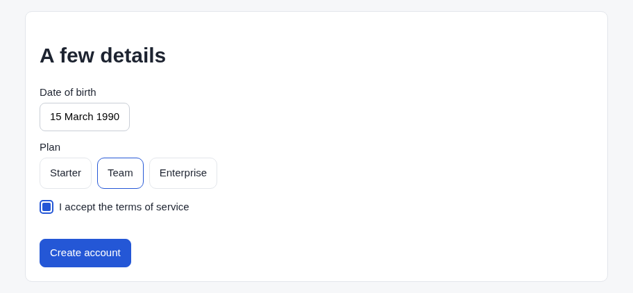
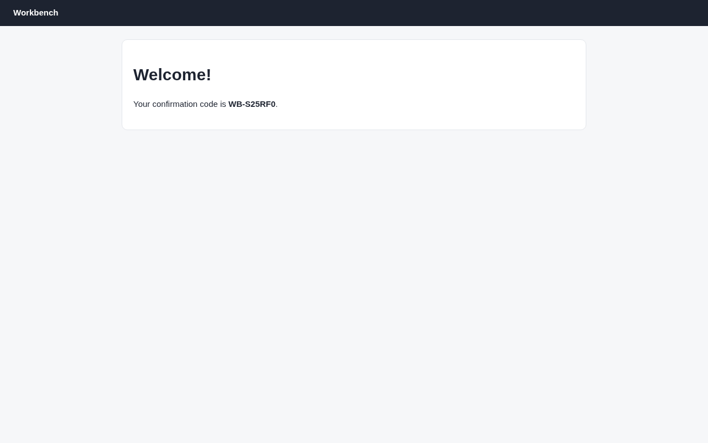

# Argus (its own browser) · Multi-step form · round 1

**correct** · goal met (read from the server): yes (submitted sam@example.com, dob 15/3/1990, plan Team; code WB-S25RF0, reported WB-S25RF0) · claimed success · 11 tool calls · 23.8 s · $0.164

## 1. `browser_open`

```json
{
  "url": "http://127.0.0.1:37673/signup",
  "budget": "600"
}
```

```
lane main opened
  → http://127.0.0.1:37673/signup
  title "Create account"
  + "Workbench"
  + "Create your account"
  + "Email"
  + "Password"
  + "At least 12 characters, including a number."
  + "Next"

Create account (1280x800)
landmarks:
  banner e0.24
  main e0.26
headings:
  Create your account e0.29
fields:
  textbox:Email e0.5
  textbox:Password e0.6
actions:
  button:Next e0.43 [disabled]
```

## 2. `browser_act`

```json
{
  "steps": [
    {
      "type": [
        "e0.5",
        "sam@example.com"
      ]
    },
    {
      "type": [
        "e0.6",
        "correct-horse-42"
      ]
    },
    {
      "click": "button:Next"
    }
  ]
}
```

```
✓ type textbox:Email e0.5  162ms
  = textbox:Email: "sam@example.com"
✓ type textbox:Password e0.6  160ms
  = textbox:Password: "correct-horse-42"
✓ click button:Next e0.43  160ms
  + "A few details"
  + "Date of birth"
  + "Select date"
  + "Plan"
  + "Starter"
  + "Team"
  + "Enterprise"
  + "I accept the terms of service"
  + "Create account"
  − "Create your account"
  − "Email"
  − "Password"
  − "At least 12 characters, including a number."
  − "Next"
```

## 3. `browser_click`

```json
{
  "target": "Select date"
}
```

```
✓ click button:Select date e0.53  163ms
  + "‹"
  + "January"
  + "›"
  + "1"
  + "2"
  + "3"
  + "4"
  + "5"
  + "6"
  + "7"
  + "8"
  + "9"
  + … 22 more
```

## 4. `browser_outline`

```json
{
  "budget": 800
}
```

```
Create account (1280x800)
landmarks:
  banner e0.24
  main e0.26
headings:
  A few details e0.47
fields:
  combobox:Year e0.7
  radio:Starter e0.286
  radio:Team e0.288
  radio:Enterprise e0.290
  checkbox:I accept the terms of service e0.8 [transparent: click it or its label]
actions:
  button:Select date e0.53
  button:Previous month e0.60
  button:Next month e0.278
  button:1 January 2000 e0.313
  button:2 January 2000 e0.315
  button:3 January 2000 e0.317
  button:4 January 2000 e0.319
  button:5 January 2000 e0.321
  button:6 January 2000 e0.323
  button:7 January 2000 e0.325
  button:8 January 2000 e0.327
  button:9 January 2000 e0.329
  button:10 January 2000 e0.331
  button:11 January 2000 e0.333
  button:12 January 2000 e0.335
  button:13 January 2000 e0.337
  button:14 January 2000 e0.339
  button:15 January 2000 e0.341
  button:16 January 2000 e0.343
  button:17 January 2000 e0.345
  button:18 January 2000 e0.347
  button:19 January 2000 e0.349
  button:20 January 2000 e0.351
  button:21 January 2000 e0.353
  button:22 January 2000 e0.355
  button:23 January 2000 e0.357
  button:24 January 2000 e0.359
  button:25 January 2000 e0.361
  button:26 January 2000 e0.363
  button:27 January 2000 e0.365
  button:28 January 2000 e0.367
  button:29 January 2000 e0.369
  button:30 January 2000 e0.371
  button:31 January 2000 e0.373
  button:Create account e0.300
```

## 5. `browser_act`

```json
{
  "steps": [
    {
      "select": [
        "combobox:Year",
        "1990"
      ]
    },
    {
      "click": "button:Next month"
    },
    {
      "click": "button:Next month"
    },
    {
      "click": "button:15 March 1990"
    }
  ]
}
```

```
✓ select combobox:Year e0.7  161ms
  = combobox:Year: "1990"
✓ click button:Next month e0.278  161ms
  + "February"
  − "January"
  − "29"
  − "30"
  − "31"
✓ click button:Next month e0.278  162ms
  + "March"
  + "29"
  + "30"
  + "31"
  − "February"
✓ click button:15 March 1990 e0.533  161ms
  + "15 March 1990"
  − "Select date"
  − "‹"
  − "March"
  − "›"
  − "1"
  − "2"
  − "3"
  − "4"
  − "5"
  − "6"
  − "7"
  − "8"
  − … 23 more
```

## 6. `browser_act`

```json
{
  "steps": [
    {
      "click": "radio:Team",
      "expect": {
        "state": [
          "radio:Team",
          "checked"
        ]
      }
    },
    {
      "click": "checkbox:I accept the terms of service",
      "expect": {
        "state": [
          "checkbox:I accept the terms of service",
          "checked"
        ]
      }
    },
    {
      "click": "button:Create account"
    }
  ]
}
```

```
✓ click radio:Team e0.288  163ms
✗ click checkbox:I accept the terms of service e0.8 · hidden  3ms
  checkbox "I accept the terms of service" is on the page but hidden (opacity).
(stopped: 1 step(s) not run)
```

## 7. `browser_click`

```json
{
  "target": "I accept the terms of service",
  "expect": {
    "state": [
      "checkbox:I accept the terms of service",
      "checked"
    ]
  }
}
```

```
✓ click label:I accept the terms of service e0.294  162ms
  = checkbox:I accept the terms of service: "unchecked" → "checked"
```

## 8. `browser_look`

```json
{
  "target": "e0.26"
}
```

```
912x422 at (184, 55) in the viewport; image pixel (px, py) is viewport point (184+px, 55+py), 528 image tokens
```



## 9. `browser_find`

```json
{
  "target": "radio:Team"
}
```

```
radio:Team e0.288 @324,282 67x45 [checked]
```

## 10. `browser_click`

```json
{
  "target": "button:Create account"
}
```

```
✓ click button:Create account e0.300  574ms
  + "Welcome!"
  + "Your confirmation code is WB-S25RF0 ."
  − "A few details"
  − "Date of birth"
  − "15 March 1990"
  − "Plan"
  − "Starter"
  − "Team"
  − "Enterprise"
  − "I accept the terms of service"
  − "Create account"
```

## 11. `browser_look`

```json
{}
```

```
1280x800 at (0, 0) in the viewport; image pixel (px, py) is viewport point (0+px, 0+py), 1334 image tokens
```



## Final answer

```
I created the account and the site showed its confirmation code.

- **Page 1:** I entered the email sam@example.com and the password correct-horse-42.
- **Page 2:** I picked 15 March 1990 as the date of birth. Before submitting, the browser showed the Team plan selected and the terms box ticked. The terms checkbox itself was invisible, so I ticked it by clicking its label.

After I clicked "Create account", the page said "Welcome!" and showed the code. The site has no page that lists the saved account details, so I could only check them on the form before submitting, not after.

CODE: WB-S25RF0

RESULT: success
```
