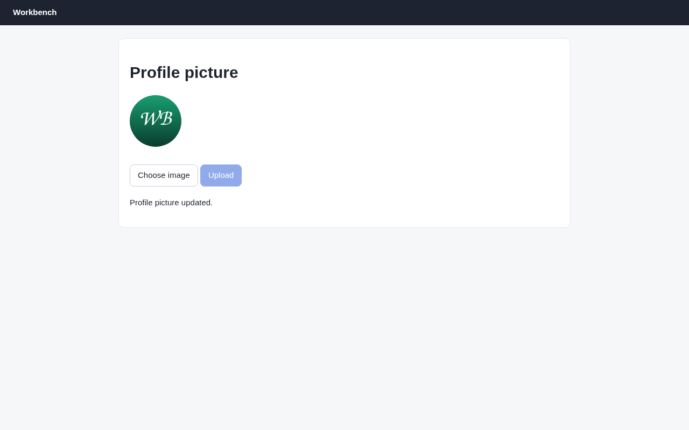

# Argus (its own browser) · File upload · round 1

**correct** · goal met (read from the server): yes (exact file uploaded) · claimed success · 12 tool calls · 25.4 s · $0.127

## 1. `browser_open`

```json
{
  "url": "http://127.0.0.1:37673/avatar"
}
```

```
lane main opened
  → http://127.0.0.1:37673/avatar
  title "Profile picture"
  + "Workbench"
  + "Profile picture"
  + "Choose image"
  + "Upload"

Profile picture (1280x800)
landmarks:
  banner e0.18
  main e0.20
headings:
  Profile picture e0.22
actions:
  button:Upload e0.32 [disabled]
```

## 2. `browser_act`

```json
{
  "steps": [
    {
      "upload": [
        "Choose image",
        "/home/elberacasa/Work/argus/argusd/bench/workbench/assets/avatar.png"
      ]
    },
    {
      "click": "button:Upload"
    }
  ]
}
```

```
✗ upload · probe-error  2ms
  The browser refused the step.
  detail: DOM.setFileInputFiles: Node is not a file input element (-32000)
(stopped: 1 step(s) not run)
```

## 3. `browser_find`

```json
{
  "target": "Choose image"
}
```

```
label:Choose image e0.28 @241,226 127x41
```

## 4. `browser_act`

```json
{
  "steps": [
    {
      "upload": [
        "e0.28",
        "/home/elberacasa/Work/argus/argusd/bench/workbench/assets/avatar.png"
      ]
    }
  ]
}
```

```
✗ upload · probe-error  2ms
  The browser refused the step.
  detail: DOM.setFileInputFiles: Node is not a file input element (-32000)
```

## 5. `browser_outline`

```json
{
  "budget": 800
}
```

```
Profile picture (1280x800)
landmarks:
  banner e0.18
  main e0.20
headings:
  Profile picture e0.22
actions:
  button:Upload e0.32 [disabled]
```

## 6. `browser_find`

```json
{
  "target": {
    "role": "textbox",
    "name": "Choose image"
  }
}
```

```
No textbox "Choose image" on the page.
did you mean: label:Choose image e0.28
```

## 7. `browser_find`

```json
{
  "target": {
    "role": "button",
    "name": "Choose image"
  }
}
```

```
No button "Choose image" on the page.
did you mean: label:Choose image e0.28 · button:Upload e0.32
```

## 8. `browser_find`

```json
{
  "target": "e0.30"
}
```

```
file:Choose image e0.30 @353,235 22x18
```

## 9. `browser_find`

```json
{
  "target": "e0.29"
}
```

```
label:Choose image e0.28 @241,226 127x41
```

## 10. `browser_find`

```json
{
  "target": "e0.31"
}
```

```
generic:div.card e0.21 @220,71 840x236
```

## 11. `browser_act`

```json
{
  "steps": [
    {
      "upload": [
        "e0.30",
        "/home/elberacasa/Work/argus/argusd/bench/workbench/assets/avatar.png"
      ]
    },
    {
      "click": "button:Upload"
    }
  ]
}
```

```
✓ upload file:Choose image e0.30  158ms
  = file:Choose image: "avatar.png"
✓ click button:Upload e0.32  209ms
  + "Profile picture updated."
```

## 12. `browser_look`

```json
{}
```

```
1280x800 at (0, 0) in the viewport; image pixel (px, py) is viewport point (0+px, 0+py), 1334 image tokens
```



## Final answer

```
I uploaded `~/Work/argus/argusd/bench/workbench/assets/avatar.png` as the profile picture. The page said "Profile picture updated." and now shows the new round green "WB" image.

The page's own feedback shows the upload went through. I can't see the server side, so I didn't check that it holds a byte-for-byte copy of the file.

The first two upload attempts failed because they pointed at the "Choose image" label, not the hidden file field behind it. The third attempt used that field directly and worked.

RESULT: success
```
