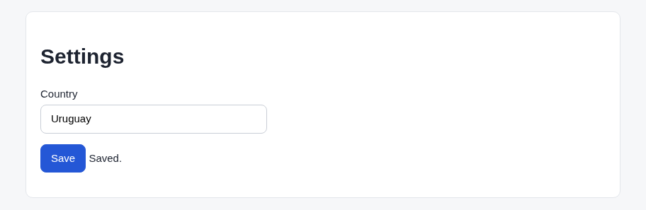

# Argus (its own browser) · Long custom list · round 1

**correct** · goal met (read from the server): yes (saved "Uruguay") · claimed success · 6 tool calls · 15 s · $0.079

## 1. `browser_open`

```json
{
  "url": "http://127.0.0.1:37673/settings"
}
```

```
lane main opened
  → http://127.0.0.1:37673/settings
  title "Settings"
  + "Workbench"
  + "Settings"
  + "Country"
  + "Choose a country"
  + "Save"

Settings (1280x800)
landmarks:
  banner e0.18
  main e0.20
headings:
  Settings e0.22
fields:
  combobox:Country e0.29
actions:
  button:Save e0.38
```

## 2. `browser_select`

```json
{
  "target": "e0.29",
  "option": "Uruguay"
}
```

```
✗ select combobox:Country e0.29 · not-found  4ms
  combobox "Country" has no option "Uruguay".
```

## 3. `browser_click`

```json
{
  "target": "e0.29"
}
```

```
✓ click combobox:Country e0.29  164ms
  + "Afghanistan"
  + "Albania"
  + "Algeria"
  + "Andorra"
  + "Angola"
  + "Antigua and Barbuda"
  + "Argentina"
  + "Armenia"
  + "Australia"
  + "Austria"
  + "Azerbaijan"
  + "Bahamas"
```

## 4. `browser_scroll`

```json
{
  "until": "option:Uruguay",
  "in": "listbox"
}
```

```
✓ scroll option:Uruguay e0.776  2669ms
  + "Tuvalu"
  + "Uganda"
  + "Ukraine"
  + "United Arab Emirates"
  + "United Kingdom"
  + "United States"
  + "Uruguay"
  + "Uzbekistan"
  + "Vanuatu"
  + "Vatican City"
  + "Venezuela"
  + "Vietnam"
  − "Afghanistan"
  − "Albania"
  − "Algeria"
  − "Andorra"
  − "Angola"
  − "Antigua and Barbuda"
  − "Argentina"
  − "Armenia"
  − "Australia"
  − "Austria"
  − "Azerbaijan"
  − "Bahamas"
```

## 5. `browser_act`

```json
{
  "steps": [
    {
      "click": "e0.776"
    },
    {
      "click": "button:Save"
    }
  ]
}
```

```
✓ click option:Uruguay e0.776  161ms
  − "Choose a country"
  − "Tuvalu"
  − "Uganda"
  − "Ukraine"
  − "United Arab Emirates"
  − "United Kingdom"
  − "United States"
  − "Uzbekistan"
  − "Vanuatu"
  − "Vatican City"
  − "Venezuela"
  − "Vietnam"
✓ click button:Save e0.38  213ms
  + "Saved."
```

## 6. `browser_look`

```json
{
  "target": "e0.20"
}
```

```
912x297 at (184, 55) in the viewport; image pixel (px, py) is viewport point (184+px, 55+py), 363 image tokens
```



## Final answer

```
I set the country to Uruguay and saved it. After I clicked Save, the page showed "Saved." and the Country field reads "Uruguay". I didn't reload the page to check that the setting stays after a refresh.

The Country field is a custom dropdown rather than a standard one, so I opened it, scrolled the list to Uruguay and clicked it.

RESULT: success
```
