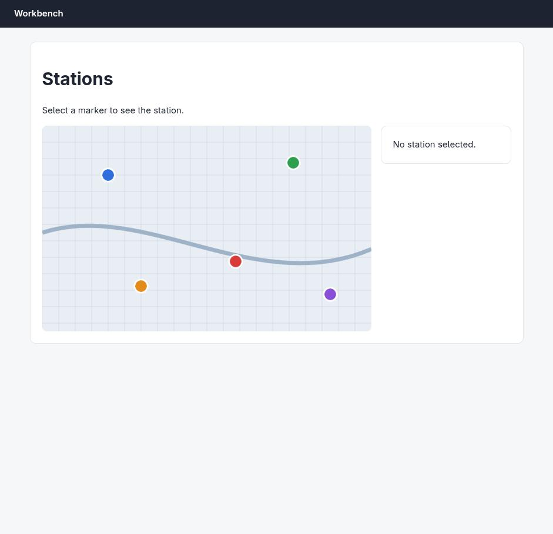
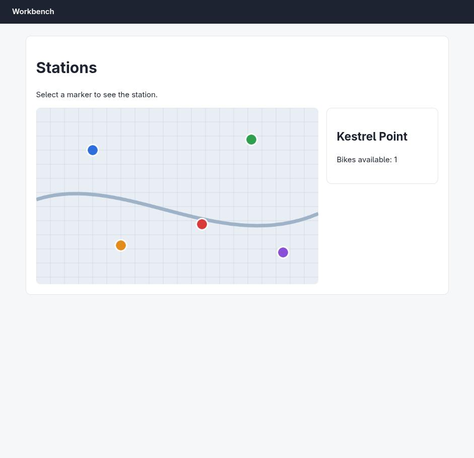
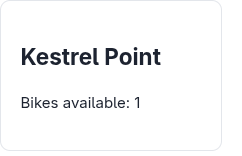

# Claude in Chrome · Canvas map · round 1

**correct** · goal met (read from the server): yes (opened Kestrel Point, Willow Bend, Kestrel Point; reported Kestrel Point) · claimed success · 14 tool calls · 113.4 s · $0.352

## 1. `tabs_context_mcp`

```json
{
  "createIfEmpty": true
}
```

```
{"availableTabs":[{"tabId":453242433,"title":"New Tab","url":"chrome://newtab/"}],"tabGroupId":793993518}
```

## 2. `browser_batch`

```json
{
  "actions": [
    {
      "name": "navigate",
      "input": {
        "url": "http://127.0.0.1:33679/map",
        "tabId": 453242433
      }
    },
    {
      "name": "computer",
      "input": {
        "action": "screenshot",
        "tabId": 453242433
      }
    }
  ]
}
```

```
[navigate] Navigated to http://127.0.0.1:33679/map
```

```
[computer:screenshot] Successfully captured screenshot (941x909, jpeg) - ID: ss_5293gtdxo
```



## 3. `browser_batch`

```json
{
  "actions": [
    {
      "name": "computer",
      "input": {
        "action": "left_click",
        "coordinate": [
          401,
          445
        ],
        "tabId": 453242433
      }
    },
    {
      "name": "computer",
      "input": {
        "action": "screenshot",
        "tabId": 453242433
      }
    }
  ]
}
```

```
[computer:left_click] Clicked at (401, 445)

actions[1] (computer:screenshot) failed: Error capturing screenshot: CDP sendCommand "Page.captureScreenshot" timed out after 30000ms on tab 453242433. The renderer may be frozen or unresponsive. (1 completed, 0 remaining)
```

## 4. `computer`

```json
{
  "action": "screenshot",
  "tabId": 453242433
}
```

```
Successfully captured screenshot (941x909, jpeg) - ID: ss_1402rq1is
```



## 5. `javascript_tool`

```json
{
  "action": "javascript_exec",
  "tabId": 453242433,
  "text": "Array.from(document.querySelectorAll('svg *, [data-station], [class*=marker]')).slice(0,40).map(e=>({tag:e.tagName, cls:e.getAttribute('class'), fill:e.getAttribute('fill'), style:e.getAttribute('style'), ds:e.getAttribute('data-station'), name:e.getAttribute('data-name'), txt:(e.textContent||'').slice(0,40)}))"
}
```

```
[]
```

## 6. `javascript_tool`

```json
{
  "action": "javascript_exec",
  "tabId": 453242433,
  "text": "const els=[...document.querySelectorAll('*')].filter(e=>{const s=getComputedStyle(e);const bg=s.backgroundColor;return e.offsetWidth>5&&e.offsetWidth<40&&bg&&bg!=='rgba(0, 0, 0, 0)'&&s.borderRadius.includes('%')});els.map(e=>{const r=e.getBoundingClientRect();return {bg:getComputedStyle(e).backgroundColor,x:Math.round(r.x+r.width/2),y:Math.round(r.y+r.height/2),attrs:[...e.attributes].map(a=>a.name+'='+a.value).join(' '),html:e.outerHTML.slice(0,200)}})"
}
```

```
[]
```

## 7. `javascript_tool`

```json
{
  "action": "javascript_exec",
  "tabId": 453242433,
  "text": "({count: document.querySelectorAll('*').length, title: document.title, bodyLen: document.body.innerHTML.length})"
}
```

```
{
  "bodyLen": 1717,
  "count": 18,
  "title": "Stations"
}
```

## 8. `javascript_tool`

```json
{
  "action": "javascript_exec",
  "tabId": 453242433,
  "text": "document.body.innerHTML"
}
```

```
[BLOCKED: Cookie/query string data]
```

## 9. `javascript_tool`

```json
{
  "action": "javascript_exec",
  "tabId": 453242433,
  "text": "[...document.querySelectorAll('*')].map((e,i)=>{const r=e.getBoundingClientRect();const s=getComputedStyle(e);return i+':'+e.tagName+' cls='+(e.className&&e.className.baseVal!==undefined?e.className.baseVal:e.className)+' bg='+s.backgroundColor+' box='+Math.round(r.x)+','+Math.round(r.y)+','+Math.round(r.width)+'x'+Math.round(r.height)}).join('\\n')"
}
```

```
0:HTML cls= bg=rgba(0, 0, 0, 0) box=0,0,941x609
1:HEAD cls= bg=rgba(0, 0, 0, 0) box=0,0,0x0
2:META cls= bg=rgba(0, 0, 0, 0) box=0,0,0x0
3:META cls= bg=rgba(0, 0, 0, 0) box=0,0,0x0
4:TITLE cls= bg=rgba(0, 0, 0, 0) box=0,0,0x0
5:STYLE cls= bg=rgba(0, 0, 0, 0) box=0,0,0x0
6:BODY cls= bg=rgb(246, 247, 249) box=0,0,941x585
7:HEADER cls= bg=rgb(29, 35, 48) box=0,0,941x47
8:MAIN cls= bg=rgba(0, 0, 0, 0) box=31,71,880x515
9:DIV cls=card bg=rgb(255, 255, 255) box=51,71,840x515
10:H1 cls= bg=rgba(0, 0, 0, 0) box=72,112,798x45
11:P cls= bg=rgba(0, 0, 0, 0) box=72,177,798x23
12:DIV cls= bg=rgba(0, 0, 0, 0) box=72,214,798x350
13:CANVAS cls= bg=rgba(0, 0, 0, 0) box=72,214,560x350
14:ASIDE cls=card bg=rgb(255, 255, 255) box=648,214,222x151
15:H2 cls= bg=rgba(0, 0, 0, 0) box=669,254,180x34
16:P cls= bg=rgba(0, 0, 0, 0) box=669,306,180x23
17:SCRIPT cls= bg=rgba(0, 0, 0, 0) box=0,0,0x0
```

## 10. `javascript_tool`

```json
{
  "action": "javascript_exec",
  "tabId": 453242433,
  "text": "const c=document.querySelector('canvas');const r=c.getBoundingClientRect();const ctx=c.getContext('2d');const sx=c.width/r.width, sy=c.height/r.height;\nfunction px(vx,vy){const d=ctx.getImageData(Math.round((vx-r.x)*sx),Math.round((vy-r.y)*sy),1,1).data;return d[0]+','+d[1]+','+d[2]}\n({canvasSize:c.width+'x'+c.height, cssSize:Math.round(r.width)+'x'+Math.round(r.height), clicked_401_445: px(401,445), green_499_277: px(499,277), blue_184_298: px(184,298)})"
}
```

```
{
  "blue_184_298": "47,111,221",
  "canvasSize": "800x500",
  "clicked_401_445": "217,58,58",
  "cssSize": "560x350",
  "green_499_277": "46,158,79"
}
```

## 11. `javascript_tool`

```json
{
  "action": "javascript_exec",
  "tabId": 453242433,
  "text": "document.querySelector('script').textContent.replace(/\\s+/g,' ').slice(0,1500)"
}
```

```
[BLOCKED: Cookie/query string data]
```

## 12. `javascript_tool`

```json
{
  "action": "javascript_exec",
  "tabId": 453242433,
  "text": "const g=Object.keys(window).filter(k=>{try{const v=window[k];return Array.isArray(v)&&v.length&&typeof v[0]==='object'&&v[0]&&('color' in v[0]||'name' in v[0])}catch(e){return false}});\ng.length? g.map(k=>k+': '+window[k].map(s=>s.name+'/'+s.color+'@'+s.x+','+s.y).join(' | ')).join('\\n') : 'no matching globals: '+Object.keys(window).filter(k=>!(k in ({}))).slice(-25).join(',')"
}
```

```
no matching globals: ondeviceorientationabsolute,onpointerrawupdate,caches,documentPictureInPicture,sharedStorage,fetchLater,getScreenDetails,queryLocalFonts,showDirectoryPicker,showOpenFilePicker,showSaveFilePicker,originAgentCluster,viewport,onpageswap,credentialless,fence,launchQueue,speechSynthesis,onscrollsnapchange,onscrollsnapchanging,ongamepadconnected,ongamepaddisconnected,webkitRequestFileSystem,webkitResolveLocalFileSystemURL,px
```

## 13. `browser_batch`

```json
{
  "actions": [
    {
      "name": "computer",
      "input": {
        "action": "left_click",
        "coordinate": [
          499,
          277
        ],
        "tabId": 453242433
      }
    },
    {
      "name": "get_page_text",
      "input": {
        "tabId": 453242433
      }
    },
    {
      "name": "computer",
      "input": {
        "action": "left_click",
        "coordinate": [
          401,
          445
        ],
        "tabId": 453242433
      }
    },
    {
      "name": "get_page_text",
      "input": {
        "tabId": 453242433
      }
    }
  ]
}
```

```
[computer:left_click] Clicked at (499, 277)
```

```
[get_page_text] Title: Stations
URL: http://127.0.0.1:33679/map
Source element: <main>
---
Stations

Select a marker to see the station.

Willow Bend

Bikes available: 3
```

```
[computer:left_click] Clicked at (401, 445)
```

```
[get_page_text] Title: Stations
URL: http://127.0.0.1:33679/map
Source element: <main>
---
Stations

Select a marker to see the station.

Kestrel Point

Bikes available: 1
```

## 14. `computer`

```json
{
  "action": "zoom",
  "region": [
    648,
    214,
    890,
    370
  ],
  "tabId": 453242433
}
```

```
Successfully captured zoomed screenshot of region (648,214) to (890,370) - 242x156 pixels
```



## Final answer

```
I opened the map, clicked the red marker, and verified the result:

- The map is a `<canvas>`, so markers aren't DOM elements. I sampled the canvas pixel at my click point (401, 445) and it returned `rgb(217,58,58)` — the red marker.
- The details panel changed from "No station selected." to **Kestrel Point** (Bikes available: 1).
- To confirm the click→panel mapping was real and per-marker, I clicked the green marker (returned "Willow Bend"), then re-clicked the red marker, which returned "Kestrel Point" again.

One note: reading the page's inline script and raw HTML was blocked by a content filter, so I verified the marker identity by canvas pixel color plus the cross-check above rather than by reading the station data directly.

STATION: Kestrel Point

RESULT: success
```
