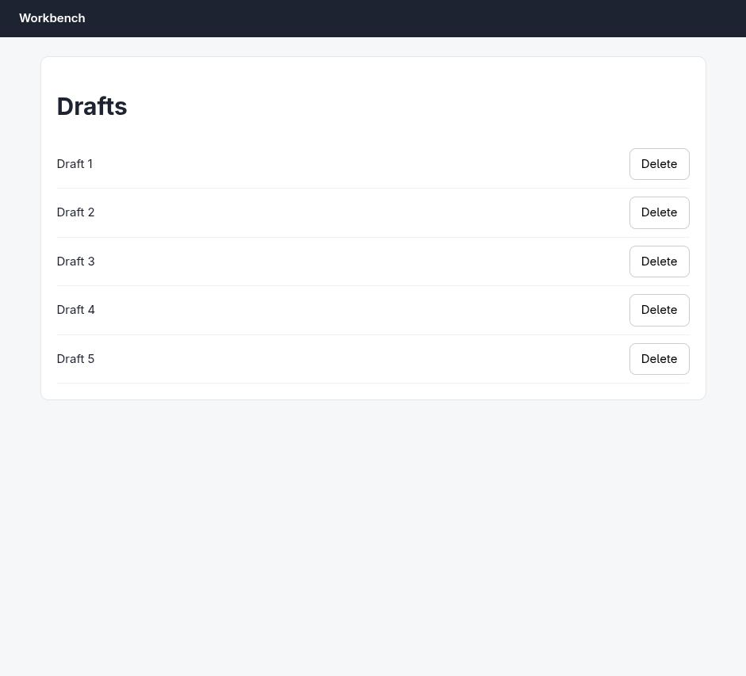
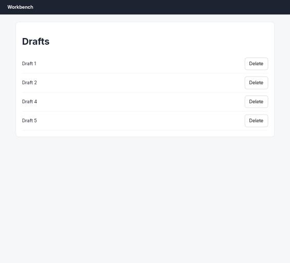

# Claude in Chrome · Confirm dialog · round 1

**correct** · goal met (read from the server): yes (drafts left: 1, 2, 4, 5) · claimed success · 18 tool calls · 166 s · $0.412

## 1. `tabs_context_mcp`

```json
{
  "createIfEmpty": true
}
```

```
{"availableTabs":[{"tabId":453242418,"title":"New Tab","url":"chrome://newtab/"}],"tabGroupId":1056560273}
```

## 2. `browser_batch`

```json
{
  "actions": [
    {
      "name": "navigate",
      "input": {
        "url": "http://127.0.0.1:33679/drafts",
        "tabId": 453242418
      }
    },
    {
      "name": "computer",
      "input": {
        "action": "screenshot",
        "tabId": 453242418
      }
    }
  ]
}
```

```
[navigate] Navigated to http://127.0.0.1:33679/drafts
```

```
[computer:screenshot] Successfully captured screenshot (941x853, jpeg) - ID: ss_4158ukdek
```



## 3. `read_page`

```json
{
  "tabId": 453242418,
  "filter": "interactive"
}
```

```
button "Delete" [ref_1]
button "Delete" [ref_2]
button "Delete" [ref_3]
button "Delete" [ref_4]
button "Delete" [ref_5]

Viewport: 941x853
```

## 4. `javascript_tool`

```json
{
  "action": "javascript_exec",
  "text": "document.body.innerHTML.slice(0,3000)",
  "tabId": 453242418
}
```

```
[BLOCKED: Cookie/query string data]
```

## 5. `browser_batch`

```json
{
  "actions": [
    {
      "name": "computer",
      "input": {
        "action": "left_click",
        "coordinate": [
          831,
          329
        ],
        "tabId": 453242418
      }
    },
    {
      "name": "computer",
      "input": {
        "action": "screenshot",
        "tabId": 453242418
      }
    }
  ]
}
```

```
actions[0] (computer:left_click) failed: Error clicking: CDP sendCommand "Input.dispatchMouseEvent" timed out after 30000ms on tab 453242418. The renderer may be frozen or unresponsive. (0 completed, 1 remaining)
```

## 6. `computer`

```json
{
  "action": "screenshot",
  "tabId": 453242418
}
```

```
Error capturing screenshot: Script injection timed out after 5000ms — the page is busy or mid-navigation (a long-running script, or a navigation the previous action triggered, may be in progress). Try again in a moment.
```

## 7. `browser_batch`

```json
{
  "actions": [
    {
      "name": "computer",
      "input": {
        "action": "wait",
        "duration": 3,
        "tabId": 453242418
      }
    },
    {
      "name": "computer",
      "input": {
        "action": "screenshot",
        "tabId": 453242418,
        "scale": 0.5
      }
    }
  ]
}
```

```
[computer:wait] Waited for 3 seconds

actions[1] (computer:screenshot) failed: Error capturing screenshot: Script injection timed out after 5000ms — the page is busy or mid-navigation (a long-running script, or a navigation the previous action triggered, may be in progress). Try again in a moment. (1 completed, 0 remaining)
```

## 8. `tabs_context_mcp`

```json
{}
```

```
{"availableTabs":[{"tabId":453242418,"title":"Drafts","url":"http://127.0.0.1:33679/drafts"}],"selectedTabId":453242418,"tabGroupId":1056560273}
```

## 9. `computer`

```json
{
  "action": "key",
  "text": "Return",
  "tabId": 453242418
}
```

```
Pressed 1 key: Return
```

## 10. `computer`

```json
{
  "action": "screenshot",
  "tabId": 453242418
}
```

```
Error capturing screenshot: Script injection timed out after 5000ms — the page is busy or mid-navigation (a long-running script, or a navigation the previous action triggered, may be in progress). Try again in a moment.
```

## 11. `tabs_create_mcp`

```json
{}
```

```
Created new tab. Tab ID: 453242419
```

## 12. `browser_batch`

```json
{
  "actions": [
    {
      "name": "navigate",
      "input": {
        "url": "http://127.0.0.1:33679/drafts",
        "tabId": 453242419
      }
    },
    {
      "name": "get_page_text",
      "input": {
        "tabId": 453242419
      }
    }
  ]
}
```

```
[navigate] Navigated to http://127.0.0.1:33679/drafts
```

```
[get_page_text] Title: Drafts
URL: http://127.0.0.1:33679/drafts
Source element: <main>
---
Drafts
Draft 1
Delete
Draft 2
Delete
Draft 3
Delete
Draft 4
Delete
Draft 5
Delete
```

## 13. `javascript_tool`

```json
{
  "action": "javascript_exec",
  "text": "Array.from(document.querySelectorAll('button')).map(b=>b.outerHTML).join('\\n')",
  "tabId": 453242419
}
```

```
<button data-id="1">Delete</button>
<button data-id="2">Delete</button>
<button data-id="3">Delete</button>
<button data-id="4">Delete</button>
<button data-id="5">Delete</button>
```

## 14. `javascript_tool`

```json
{
  "action": "javascript_exec",
  "text": "Array.from(document.querySelectorAll('script')).map(s=>s.src||s.textContent).join('\\n---\\n')",
  "tabId": 453242419
}
```

```
[BLOCKED: Cookie/query string data]
```

## 15. `javascript_tool`

```json
{
  "action": "javascript_exec",
  "text": "window.__msgs=[]; window.confirm=function(m){window.__msgs.push(String(m)); return false;}; document.querySelector('button[data-id=\"3\"]').click(); await new Promise(r=>setTimeout(r,500)); JSON.stringify(window.__msgs)",
  "tabId": 453242419
}
```

```
["Delete \"Draft 3\"? This cannot be undone."]
```

## 16. `javascript_tool`

```json
{
  "action": "javascript_exec",
  "text": "window.__msgs2=[]; window.confirm=function(m){window.__msgs2.push(String(m)); return true;}; document.querySelector('button[data-id=\"3\"]').click(); await new Promise(r=>setTimeout(r,1500)); JSON.stringify({asked:window.__msgs2, rows:Array.from(document.querySelectorAll('button')).map(b=>b.dataset.id)})",
  "tabId": 453242419
}
```

```
{"asked":["Delete \"Draft 3\"? This cannot be undone."],"rows":["1","2","4","5"]}
```

## 17. `browser_batch`

```json
{
  "actions": [
    {
      "name": "navigate",
      "input": {
        "url": "http://127.0.0.1:33679/drafts",
        "tabId": 453242419
      }
    },
    {
      "name": "get_page_text",
      "input": {
        "tabId": 453242419
      }
    },
    {
      "name": "computer",
      "input": {
        "action": "screenshot",
        "tabId": 453242419,
        "scale": 0.6
      }
    }
  ]
}
```

```
[navigate] Navigated to http://127.0.0.1:33679/drafts
```

```
[get_page_text] Title: Drafts
URL: http://127.0.0.1:33679/drafts
Source element: <main>
---
Drafts
Draft 1
Delete
Draft 2
Delete
Draft 4
Delete
Draft 5
Delete
```

```
[computer:screenshot] Successfully captured screenshot (565x512, jpeg) - ID: ss_5291zzwv3 — 0.6-scale view; coordinate frame: 941x853.
```



## 18. `browser_batch`

```json
{
  "actions": [
    {
      "name": "tabs_close_mcp",
      "input": {
        "tabId": 453242418
      }
    },
    {
      "name": "tabs_close_mcp",
      "input": {
        "tabId": 453242419
      }
    }
  ]
}
```

```
[tabs_close_mcp] Closed tab 453242418. 1 tab(s) remain.
```

```
[tabs_close_mcp] Closed tab 453242419. Group is now empty (auto-removed).
```

## Final answer

```
Done. Draft 3 is deleted and Drafts 1, 2, 4, and 5 are intact.

What happened along the way:

- The page's Delete button uses a native `window.confirm()`. Clicking it normally froze the renderer and blocked all further extension commands (screenshots and clicks timed out), so that first attempt could not be completed — nothing was deleted by it.
- I opened a second tab and inspected the buttons: each carries a `data-id`, with `data-id="3"` belonging to the "Draft 3" row.
- Before confirming anything, I intercepted the confirm to read its text without accepting it. It read: `Delete "Draft 3"? This cannot be undone.` — matching exactly what you authorized, so I then accepted it and clicked that row's Delete.
- Verified with a fresh page load (server state, not just DOM): the list now shows Draft 1, Draft 2, Draft 4, Draft 5.

I closed both tabs, including the frozen one that still had the stale dialog pending.

RESULT: success
```
