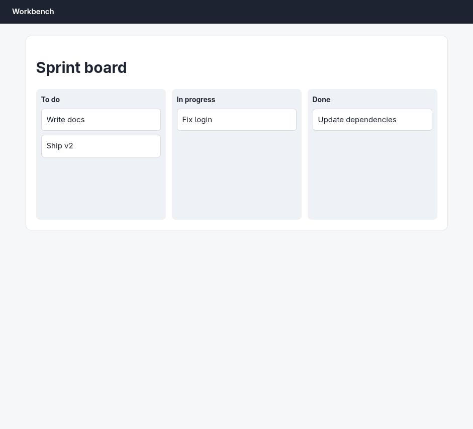
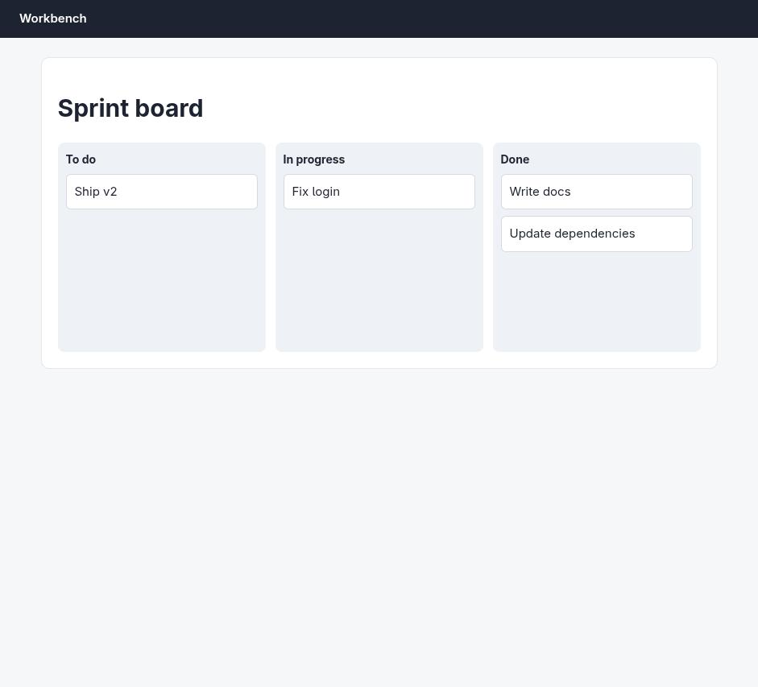

# Claude in Chrome · Drag and drop · round 1

**correct** · goal met (read from the server): yes (write-docs→done, fix-login→doing, ship-v2→todo, update-deps→done) · claimed success · 7 tool calls · 45.3 s · $0.166

## 1. `tabs_context_mcp`

```json
{
  "createIfEmpty": true
}
```

```
{"availableTabs":[{"tabId":453242428,"title":"New Tab","url":"chrome://newtab/"}],"tabGroupId":1297025920}
```

## 2. `browser_batch`

```json
{
  "actions": [
    {
      "name": "navigate",
      "input": {
        "url": "http://127.0.0.1:33679/board",
        "tabId": 453242428
      }
    },
    {
      "name": "computer",
      "input": {
        "action": "screenshot",
        "tabId": 453242428
      }
    }
  ]
}
```

```
[navigate] Navigated to http://127.0.0.1:33679/board
```

```
[computer:screenshot] Successfully captured screenshot (941x853, jpeg) - ID: ss_7060hsujp
```



## 3. `javascript_tool`

```json
{
  "action": "javascript_exec",
  "text": "document.documentElement.outerHTML.slice(0, 6000)",
  "tabId": 453242428
}
```

```
[BLOCKED: Cookie/query string data]
```

## 4. `read_page`

```json
{
  "tabId": 453242428,
  "filter": "all"
}
```

```
banner "Workbench" [ref_1]
main [ref_2]
 heading "Sprint board" [ref_3]
 region [ref_4]
  heading "To do" [ref_5]
  generic "Write docs" [ref_6]
  generic "Ship v2" [ref_7]
 region [ref_8]
  heading "In progress" [ref_9]
  generic "Fix login" [ref_10]
 region [ref_11]
  heading "Done" [ref_12]
  generic "Update dependencies" [ref_13]

Viewport: 941x853
```

## 5. `browser_batch`

```json
{
  "actions": [
    {
      "name": "computer",
      "input": {
        "action": "left_click_drag",
        "start_coordinate": [
          200,
          238
        ],
        "coordinate": [
          740,
          320
        ],
        "tabId": 453242428
      }
    },
    {
      "name": "computer",
      "input": {
        "action": "screenshot",
        "tabId": 453242428
      }
    }
  ]
}
```

```
[computer:left_click_drag] Dragged from (200, 238) to (740, 320)
```

```
[computer:screenshot] Successfully captured screenshot (941x853, jpeg) - ID: ss_94447kn74
```



## 6. `browser_batch`

```json
{
  "actions": [
    {
      "name": "navigate",
      "input": {
        "url": "http://127.0.0.1:33679/board",
        "tabId": 453242428
      }
    },
    {
      "name": "computer",
      "input": {
        "action": "screenshot",
        "tabId": 453242428,
        "scale": 0.6
      }
    },
    {
      "name": "mcp__claude-in-chrome__read_page",
      "input": {
        "tabId": 453242428,
        "filter": "all"
      }
    }
  ]
}
```

```
[navigate] Navigated to http://127.0.0.1:33679/board
[computer:screenshot] Successfully captured screenshot (565x512, jpeg) - ID: ss_4450ir805 — 0.6-scale view; coordinate frame: 941x853. [Image omitted due to error]

actions[2] (mcp__claude-in-chrome__read_page) failed: unknown tool "mcp__claude-in-chrome__read_page" (2 completed, 0 remaining)
```

## 7. `read_page`

```json
{
  "tabId": 453242428,
  "filter": "all"
}
```

```
banner "Workbench" [ref_1]
main [ref_2]
 heading "Sprint board" [ref_3]
 region [ref_4]
  heading "To do" [ref_5]
  generic "Ship v2" [ref_6]
 region [ref_7]
  heading "In progress" [ref_8]
  generic "Fix login" [ref_9]
 region [ref_10]
  heading "Done" [ref_11]
  generic "Write docs" [ref_12]
  generic "Update dependencies" [ref_13]

Viewport: 941x853
```

## Final answer

```
Done. I dragged the "Write docs" card from **To do** into **Done**, then reloaded the page to confirm the change persisted server-side.

Board state after reload:
- **To do:** Ship v2
- **In progress:** Fix login
- **Done:** Write docs, Update dependencies

"Write docs" is in Done, and the other three cards (Ship v2, Fix login, Update dependencies) are in their original columns.

RESULT: success
```
