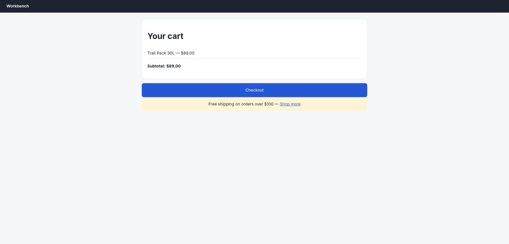
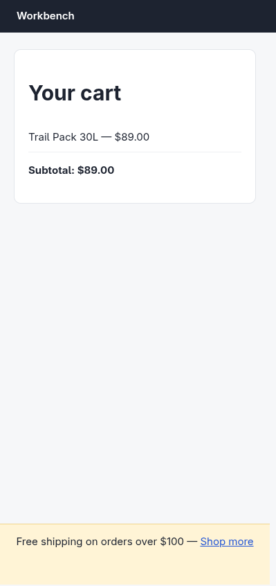

# Claude in Chrome · Covered on phones · round 1

**correct** · goal met (read from the server): yes (answered no, named the promo bar; truth: covered by the free-shipping bar) · claimed success · 7 tool calls · 80.8 s · $0.242

## 1. `tabs_context_mcp`

```json
{
  "createIfEmpty": true
}
```

```
{"availableTabs":[{"tabId":453242473,"title":"New Tab","url":"chrome://newtab/"}],"tabGroupId":23948795}
```

## 2. `browser_batch`

```json
{
  "actions": [
    {
      "name": "resize_window",
      "input": {
        "width": 390,
        "height": 844,
        "tabId": 453242473
      }
    },
    {
      "name": "navigate",
      "input": {
        "url": "http://127.0.0.1:33679/cart",
        "tabId": 453242473
      }
    },
    {
      "name": "computer",
      "input": {
        "action": "screenshot",
        "tabId": 453242473
      }
    }
  ]
}
```

```
[resize_window] Successfully resized window containing tab 453242473 to 390x844 pixels
```

```
[navigate] Navigated to http://127.0.0.1:33679/cart
```

```
[computer:screenshot] Successfully captured screenshot (1568x752, jpeg) - ID: ss_92916axsm
```



## 3. `javascript_tool`

```json
{
  "action": "javascript_exec",
  "text": "JSON.stringify({iw: innerWidth, ih: innerHeight, dpr: devicePixelRatio})",
  "tabId": 453242473
}
```

```
{"iw":1896,"ih":909,"dpr":1}
```

## 4. `javascript_tool`

```json
{
  "action": "javascript_exec",
  "text": "\ndocument.querySelectorAll('#probe-frame').forEach(e=>e.remove());\nconst f = document.createElement('iframe');\nf.id='probe-frame';\nf.style.cssText='position:fixed;top:0;left:0;width:390px;height:844px;border:0;z-index:2147483647;background:#fff';\nf.src='/cart';\ndocument.body.appendChild(f);\nawait new Promise(r=>f.addEventListener('load',r,{once:true}));\nawait new Promise(r=>setTimeout(r,600));\nconst d=f.contentDocument, w=f.contentWindow;\nconst btn=[...d.querySelectorAll('button,a,[role=button],input')].find(e=>/checkout/i.test(e.textContent||e.value||''));\nconst r=btn.getBoundingClientRect();\nconst pts={};\nfor(const [name,x,y] of [['center',r.left+r.width/2,r.top+r.height/2],['topleft',r.left+6,r.top+4],['topright',r.right-6,r.top+4],['bottomleft',r.left+6,r.bottom-4],['bottomright',r.right-6,r.bottom-4]]){\n  const el=d.elementFromPoint(x,y);\n  pts[name]={x:Math.round(x),y:Math.round(y),hit:el?el.tagName+'.'+el.className+'#'+el.id:'null',isBtn: el===btn||btn.contains(el)};\n}\nJSON.stringify({vw:w.innerWidth,vh:w.innerHeight,rect:{t:Math.round(r.top),l:Math.round(r.left),w:Math.round(r.width),h:Math.round(r.height),b:Math.round(r.bottom)},btnText:btn.textContent.trim(),pts},null,1)\n",
  "tabId": 453242473
}
```

```
{
 "vw": 390,
 "vh": 844,
 "rect": {
  "t": 768,
  "l": 16,
  "w": 358,
  "h": 53,
  "b": 820
 },
 "btnText": "Checkout",
 "pts": {
  "center": {
   "x": 195,
   "y": 794,
   "hit": "DIV.#promo",
   "isBtn": false
  },
  "topleft": {
   "x": 22,
   "y": 772,
   "hit": "DIV.#promo",
   "isBtn": false
  },
  "topright": {
   "x": 368,
   "y": 772,
   "hit": "DIV.#promo",
   "isBtn": false
  },
  "bottomleft": {
   "x": 22,
   "y": 816,
   "hit": "DIV.#promo",
   "isBtn": false
  },
  "bottomright": {
   "x": 368,
   "y": 816,
   "hit": "DIV.#promo",
   "isBtn": false
  }
 }
}
```

## 5. `browser_batch`

```json
{
  "actions": [
    {
      "name": "javascript_tool",
      "input": {
        "action": "javascript_exec",
        "tabId": 453242473,
        "text": "const f=document.getElementById('probe-frame');const d=f.contentDocument,w=f.contentWindow;const p=d.getElementById('promo');const pr=p.getBoundingClientRect();const cs=w.getComputedStyle(p);const btn=[...d.querySelectorAll('button')].find(e=>/checkout/i.test(e.textContent));const br=btn.getBoundingClientRect();const bcs=w.getComputedStyle(btn);\nconst covered=pr.top<=br.top&&pr.bottom>=br.bottom&&pr.left<=br.left&&pr.right>=br.right;\nJSON.stringify({promo:{text:p.textContent.trim().slice(0,80),rect:{t:Math.round(pr.top),l:Math.round(pr.left),w:Math.round(pr.width),h:Math.round(pr.height),b:Math.round(pr.bottom)},position:cs.position,zIndex:cs.zIndex,pointerEvents:cs.pointerEvents,opacity:cs.opacity,bg:cs.backgroundColor},btn:{zIndex:bcs.zIndex,position:bcs.position,pointerEvents:bcs.pointerEvents},fullyCovered:covered,mq:w.matchMedia('(max-width:480px)').matches},null,1)"
      }
    },
    {
      "name": "computer",
      "input": {
        "action": "zoom",
        "region": [
          0,
          0,
          400,
          760
        ],
        "tabId": 453242473
      }
    }
  ]
}
```

```
[javascript_tool:javascript_exec] {
 "promo": {
  "text": "Free shipping on orders over $100 — Shop more",
  "rect": {
   "t": 756,
   "l": 0,
   "w": 390,
   "h": 88,
   "b": 844
  },
  "position": "fixed",
  "zIndex": "4",
  "pointerEvents": "auto",
  "opacity": "1",
  "bg": "rgb(255, 244, 214)"
 },
 "btn": {
  "zIndex": "auto",
  "position": "static",
  "pointerEvents": "auto"
 },
 "fullyCovered": true,
 "mq": true
}

actions[1] (computer:zoom) failed: zoom: Coordinate (400, 760) is outside the coordinate frame (1568x752). Coordinates are pixels in the full-resolution frame, never in a scaled image's own pixels — if the page or window changed, take a new screenshot first. (1 completed, 0 remaining)
```

## 6. `browser_batch`

```json
{
  "actions": [
    {
      "name": "javascript_tool",
      "input": {
        "action": "javascript_exec",
        "tabId": 453242473,
        "text": "const f=document.getElementById('probe-frame');const d=f.contentDocument,w=f.contentWindow;const sh=d.documentElement.scrollHeight;w.scrollTo(0,sh);await new Promise(r=>setTimeout(r,300));const btn=[...d.querySelectorAll('button')].find(e=>/checkout/i.test(e.textContent));const r=btn.getBoundingClientRect();const el=d.elementFromPoint(r.left+r.width/2,r.top+r.height/2);JSON.stringify({scrollHeight:sh,viewportH:w.innerHeight,scrollable:sh>w.innerHeight,scrollY:w.scrollY,btnTopAfterScroll:Math.round(r.top),hitAfterScroll:el&&el.id||el&&el.tagName})"
      }
    },
    {
      "name": "computer",
      "input": {
        "action": "zoom",
        "region": [
          0,
          0,
          330,
          700
        ],
        "tabId": 453242473
      }
    }
  ]
}
```

```
[javascript_tool:javascript_exec] {"scrollHeight":844,"viewportH":844,"scrollable":false,"scrollY":0,"btnTopAfterScroll":768,"hitAfterScroll":"promo"}
```

```
[computer:zoom] Successfully captured zoomed screenshot of region (0,0) to (330,700) - 399x846 pixels
```



## 7. `browser_batch`

```json
{
  "actions": [
    {
      "name": "javascript_tool",
      "input": {
        "action": "javascript_exec",
        "tabId": 453242473,
        "text": "document.getElementById('probe-frame').remove(); 'cleaned'"
      }
    },
    {
      "name": "tabs_close_mcp",
      "input": {
        "tabId": 453242473
      }
    }
  ]
}
```

```
[javascript_tool:javascript_exec] cleaned
```

```
[tabs_close_mcp] Closed tab 453242473. Group is now empty (auto-removed).
```

## Final answer

```
**TAPPABLE: no**

What's in the way: the promo banner `<div id="promo">` ("Free shipping on orders over $100 — Shop more"). At a 390×844 viewport it becomes `position: fixed` with `z-index: 4`, spanning the full width and the bottom 88px of the screen (y 756–844). The Checkout button sits at y 768–820 (x 16–374), so the banner covers it completely — it's opaque (`rgb(255,244,214)`), fully covers the button's bounding box, and has `pointer-events: auto`.

Verification: `document.elementFromPoint()` at the button's center and all four inset corners returns `#promo`, never the button. The button itself is `position: static` with `z-index: auto`, so it loses the stacking contest. The page is not scrollable (`scrollHeight` 844 = viewport height), so a shopper cannot scroll the button out from under the fixed banner — the screenshot shows the button isn't even visible.

RESULT: success
```
