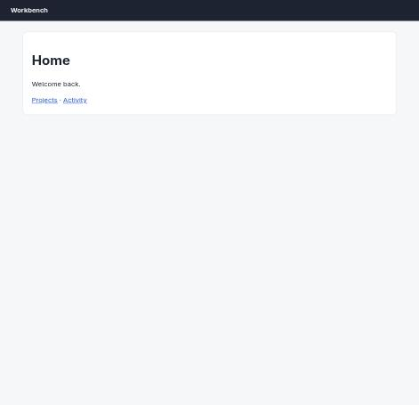
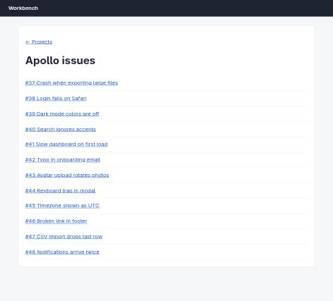
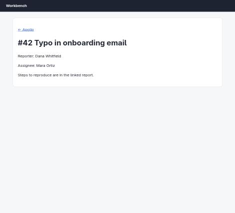

# Claude in Chrome · App navigation · round 1

**correct** · goal met (read from the server): yes (reported "Mara Ortiz"; opened apollo/42) · claimed success · 10 tool calls · 48.4 s · $0.229

## 1. `tabs_context_mcp`

```json
{
  "createIfEmpty": true
}
```

```
{"availableTabs":[{"tabId":453242409,"title":"New Tab","url":"chrome://newtab/"}],"tabGroupId":870869058}
```

## 2. `browser_batch`

```json
{
  "actions": [
    {
      "name": "navigate",
      "input": {
        "url": "http://127.0.0.1:33679/app",
        "tabId": 453242409
      }
    },
    {
      "name": "computer",
      "input": {
        "action": "screenshot",
        "tabId": 453242409,
        "scale": 0.5
      }
    }
  ]
}
```

```
[navigate] Navigated to http://127.0.0.1:33679/app
```

```
[computer:screenshot] Successfully captured screenshot (471x455, jpeg) - ID: ss_4311chcl9 — 0.5-scale view; coordinate frame: 941x909.
```



## 3. `browser_batch`

```json
{
  "actions": [
    {
      "name": "computer",
      "input": {
        "action": "left_click",
        "coordinate": [
          99,
          223
        ],
        "tabId": 453242409
      }
    },
    {
      "name": "get_page_text",
      "input": {
        "tabId": 453242409
      }
    }
  ]
}
```

```
[computer:left_click] Clicked at (99, 223)
```

```
[get_page_text] Title: Workbench
URL: http://127.0.0.1:33679/app/projects
Source element: <main>
---
Loading projects…
```

## 4. `get_page_text`

```json
{
  "tabId": 453242409
}
```

```
Title: Workbench
URL: http://127.0.0.1:33679/app/projects
Source element: <main>
---
Projects
Apollo 12 open issues
Hermes 12 open issues
```

## 5. `find`

```json
{
  "query": "Apollo project link",
  "tabId": 453242409
}
```

```
Found 1 matching element

- ref_7: link "Apollo" (href="/app/projects/apollo") - This is the Apollo project link that matches the user's query exactly
```

## 6. `browser_batch`

```json
{
  "actions": [
    {
      "name": "navigate",
      "input": {
        "url": "http://127.0.0.1:33679/app/projects/apollo",
        "tabId": 453242409
      }
    },
    {
      "name": "computer",
      "input": {
        "action": "wait",
        "duration": 2,
        "tabId": 453242409
      }
    },
    {
      "name": "get_page_text",
      "input": {
        "tabId": 453242409
      }
    }
  ]
}
```

```
[navigate] Navigated to http://127.0.0.1:33679/app/projects/apollo
```

```
[computer:wait] Waited for 2 seconds
```

```
[get_page_text] Title: Workbench
URL: http://127.0.0.1:33679/app/projects/apollo
Source element: <main>
---
← Projects

Apollo issues
#37 Crash when exporting large files
#38 Login fails on Safari
#39 Dark mode colors are off
#40 Search ignores accents
#41 Slow dashboard on first load
#42 Typo in onboarding email
#43 Avatar upload rotates photos
#44 Keyboard trap in modal
#45 Timezone shown as UTC
#46 Broken link in footer
#47 CSV import drops last row
#48 Notifications arrive twice
```

## 7. `find`

```json
{
  "query": "issue #42 link",
  "tabId": 453242409
}
```

```
Found 1 matching element

- ref_18: link "#42 Typo in onboarding email" (link) - Exact match for issue #42 link
```

## 8. `browser_batch`

```json
{
  "actions": [
    {
      "name": "computer",
      "input": {
        "action": "left_click",
        "ref": "ref_18",
        "tabId": 453242409
      }
    },
    {
      "name": "computer",
      "input": {
        "action": "wait",
        "duration": 2,
        "tabId": 453242409
      }
    },
    {
      "name": "get_page_text",
      "input": {
        "tabId": 453242409
      }
    },
    {
      "name": "computer",
      "input": {
        "action": "screenshot",
        "tabId": 453242409,
        "scale": 0.5
      }
    }
  ]
}
```

```
[computer:left_click] Clicked on element ref_18
```

```
[computer:wait] Waited for 2 seconds
```

```
[get_page_text] Title: Workbench
URL: http://127.0.0.1:33679/app/projects/apollo
Source element: <main>
---
← Projects

Apollo issues
#37 Crash when exporting large files
#38 Login fails on Safari
#39 Dark mode colors are off
#40 Search ignores accents
#41 Slow dashboard on first load
#42 Typo in onboarding email
#43 Avatar upload rotates photos
#44 Keyboard trap in modal
#45 Timezone shown as UTC
#46 Broken link in footer
#47 CSV import drops last row
#48 Notifications arrive twice
```

```
[computer:screenshot] Successfully captured screenshot (471x427, jpeg) - ID: ss_5849lxp37 — 0.5-scale view; coordinate frame: 941x853.
```



## 9. `javascript_tool`

```json
{
  "action": "javascript_exec",
  "text": "Array.from(document.querySelectorAll('a')).map(a=>a.textContent.trim()+' -> '+a.getAttribute('href')).join('\\n')",
  "tabId": 453242409
}
```

```
← Projects -> /app/projects
#37 Crash when exporting large files -> /app/projects/apollo/issues/37
#38 Login fails on Safari -> /app/projects/apollo/issues/38
#39 Dark mode colors are off -> /app/projects/apollo/issues/39
#40 Search ignores accents -> /app/projects/apollo/issues/40
#41 Slow dashboard on first load -> /app/projects/apollo/issues/41
#42 Typo in onboarding email -> /app/projects/apollo/issues/42
#43 Avatar upload rotates photos -> /app/projects/apollo/issues/43
#44 Keyboard trap in modal -> /app/projects/apollo/issues/44
#45 Timezone shown as UTC -> /app/projects/apollo/issues/45
#46 Broken link in footer -> /app/projects/apollo/issues/46
#47 CSV import drops last row -> /app/projects/apollo/issues/47
#48 Notifications arrive twice -> /app/projects/apollo/issues/48
```

## 10. `browser_batch`

```json
{
  "actions": [
    {
      "name": "navigate",
      "input": {
        "url": "http://127.0.0.1:33679/app/projects/apollo/issues/42",
        "tabId": 453242409
      }
    },
    {
      "name": "computer",
      "input": {
        "action": "wait",
        "duration": 2,
        "tabId": 453242409
      }
    },
    {
      "name": "get_page_text",
      "input": {
        "tabId": 453242409
      }
    },
    {
      "name": "computer",
      "input": {
        "action": "screenshot",
        "tabId": 453242409,
        "scale": 0.5
      }
    }
  ]
}
```

```
[navigate] Navigated to http://127.0.0.1:33679/app/projects/apollo/issues/42
```

```
[computer:wait] Waited for 2 seconds
```

```
[get_page_text] Title: Workbench
URL: http://127.0.0.1:33679/app/projects/apollo/issues/42
Source element: <main>
---
← Apollo

#42 Typo in onboarding email

Reporter: Dana Whitfield

Assignee: Mara Ortiz

Steps to reproduce are in the linked report.
```

```
[computer:screenshot] Successfully captured screenshot (471x427, jpeg) - ID: ss_8334qvz1h — 0.5-scale view; coordinate frame: 941x853.
```



## Final answer

```
Opened Apollo issue #42 ("Typo in onboarding email") at `/app/projects/apollo/issues/42` and confirmed the assignee field on the page.

ASSIGNEE: Mara Ortiz

RESULT: success
```
